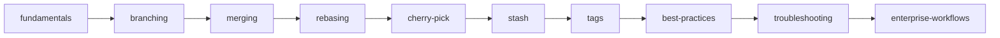

# Git — BuildWithAkash | Automation Lab

Git is the foundation of every modern engineering workflow. This section is not a tutorial — it is a production reference for engineers who want to understand how Git actually behaves in enterprise environments, under pressure, at scale.

If you are here to learn `git add` and `git commit` for the first time, the [official Git book](https://git-scm.com/book/en/v2) is a better starting point. This section assumes you already know the basics and want to go deeper.

---

## Enterprise Git Philosophy

Most Git problems in enterprise environments are not tool problems — they are workflow and discipline problems.

These are the principles that separate functional teams from dysfunctional ones:

| Principle | Why it matters |
|---|---|
| Every commit should be deployable | Broken commits on shared branches cause cascading failures |
| Commit messages are engineering documentation | Six months later, only the message explains *why* a change was made |
| The branch model must match the deployment model | Mismatched models create friction, conflicts, and manual reconciliation |
| Rebase cleans history — merge preserves it | Choose based on the team's need for auditability vs. readability |
| Force push to shared branches is a team incident | It rewrites history others depend on |
| The reflog is your recovery mechanism | Almost nothing is truly lost in Git |
| Tag releases, not commits | Commits move with rebases; tags do not |
| Protect main and release branches | Branch protection is not optional in a regulated environment |

---

## Learning Roadmap

Study these topics in order. Each builds on the previous one.

---

## Section Overview

| Folder | What you will learn |
|---|---|
| `fundamentals/` | Git internals — objects, refs, the DAG, how commits actually work |
| `branching/` | Branch models, naming conventions, trunk-based vs. GitFlow |
| `merging/` | Merge strategies, fast-forward, 3-way, squash, octopus |
| `rebasing/` | Interactive rebase, squashing, the golden rule, when NOT to rebase |
| `cherry-pick/` | Selective commit application — hotfix workflows, backports |
| `stash/` | Stash operations, named stashes, partial stashes |
| `tags/` | Annotated tags, semantic versioning, signed releases |
| `troubleshooting/` | Detached HEAD, reflog recovery, bisect, conflict resolution |
| `best-practices/` | Commit standards, gitignore, large repos, security |
| `enterprise-workflows/` | GitOps, monorepos, release branching, compliance audit trails |

---

## Recommended Study Order

### Track 1 — Foundations

1. `fundamentals/` — understand what Git stores and why
2. `branching/` — understand how branches are just pointers
3. `merging/` — understand how Git combines histories

### Track 2 — Precision tools

4. `rebasing/` — rewrite history safely
5. `cherry-pick/` — apply specific changes across branches
6. `stash/` — manage work-in-progress cleanly

### Track 3 — Production engineering

7. `tags/` — version and release management
8. `best-practices/` — enterprise standards
9. `troubleshooting/` — recovery scenarios
10. `enterprise-workflows/` — team-scale and regulated environment patterns

---

## References

| Resource | URL |
|---|---|
| Pro Git (official book) | https://git-scm.com/book/en/v2 |
| Git Reference Manual | https://git-scm.com/docs |
| GitHub Flow | https://docs.github.com/en/get-started/quickstart/github-flow |
| Conventional Commits | https://www.conventionalcommits.org |
| Semantic Versioning | https://semver.org |
