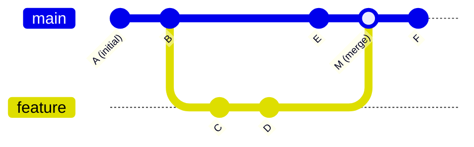
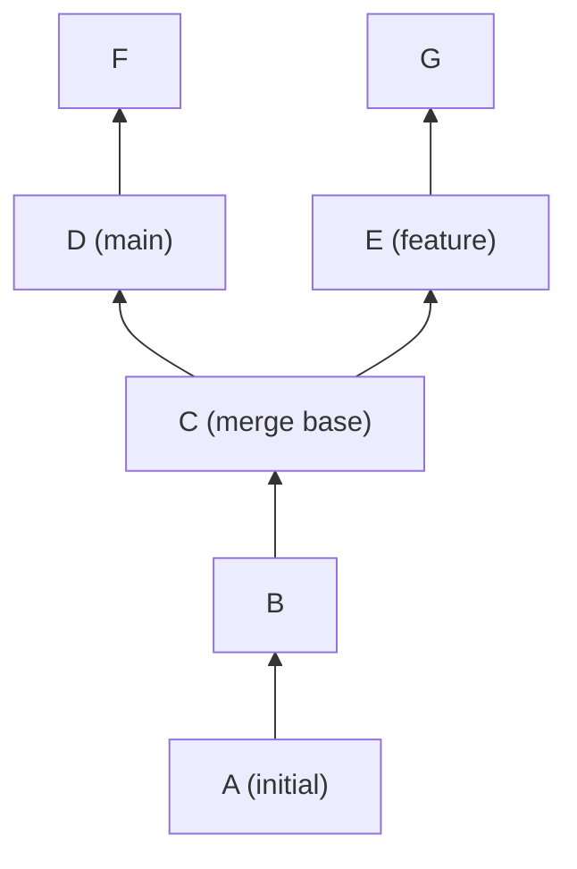

# Git Commit Graph

How commits form a directed acyclic graph, how reachability determines what Git can access, and how garbage collection and the commit-graph file work.

---

## The DAG Structure

Git's commit history is a **Directed Acyclic Graph (DAG)**:
- Each commit points to one or more parent commits (directed edges)
- Edges go backward in time (towards older commits)
- No cycles: a commit cannot be its own ancestor



In this graph:
- M has two parents: E and D
- `git log` traverses from the current commit backwards through all parents
- `git log main..feature` traverses the subgraph reachable from `feature` but not from `main`

---

## Reachability

**Reachability** is the central concept in Git's garbage collection, access control, and command semantics.

A commit is **reachable** if there is a path from any ref (branch, tag, HEAD) to it through parent pointers.

```
Refs: main → F, tags: v1.0.0 → B

Reachable from main: F, M, E, D, C, B, A
Reachable from v1.0.0: B, A
All reachable: F, M, E, D, C, B, A (union)

Unreachable: commits with no path from any ref
```

```bash
# Show all commits reachable from main
git log main --oneline

# Show commits reachable from main but NOT from feature
git log feature..main --oneline

# Show commits on either side but not both (symmetric difference)
git log main...feature --oneline

# Check if commit X is an ancestor of Y
git merge-base --is-ancestor X Y && echo "X is ancestor of Y"
```

---

## Merge Base

The merge base of two commits is their nearest common ancestor — the point where their histories diverged.

```bash
# Find the merge base
git merge-base main feature

# Used by:
# - git merge (to find the three-way merge base)
# - git rebase (to find which commits to replay)
# - git log A..B (to show commits reachable from B but not from A)
# - git diff A...B (three-dot diff: changes on B since diverging from A)
```



In a complex history with multiple merge bases, `git merge-base --all` returns all candidates.

---

## Garbage Collection

GC removes unreachable objects and repacks loose objects into packfiles.

```bash
# Automatic GC (runs when loose object count exceeds gc.auto threshold)
# Threshold: 6700 loose objects by default

# Manual GC
git gc                              # Standard GC
git gc --aggressive                 # More compression (much slower)
git gc --prune=now                  # Prune all unreachable objects immediately
git gc --prune=<date>               # Prune objects older than date (default: 2 weeks)
```

### GC phases

1. **Pack loose objects:** `git pack-objects` bundles all loose objects into a new packfile
2. **Prune old packs:** Remove redundant packfiles that are fully covered by the new one
3. **Prune loose objects:** Remove loose objects that are in the pack (and unreachable objects older than the prune date)
4. **Update commit-graph:** Rebuild the commit-graph file for fast reachability queries
5. **Repack:** Optionally re-pack existing packs for better delta compression

### Why the 2-week default matters

Objects younger than 2 weeks are not pruned even if unreachable. This is a safety window for:
- Developers mid-operation (files staged but not committed)
- Recent reflog entries (which reference objects that may appear unreachable from the current branch state)
- Ongoing transfers

```bash
# Change the safe window
git config gc.pruneExpire "30 days"
git config gc.reflogExpire "90 days"
git config gc.reflogExpireUnreachable "60 days"
```

---

## The Commit-Graph File

The commit-graph file (`.git/objects/info/commit-graph` or `.git/objects/info/commit-graphs/`) is a performance optimization introduced in Git 2.18.

### Problem it solves

Operations like `git log`, `git merge-base`, and reachability checks require traversing the commit DAG. For repositories with millions of commits, each traversal reads many commit objects from disk. This is slow.

### How it works

The commit-graph file is a precomputed binary index of:
- All commit SHAs in topological order
- Parent pointers (by index, not SHA — faster lookup)
- Commit date (for fast range filtering)
- **Generation numbers**: a number assigned to each commit such that a commit's generation number is always greater than any of its ancestors

```bash
# Generate the commit-graph
git commit-graph write --reachable

# Verify it
git commit-graph verify

# Enable automatic update during gc
git config core.commitGraph true
git config fetch.writeCommitGraph true

# Check if it exists
ls .git/objects/info/commit-graph 2>/dev/null && echo "present" || echo "not present"
```

### Generation numbers

Generation numbers enable a critical optimization: to check if commit A is an ancestor of commit B, compare their generation numbers first.

- If `gen(A) >= gen(B)`, A cannot be an ancestor of B — return immediately without traversal
- If `gen(A) < gen(B)`, traversal may be needed

For `git merge-base` on a repository with 500,000 commits, this can reduce the traversal from traversing hundreds of thousands of commits to checking a few thousand.

---

## Reachability Bitmaps

Bitmap indexes (`.git/objects/pack/pack-*.bitmap`) further accelerate reachability computation for `git clone` and `git fetch`.

```bash
# Bitmaps are created during git repack with the bitmap flag
git repack -Ad --write-bitmap-index
# -A: convert loose objects
# -d: delete redundant packs
# --write-bitmap-index: create the bitmap

# GitHub, GitLab, and Gitea generate bitmaps on their servers
# This is why cloning from GitHub is faster than cloning from a self-hosted server without bitmaps
```

A bitmap stores a bit for each object in the packfile. For commonly accessed commits (branch tips, recent tags), a precomputed bitmap records which objects are reachable. Computing the clone packfile becomes a bitwise OR operation on bitmaps rather than a full DAG traversal.

---

## Practical Diagnostics

```bash
# Show the full DAG in text form
git log --graph --oneline --all | head -30

# Count commits reachable from main
git rev-list --count main

# Find commits in the last 7 days
git log --oneline --since="7 days ago" main

# Find the first commit where a file appeared
git log --follow --diff-filter=A -- path/to/file

# Verify commit-graph integrity
git commit-graph verify --object-dir=.git/objects

# Force GC and measure before/after
git count-objects -vH
git gc --prune=now
git count-objects -vH
```

---

## Related

- [Objects](objects.md)
- [Refs](refs.md)
- [Storage](storage.md)
- [Performance Reference](../performance/README.md)

---

[← Storage](storage.md) | [⌂ Architecture Index](README.md)
