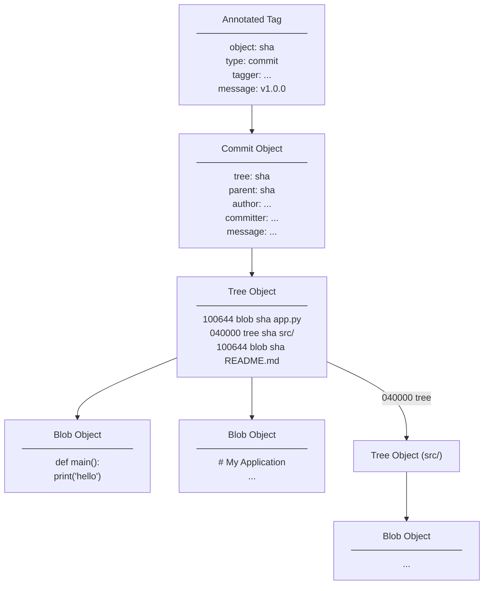

# Git Objects

Git stores everything in a content-addressed object database. Four object types form the complete data model.

---

## The Four Object Types



---

## Blob

A blob stores **file content only** — no filename, no permissions, no metadata.

```bash
# Create a blob manually
echo "Hello, world!" | git hash-object --stdin
# Output: 8ab686eafeb1f44702738c8b0f24f2567c36da6d

# Git stores it at:
# .git/objects/8a/b686eafeb1f44702738c8b0f24f2567c36da6d

# Inspect it
git cat-file -t 8ab686ea     # → blob
git cat-file -p 8ab686ea     # → Hello, world!
```

### Key properties

- **Content-addressed:** The SHA is derived from the content. Same content always produces the same SHA.
- **Deduplication is automatic.** Two files with identical content share one blob object. This is why cloning a monorepo that has many copies of `package-lock.json` across packages doesn't multiply storage.
- **Format:** `blob <size>\0<content>` — the preamble is hashed with the content. This prevents SHA collisions between different object types with the same raw content.

```bash
# Verify the format
python3 -c "
import hashlib
content = b'Hello, world!\n'
header = b'blob ' + str(len(content)).encode() + b'\0'
full = header + content
print(hashlib.sha1(full).hexdigest())
"
# Output matches: 8ab686eafeb1f44702738c8b0f24f2567c36da6d
```

---

## Tree

A tree stores a **directory listing** — an ordered list of entries, each containing mode, type, SHA, and name.

```bash
# Inspect a tree object
git cat-file -p HEAD^{tree}

# Example output:
# 100644 blob a3f2c118... .gitignore
# 100644 blob 9b1e4a7d... README.md
# 040000 tree 4b8c1d5a... src
# 100644 blob 8d0c2f3b... main.py
```

### Mode values

| Mode | Meaning |
|------|---------|
| `100644` | Regular file |
| `100755` | Executable file |
| `120000` | Symbolic link |
| `040000` | Directory (subtree) |
| `160000` | Git submodule (gitlink) |

### Key properties

- **Trees are recursive.** A tree entry with mode `040000` points to another tree object, forming the directory hierarchy.
- **Snapshot, not diff.** Each commit stores a full snapshot of the repository state as a tree, not a diff from the previous commit. Git computes diffs on demand by comparing tree objects.
- **Order matters for SHA.** Tree entries are sorted by name. A tree with entries in different order has a different SHA even if the entries are identical.

```bash
# Walk the full tree from a commit
git ls-tree -r HEAD                   # All files (flat)
git ls-tree HEAD                      # Top-level entries only (not recursive)
git ls-tree HEAD src/                 # Contents of the src/ directory
```

---

## Commit

A commit records a snapshot of the repository at a point in time, with authorship and a pointer to its parent.

```bash
# Inspect a commit object
git cat-file -p HEAD

# Output:
# tree 4b8c1d5a2f3...
# parent 9e3f7a26b1c...
# author Alice <alice@example.com> 1710864000 +0000
# committer Bob <bob@example.com> 1710864120 +0000
#
# feat: add user authentication
#
# Closes #142
```

### Parent structure

| Commit type | Parents |
|-------------|---------|
| First commit | 0 parents |
| Regular commit | 1 parent |
| Merge commit | 2 parents (the two merged branches) |
| Octopus merge | 3+ parents (rare, multi-branch merge) |

### Author vs. Committer

- **Author**: The person who wrote the change (preserved across cherry-picks and rebases)
- **Committer**: The person who applied the change to the repository (updated when cherry-picking or rebasing)

After a `git rebase`, all commits get new SHAs because the **committer timestamp and parent SHA** both change, even if the author and diff are identical.

### SHA stability

```bash
# The commit SHA is a hash of: tree sha + parent sha(s) + author + committer + message
# Change any field, and the SHA changes.
# This is why git rebase always produces new SHAs.

git cat-file commit HEAD | sha1sum
# Compare with git rev-parse HEAD — they should match
```

---

## Annotated Tag

An annotated tag is a Git object with its own SHA, distinct from the commit it points to.

```bash
# Create an annotated tag
git tag -a v1.0.0 -m "Initial public release"

# Inspect
git cat-file -p v1.0.0

# Output:
# object 9b1e4a7d...      ← SHA of the tagged commit
# type commit
# tag v1.0.0
# tagger Alice <alice@example.com> 1710864000 +0000
#
# Initial public release
```

### Annotated vs. Lightweight

| | Annotated | Lightweight |
|-|-----------|-------------|
| Git object | Yes (tag object) | No (just a ref) |
| Tagger info | Yes | No |
| Signable | Yes | No |
| `git describe` | Shows annotated tags | Shows lightweight tags only if `--tags` |
| Use for releases | **Always** | Test/temporary labels only |

```bash
# List tag types
git for-each-ref --format='%(objecttype) %(refname:short)' refs/tags
# annotated tags show "tag"
# lightweight tags show "commit"
```

---

## Object Storage Layout

```
.git/objects/
├── 9b/
│   └── 1e4a7d2f3c...      ← Loose object (first 2 chars = directory name)
├── a3/
│   └── f2c118e4b5...
├── pack/
│   ├── pack-abc123.idx    ← Index for fast lookup
│   └── pack-abc123.pack   ← Compressed delta-encoded objects
└── info/
    └── packs
```

Loose objects are individual files. Packfiles bundle many objects with delta compression. `git gc` converts loose objects to pack format and removes the loose files.

---

## Practical Diagnostics

```bash
# Count all objects
git count-objects -vH

# Find the largest objects in the object database
git cat-file --batch-all-objects --batch-check | sort -k3 -rn | head -20

# Verify integrity of all objects
git fsck --full

# Find dangling objects (no ref pointing to them)
git fsck 2>/dev/null | grep "dangling"

# Inspect any object by SHA
git cat-file -t <sha>       # type
git cat-file -p <sha>       # content
git cat-file -s <sha>       # size in bytes
```

---

## Related

- [Refs](refs.md)
- [Storage](storage.md)
- [Commit Graph](commit-graph.md)
- [Internals Overview](../internals/README.md)

---

[← Architecture Index](README.md) | [Refs →](refs.md)
