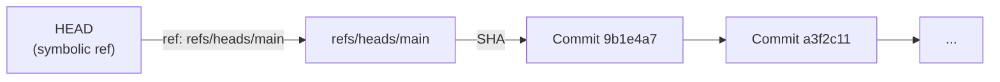

# Git Refs

Refs are named pointers to Git objects — primarily commits. They are the mechanism that makes branches, tags, and HEAD work.

---

## What a Ref Is

A ref is a file containing a 40-character SHA (or a symbolic ref pointing to another ref):

```bash
cat .git/refs/heads/main
# 9b1e4a7d2f3c...

cat .git/HEAD
# ref: refs/heads/main       ← symbolic ref (normal state)
# OR
# 9b1e4a7d2f3c...            ← direct SHA (detached HEAD state)
```

---

## Ref Namespace

```
.git/
├── HEAD                              ← Symbolic ref to current branch
├── ORIG_HEAD                         ← Previous HEAD before reset/merge (recovery)
├── MERGE_HEAD                        ← Branch being merged in (during merge)
├── CHERRY_PICK_HEAD                  ← Commit being cherry-picked
├── refs/
│   ├── heads/                        ← Local branches
│   │   ├── main
│   │   ├── feat/add-vpc
│   │   └── hotfix/INC-0001
│   ├── tags/                         ← Tags
│   │   ├── v1.0.0
│   │   └── v2.0.0-rc.1
│   └── remotes/                      ← Remote-tracking refs
│       └── origin/
│           ├── HEAD                  ← Default branch of remote
│           ├── main
│           └── feat/add-vpc
└── packed-refs                       ← Flat file for large ref counts (performance)
```

---

## Local Branches (`refs/heads/`)

A local branch is a file at `.git/refs/heads/<name>` containing the SHA of the tip commit.

```bash
# Create a branch (creates the ref file)
git checkout -b feature/payment
# Equivalent to:
echo "$(git rev-parse HEAD)" > .git/refs/heads/feature/payment

# Move a branch (update the ref file)
git reset --hard HEAD~1
# Equivalent to: updating .git/refs/heads/feature/payment to the parent SHA

# Delete a branch (delete the ref file)
git branch -d feature/payment
# Equivalent to: rm .git/refs/heads/feature/payment
```

Branch names are stored as path components, which is why `/` in branch names is valid and maps to a directory:

```
refs/heads/feat/add-vpc  →  .git/refs/heads/feat/add-vpc
```

Naming rules enforced by Git:
- No `..` (double dot)
- No space, `~`, `^`, `:`, `?`, `*`, `[` characters
- Cannot begin or end with `/`
- Cannot end with `.lock`

---

## HEAD

HEAD is the special ref that tells Git what commit the working tree is at.



### HEAD transitions

```bash
# Attached HEAD (normal)
git status
# On branch main

cat .git/HEAD
# ref: refs/heads/main

# Checkout a specific commit → detached HEAD
git checkout 9b1e4a7

cat .git/HEAD
# 9b1e4a7d2f3c...         ← direct SHA, not a branch name

# Reattach HEAD by checking out a branch
git checkout main
cat .git/HEAD
# ref: refs/heads/main    ← symbolic ref restored
```

### ORIG_HEAD

Git writes `ORIG_HEAD` before any operation that moves HEAD significantly (`reset`, `merge`, `rebase`). This is your escape hatch:

```bash
# Undo a merge
git reset --hard ORIG_HEAD

# Undo a rebase
git reset --hard ORIG_HEAD

# Undo a reset
git reset --hard ORIG_HEAD
```

`ORIG_HEAD` is overwritten on each operation — it only holds the state from the most recent operation.

---

## Remote-Tracking Refs (`refs/remotes/`)

Remote-tracking refs are local copies of what the remote reported during the last `git fetch`.

```bash
# After git fetch origin
ls .git/refs/remotes/origin/
# HEAD  main  feat/add-vpc  hotfix/INC-0001

cat .git/refs/remotes/origin/main
# a3f2c118...                         ← last-fetched state of origin/main
```

**Important:** Remote-tracking refs are never directly edited by local operations. Only `git fetch` updates them. If you make commits locally, `origin/main` stays at its last-fetched value until you fetch again.

```bash
# See divergence between local and remote
git log --oneline origin/main..main    # Local commits not on remote
git log --oneline main..origin/main    # Remote commits not local (need pull)
```

---

## Tags (`refs/tags/`)

```bash
# Lightweight tag: just a ref pointing to a commit
git tag v1.0.0-lite
cat .git/refs/tags/v1.0.0-lite
# 9b1e4a7...      ← directly points to a commit

# Annotated tag: ref points to a tag object, which points to the commit
git tag -a v1.0.0 -m "Release"
cat .git/refs/tags/v1.0.0
# 4f5b6c7d...     ← points to a TAG OBJECT, not a commit

git cat-file -t $(cat .git/refs/tags/v1.0.0)
# tag                                  ← confirms it's a tag object

git cat-file -p $(cat .git/refs/tags/v1.0.0)
# object 9b1e4a7d...                  ← tag object points to the commit
```

---

## packed-refs

When a repository accumulates many refs (branches, tags), having thousands of individual files becomes slow. Git consolidates them into a single `.git/packed-refs` file:

```bash
cat .git/packed-refs

# Example:
# # pack-refs with: peeled fully-peeled sorted
# 9b1e4a7d refs/heads/main
# a3f2c118 refs/remotes/origin/main
# 4f5b6c7d refs/tags/v1.0.0
# 9b1e4a7d ^9b1e4a7d    ← peeled: the commit that the tag points to
```

The `^` line is a "peeled" ref — the dereferenced target of an annotated tag, precomputed for performance so that `git describe` and `git log` don't have to dereference tag objects.

Loose ref files take priority over `packed-refs`. When a branch is updated, its loose file is written. When `git gc` runs, loose refs are packed.

---

## Ref Operations Cheat Sheet

```bash
# List all local branches
git branch                                  # Local
git branch -r                               # Remote-tracking
git branch -a                               # All

# List all refs with their SHAs
git show-ref

# List refs in a namespace
git for-each-ref refs/heads/ --format='%(refname:short) %(objectname:short)'

# Delete a remote branch (delete the remote ref)
git push origin --delete feat/old-branch

# Prune remote-tracking refs for deleted remote branches
git fetch --prune origin
git remote prune origin                     # Same effect

# Reset a branch to a specific commit
git update-ref refs/heads/main <new-sha>    # Low-level, direct ref update
```

---

## Related

- [Objects](objects.md)
- [Storage](storage.md)
- [Branching Reference](../branching/README.md)
- [Tags Reference](../tags/README.md)

---

[← Objects](objects.md) | [Storage →](storage.md)
