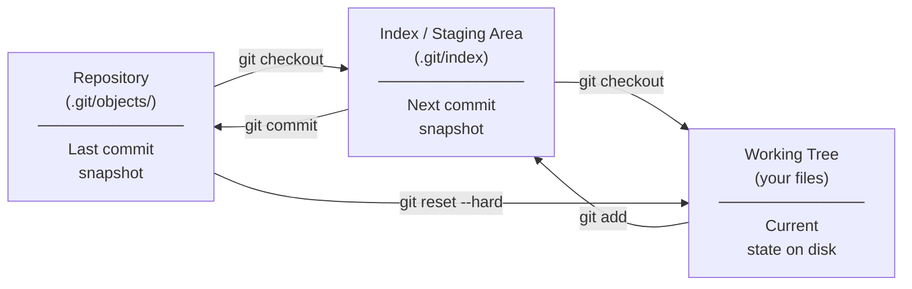

# Git Storage

How Git physically stores objects, how the staging area (index) works, and how the working tree relates to both.

---

## The Three Trees

Git's mental model is three trees — three file system snapshots that Git manages and compares:



| Tree | `git status` label | Description |
|------|--------------------|-------------|
| Repository | "Changes to be committed" (diff from HEAD) | Last committed state |
| Index | "Changes not staged" (diff from index) | Proposed next commit |
| Working tree | (untracked files) | Current files on disk |

---

## Loose Object Storage

When you make a commit or `git add` a file, Git writes loose objects to `.git/objects/`:

```
.git/objects/
├── 9b/
│   └── 1e4a7d2f3c4e5f6a7b8c9d0e1f2a3b4c5d6e7f8
├── a3/
│   └── f2c118e4b5c6d7e8f9a0b1c2d3e4f5a6b7c8d9
└── pack/
```

**File naming:** The first 2 characters of the SHA become the directory; the remaining 38 characters become the filename. This keeps directory listing manageable — if all objects were in one directory, `ls` on a large repository would return millions of entries.

**Compression:** Each loose object is zlib-compressed. The format is:

```
zlib_compress("blob " + str(size) + "\0" + content)
```

**Write-once:** Object files are never modified after creation. If content changes, a new object is written with a new SHA. Old objects remain until garbage collection.

---

## Packfiles

As a repository grows, thousands of loose objects become inefficient. `git gc` converts them to packfiles:

```
.git/objects/pack/
├── pack-abc123def456.idx     ← Index: SHA → offset in pack
└── pack-abc123def456.pack    ← Packed objects (delta-compressed)
```

### Delta compression

Instead of storing every version of a file completely, packfiles store one base version and deltas:

```
File v1 (full): 10KB
File v2 (delta from v1): 100 bytes
File v3 (delta from v2): 200 bytes
File v4 (delta from v3): 50 bytes
```

Total storage: 10KB + 350 bytes instead of 40KB. The delta chain can reference any older version, not just the immediately previous one — Git picks the best base for each object.

### Pack index structure

The `.idx` file enables O(log n) lookup without reading the entire pack:

1. **Fan-out table** (256 entries): for each possible first byte of SHA, the cumulative count of objects with that first byte
2. **Sorted SHA list**: all SHAs in the pack, sorted
3. **CRC32 checksums**: integrity check per object
4. **Offset table**: byte offset in the `.pack` file for each object

```bash
# Inspect a packfile
git verify-pack -v .git/objects/pack/pack-*.idx | head -20

# Output:
# 9b1e4a7d... commit 220 155 12
# a3f2c118... blob   1042 823 167        ← full object (base)
# 4b8c1d5a... blob   12 18 990 1 a3f2c118  ← delta from a3f2c118
```

The numbers are: SHA, type, uncompressed size, compressed size, offset in pack, delta base.

---

## The Index (Staging Area)

The index is a binary file at `.git/index`. It is the proposed state of the next commit.

```bash
# Read the index (human-readable)
git ls-files --stage

# Output:
# 100644 9b1e4a7d... 0  .gitignore
# 100644 a3f2c118... 0  README.md
# 100644 4b8c1d5a... 0  src/main.py

# Format: mode SHA stage-number filename
```

### Stage numbers

The `0` is the stage number. During a merge conflict, a file may have up to 3 stage entries:

| Stage | Meaning |
|-------|---------|
| 0 | Normal (no conflict) |
| 1 | Common ancestor (base) |
| 2 | HEAD (current branch) |
| 3 | MERGE_HEAD (incoming branch) |

```bash
# See all stages during a conflict
git ls-files --stage src/config.yaml

# Output:
# 100644 abc123... 1  src/config.yaml   ← base
# 100644 def456... 2  src/config.yaml   ← ours
# 100644 ghi789... 3  src/config.yaml   ← theirs
```

After resolving and `git add`-ing the file, the stage entries collapse back to stage 0.

### What git add actually does

```bash
git add src/main.py

# Internally:
# 1. Compute SHA of the file content
# 2. Write a blob object to .git/objects/ (if not already there)
# 3. Update .git/index to point src/main.py at the new blob SHA
```

`git add` is cheap — it only writes a blob and updates the index binary. The tree and commit objects are not created until `git commit`.

---

## Shallow Clones

A shallow clone (`git clone --depth=N`) stores only the most recent N commits, not the full history.

```bash
# Shallow clone for CI (fast, fewer objects)
git clone --depth=1 git@github.com:org/repo.git

# The boundary commits have a "grafted" parent of null
cat .git/shallow
# 9b1e4a7d...   ← these commits have no parent in this clone

# Deepen a shallow clone
git fetch --deepen=100              # Add 100 more commits
git fetch --unshallow               # Fetch full history
```

**Trade-off:** Shallow clones break operations that need history depth: `git log --follow`, `git blame`, `git bisect`, and merge-base computation. Use `--unshallow` before any operation that needs history.

---

## Partial Clone

Partial clones (Git 2.22+) skip downloading blob objects until they are accessed:

```bash
# Clone without blobs (metadata only — extremely fast)
git clone --filter=blob:none git@github.com:org/repo.git

# Clone without tree objects (very advanced — commits only)
git clone --filter=tree:0 git@github.com:org/repo.git
```

With `--filter=blob:none`, blobs are downloaded on demand as you checkout files. This is the recommended approach for large monorepos in CI — checkout only the paths you need:

```bash
git clone --filter=blob:none --sparse git@github.com:org/monorepo.git
git sparse-checkout set services/payment/
```

---

## Storage Size Reference

| Object type | Typical size | Notes |
|-------------|-------------|-------|
| Blob (small file) | 50–5000 bytes | Compressed with zlib |
| Tree object | 100–5000 bytes | Grows with directory size |
| Commit object | 100–500 bytes | Larger with long messages |
| Loose object overhead | ~50 bytes/object | Directory entry + file metadata |
| Packfile efficiency | 5–20x compression | Depends on content type |

```bash
# Diagnose repository size
git count-objects -vH

# Key fields:
# count: number of loose objects
# size: size of loose objects (bytes)
# in-pack: number of objects in packfiles
# size-pack: size of packfiles (bytes)
# garbage: stale pack files to be pruned
```

---

## Related

- [Objects](objects.md)
- [Refs](refs.md)
- [Commit Graph](commit-graph.md)
- [Performance Reference](../performance/README.md)

---

[← Refs](refs.md) | [Commit Graph →](commit-graph.md)
