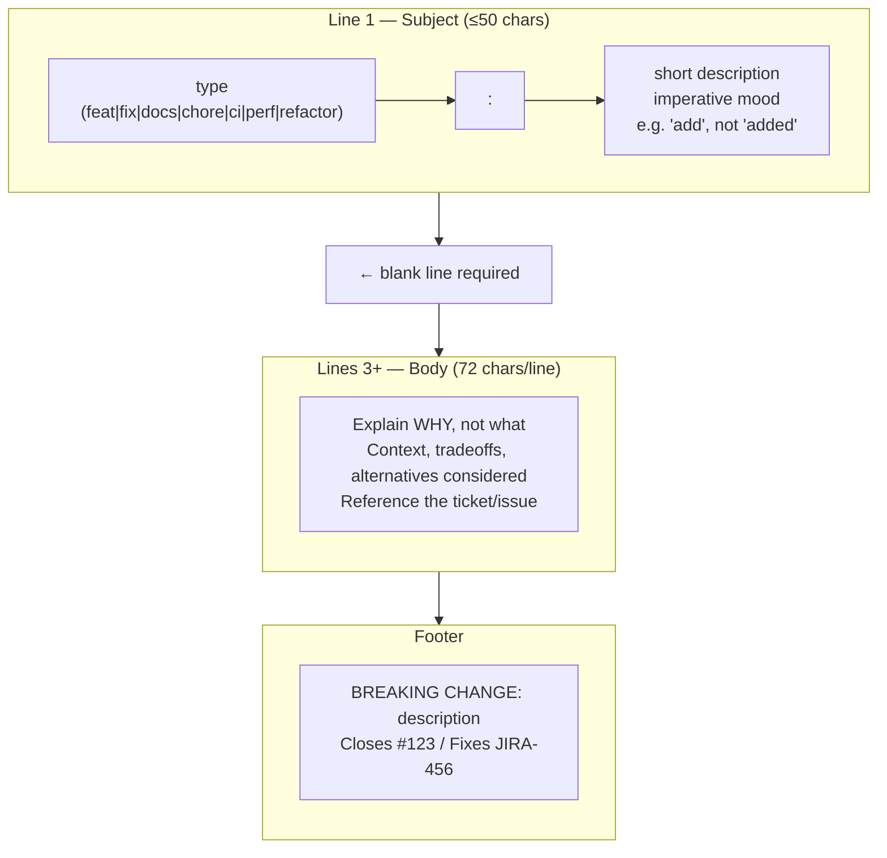

# Git Best Practices — Enterprise Standards for Production Teams

> **Related sections:** [`hooks/`](../hooks/) for automating enforcement of these standards; [`security/`](../security/) for secrets prevention and GPG signing; [`enterprise-workflows/`](../enterprise-workflows/) for how these practices apply within team branching models; [`troubleshooting/`](../troubleshooting/) when practices are not followed.
>
> **Navigation:** [⌂ Index](../) | [← `enterprise-workflows/`](../enterprise-workflows/) | [`troubleshooting/` →](../troubleshooting/)

## Overview

Best practices in Git are not opinions — they are the difference between a codebase that engineers can trust and debug, and one that they fear touching. Every standard in this document comes from the pain of not following it.

---

## Commit Messages — The Most Underrated Engineering Standard

A commit message is engineering documentation written in the moment when context is highest. Six months later, the diff shows *what* changed. Only the message explains *why*.

### Conventional Commits format

```
type(scope): short description   ← Line 1: ≤50 chars, imperative mood
                                 ← Line 2: BLANK (required)
Body explains WHY, not what.     ← Line 3+: ≤72 chars/line
Context, tradeoffs, references.

Closes #123                      ← Footer: issue refs, breaking changes
```



> **Rule:** `type(scope): description` on line 1. Blank line. Body from line 3. Footer (Breaking Changes, issue refs) last.

| Type | When to use |
|---|---|
| `feat` | New feature or capability |
| `fix` | Bug fix |
| `docs` | Documentation only |
| `refactor` | Code restructuring, no behavior change |
| `test` | Adding or updating tests |
| `chore` | Maintenance — deps, config, build |
| `ci` | Changes to CI/CD configuration |
| `perf` | Performance improvement |
| `revert` | Reverting a previous commit |
| `security` | Security-related change |

### Good vs bad commit messages

Bad:
```
fix stuff
update config
WIP
changes
```

Good:
```
fix(terraform): correct CIDR block overlap in prod VPC [INFRA-1098]

The prod VPC CIDR 10.0.0.0/16 was overlapping with the transit gateway
attachment subnet 10.0.255.0/24. Corrected to 10.0.0.0/20.

Resolves: INFRA-1098
Reported-by: network-team
Tested: plan + apply in staging, verified no route conflicts
```

### Rules

- Subject line: max 72 characters
- Imperative mood: "add feature", not "added feature"
- No period at the end of the subject
- Blank line between subject and body
- Body explains *why*, not *what* (the diff shows *what*)
- Footer references tickets: `Resolves: INFRA-1098`

---

## Atomic Commits

Each commit should represent one logical change that can be understood, reviewed, and reverted independently.

```bash
# Bad: one massive commit with unrelated changes
git add .
git commit -m "lots of stuff"

# Good: stage and commit by logical group
git add modules/vpc/
git commit -m "feat(vpc): add multi-AZ subnet configuration"

git add .github/workflows/
git commit -m "ci: add Terraform plan workflow for PRs"
```

Use `git add -p` to stage specific hunks from a file:

```bash
git add -p modules/vpc/main.tf
# Presents each changed hunk, y/n to stage
```

---

## .gitignore — What Should Never Be Committed

Create a `.gitignore` from the start. These should never reach version control:

```gitignore
# Terraform
.terraform/
*.tfstate
*.tfstate.backup
*.tfvars
.terraform.lock.hcl   # Commit this one — it locks provider versions

# Secrets
*.pem
*.key
*.env
.env*
secrets/
credentials

# OS
.DS_Store
Thumbs.db

# Editor
.vscode/
.idea/
*.swp
*.swo

# Python
__pycache__/
*.pyc
.venv/

# Ansible
*.retry
```

Use [gitignore.io](https://www.toptal.com/developers/gitignore) for language-specific templates.

### If a secret was already committed

```bash
# Remove the file from tracking
git rm --cached secrets/credentials.json
echo "secrets/" >> .gitignore
git commit -m "security: remove accidentally committed credentials"

# Rotate the secret immediately — assume it was already read
# If it was pushed, rotate before fixing the git history
```

---

## Security Practices

For the full security coverage — secrets scanning, GPG signing, SSH configuration, CODEOWNERS, and PAT scopes — see [`security/`](../security/). This section covers only the practices that belong in every repository's baseline configuration.

| Practice | Implementation |
|---|---|
| Never commit secrets | `.gitignore` + pre-commit hooks |
| Scan every commit for secrets | gitleaks via pre-commit framework |
| Require signed commits on protected branches | GitHub branch protection → require signed commits |
| Set CODEOWNERS for sensitive paths | `.github/CODEOWNERS` |

### Pre-commit hook for secret scanning

```bash
# .git/hooks/pre-commit
#!/bin/sh
gitleaks detect --staged --exit-code 1
if [ $? -ne 0 ]; then
    echo "ERROR: Secrets detected in staged files. Commit aborted."
    exit 1
fi
```

```bash
chmod +x .git/hooks/pre-commit
```

For team-wide enforcement, use the [pre-commit framework](https://pre-commit.com). See [`hooks/`](../hooks/) for the full pre-commit framework setup.

---

## Branch Protection — Minimum Standards

Every production repository should have these branch protection rules on `main`:

| Rule | Why |
|---|---|
| Require pull request before merging | Enforces code review |
| Require at least 1 approval | No self-merging |
| Dismiss stale reviews on push | A new commit invalidates old approvals |
| Require status checks to pass | CI must pass before merge |
| Require branches to be up to date | Prevents stale merges |
| Do not allow force pushes | Protects shared history |
| Do not allow deletions | Prevents accidental main deletion |

---

## Repository Hygiene

```bash
# Clean up merged branches regularly
git fetch --prune
git branch -vv | grep ': gone]' | awk '{print $1}' | xargs git branch -d

# Verify repository health
git fsck

# Schedule background maintenance (Git 2.31+ — preferred over manual gc)
git maintenance start

# Check repository disk usage
git count-objects -vH
```

> `git gc --aggressive` is very slow (30+ minutes on large repositories) and provides diminishing returns. Use `git maintenance` for ongoing health. Reserve `git gc --aggressive` for one-time cleanup of repositories that have never been optimized.

---

## Commit Frequency and PR Size

| Anti-pattern | Impact |
|---|---|
| Giant PRs (500+ lines) | Reviewers cannot meaningfully review — rubber-stamping |
| Commits every 3 days | Context is lost, conflicts accumulate |
| WIP commits on main | CI breaks for everyone |

**Target**: PRs under 400 lines of meaningful change. One logical unit per PR.

---

## .gitattributes — Line Endings and Diff Behavior

```gitattributes
# Normalize line endings to LF on checkout
* text=auto

# Force LF for shell scripts
*.sh text eol=lf

# Force CRLF for Windows batch files
*.bat text eol=crlf

# Binary files — no diff, no merge
*.png binary
*.pdf binary
*.zip binary

# Terraform files — use HCL diff
*.tf diff=terraform
```

---

## Large Repository Handling

```bash
# Shallow clone (for CI — get only recent history)
git clone --depth=1 https://github.com/org/repo.git

# Sparse checkout (only checkout specific directories)
git clone --no-checkout https://github.com/org/monorepo.git
cd monorepo
git sparse-checkout init --cone
git sparse-checkout set modules/vpc modules/eks
git checkout main

# Git LFS for large binary files
git lfs install
git lfs track "*.bin"
git lfs track "diagrams/*.png"
git add .gitattributes
```

---

## Interview Questions

**Q: What is Conventional Commits and why does it matter operationally?**
A: Conventional Commits is a commit message specification using structured prefixes (`feat`, `fix`, `chore`, etc.) and optional scope. Operationally, it enables automated changelog generation, semantic version bumping, and reliable `git log` filtering. Tools like `semantic-release` and `release-please` parse these messages to generate release notes automatically.

**Q: What belongs in `.gitignore` versus `.gitattributes`?**
A: `.gitignore` controls what Git tracks at all — files listed there are never staged. `.gitattributes` controls how Git handles files it does track: line-ending normalization (`eol`), diff behavior (`diff=word`), merge strategy (`merge=ours`), and LFS routing (`filter=lfs`). Both should be committed to the repository.

**Q: Why is committing a secret to Git such a serious issue, even if it is deleted in the next commit?**
A: The secret still exists in the Git object store and is visible in the history. Anyone who cloned the repository between the bad commit and the deletion still has the secret locally. GitHub scans repositories and notifies secret owners (AWS, GCP, etc.) even before you notice. Removal requires `git filter-repo` to rewrite history and force-push — disrupting all existing clones. The only safe resolution is to rotate the secret immediately, regardless of cleanup.

---

## Engineering Notes

**Best practices are not a checklist; they are defaults that must be actively maintained.** Conventional commits, atomic commits, and branch protection rules are all easy to configure once. The challenge is maintaining them as teams change and processes drift. Schedule a quarterly review of your Git practices the same way you schedule dependency updates.

**Atomic commits are the single most impactful commit discipline for infrastructure teams.** A Terraform commit that modifies networking, IAM, and compute simultaneously cannot be partially reverted. If the compute change caused an outage, you need to revert everything or craft a surgical forward-fix. An atomic commit that changes only networking can be reverted in 30 seconds.

**Conventional commits enable automatic changelog generation.** `feat:`, `fix:`, `docs:`, `chore:` prefixes are machine-parseable. Tools like `semantic-release`, `conventional-changelog`, and `release-please` use these prefixes to automatically determine the next version number and generate release notes. This is not a formatting preference — it is infrastructure for your release pipeline.

**`.gitignore` should be repository-specific, not global.** A global `.gitignore` on an engineer's machine hides ignores from the repository. Other contributors, CI, and production environments do not have that global file. Repository-level `.gitignore` is version-controlled and applies everywhere the repository is checked out.

**Code review is a Git practice.** Branch protection rules that require PR approval are not bureaucracy — they are the mechanism that ensures every change to production infrastructure was seen by at least one other engineer. The Git history is also the audit trail. Every merge commit is a record of who approved what and when.

---

## References

| Resource | URL |
|---|---|
| Conventional Commits | https://www.conventionalcommits.org |
| Pre-commit framework | https://pre-commit.com |
| Gitleaks | https://github.com/gitleaks/gitleaks |
| Git LFS | https://git-lfs.com |
| GitHub Branch Protection | https://docs.github.com/en/repositories/configuring-branches-and-merges |
| gitignore.io | https://www.toptal.com/developers/gitignore |
