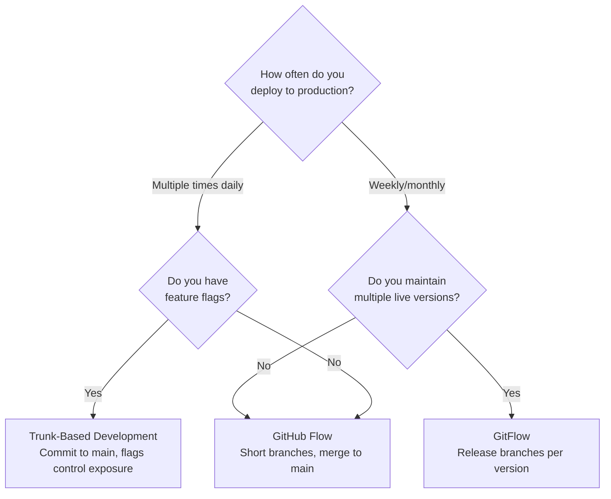
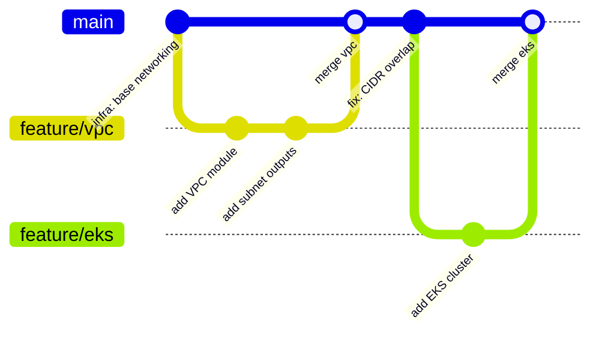
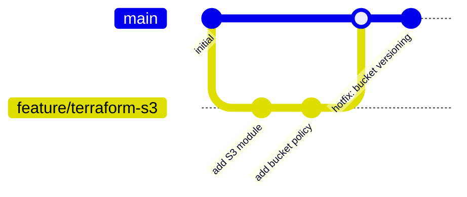
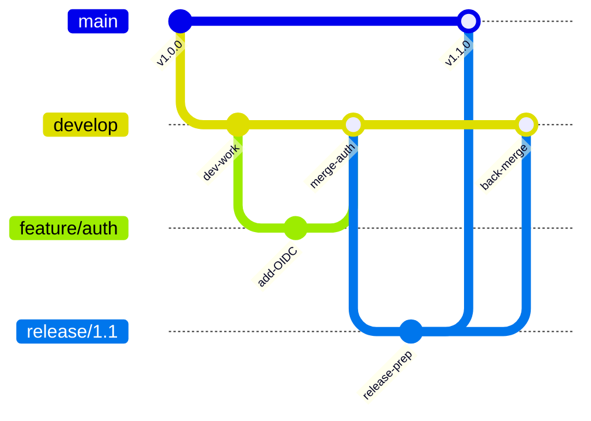

# Git Branching — Strategy, Structure, and Enterprise Patterns

> **Related sections:** [`merging/`](../merging/) for how branches are integrated; [`rebasing/`](../rebasing/) for updating branches from main; [`enterprise-workflows/`](../enterprise-workflows/) for how branch models connect to deployment pipelines; [`hooks/`](../hooks/) for enforcing branch naming with commit hooks.
>
> **Navigation:** [⌂ Index](../) | [← `fundamentals/`](../fundamentals/) | [`merging/` →](../merging/)

---

## Overview

A branch model is an engineering contract between your team and your deployment pipeline. Get it wrong and every release becomes manual reconciliation work. Get it right and the pipeline runs itself.

This document covers the dominant branch strategies, how to choose between them, and what naming conventions look like in regulated enterprise environments.

---

## Why Branching Strategy Matters

| Problem | Root cause |
|---|---|
| Long-lived branches with constant merge conflicts | Branch model doesn't match team cadence |
| CI can't tell which branch should deploy where | No environment mapping baked into the branch model |
| Feature work blocks hotfixes | No separation between feature flow and release flow |
| History is unreadable | No naming convention, no discipline |

The branch model should be decided once, written down, enforced by branch protection rules, and revisited only when your deployment model changes.

---

## Learning Objectives

- Articulate the tradeoffs between trunk-based development, GitHub Flow, and GitFlow
- Choose the right branch model for a given deployment cadence
- Enforce branch naming conventions with automation
- Manage branch lifecycle cleanly at scale
- Understand how branching strategy connects to CI/CD pipeline design

---

## Branch Model Decision Tree



---

## How Branches Work Internally

A branch is a file in `.git/refs/heads/` (or in `.git/packed-refs`) containing a 40-character commit SHA.

```bash
cat .git/refs/heads/main
# 3f8a2b1c4d5e6f7a8b9c0d1e2f3a4b5c6d7e8f90

git branch feature/infra-vpc
# Creates .git/refs/heads/feature/infra-vpc pointing to current HEAD
```

Creating a branch costs one filesystem write. Deleting it costs one filesystem delete. Branches are not copies of code.

---

## Branch Models

### Trunk-Based Development (preferred for CI/CD teams)

All engineers commit to `main` (trunk) continuously. Feature branches are short-lived — hours to a maximum of two days. Feature flags control what is exposed in production.



**When to use**: Teams with mature CI/CD, automated testing gates, and feature flags. Standard in Platform Engineering and SRE.

**When NOT to use**: Teams without automated test coverage. The trunk breaks constantly without tests.

**Feature flags for trunk-based development**: Code merged to `main` may not be activated in production. Use environment variables, LaunchDarkly, AWS AppConfig, or a simple `FEATURE_X_ENABLED=true` env var to control exposure. The flag is removed once the feature is stable.

```bash
# Example: simple env-var feature flag in Python
if os.environ.get("FEATURE_NEW_VPC_MODULE"):
    use_new_vpc_module()
else:
    use_legacy_vpc_module()
```

---

### GitHub Flow (good for most teams)

One long-lived branch (`main`). All work happens in short feature branches. Pull requests are required to merge. Deploys happen from `main`.



**When to use**: Teams deploying continuously from main. Simple model, easy to enforce.

**When NOT to use**: Products with multiple concurrent release versions in production.

---

### GitFlow (for versioned software releases)

Two permanent branches (`main`, `develop`). Feature branches come off `develop`. Release branches cut from `develop`. Hotfixes branch directly from `main`.



**When to use**: Software with versioned releases, enterprise products that maintain v1, v2, v3 simultaneously.

**When NOT to use**: Services deployed continuously. GitFlow overhead kills velocity when you are shipping daily.

---

## Branch Naming Conventions

Consistent naming enables automation. CI/CD pipelines, monitoring, and security scanners can use branch names to route behavior.

### Recommended convention

```
<type>/<scope>-<short-description>

feature/INFRA-1042-vpc-module
fix/INFRA-1098-cidr-overlap
hotfix/SEC-220-rotate-api-key
release/2024-q3
chore/update-terraform-providers
```

| Prefix | When to use |
|---|---|
| `feature/` | New functionality |
| `fix/` | Bug fixes that go through normal PR flow |
| `hotfix/` | Emergency fixes that bypass normal flow and go directly to `main` |
| `release/` | Release preparation branch |
| `chore/` | Maintenance — dependency updates, config cleanup |
| `docs/` | Documentation-only changes |
| `experiment/` | Exploratory work, not intended to merge |

### Branch naming rules (enforce with pre-receive hooks or CI)

- Lowercase only
- Hyphens as separators, not underscores
- Ticket reference where one exists
- No spaces or special characters
- Maximum 72 characters

---

## Practical Examples

### Create and push a feature branch

```bash
git checkout main
git pull origin main
git checkout -b feature/INFRA-1042-vpc-module

# Do work, then:
git add modules/vpc/
git commit -m "feat(vpc): add reusable VPC module for production environments"
git push -u origin feature/INFRA-1042-vpc-module
```

### Delete a branch after merge

```bash
# Locally
git branch -d feature/INFRA-1042-vpc-module

# Remote
git push origin --delete feature/INFRA-1042-vpc-module

# Clean up tracking references to deleted remote branches
git fetch --prune
```

### List branches with last commit info

```bash
git branch -v
# feature/INFRA-1042-vpc-module  3f8a2b1 feat(vpc): add reusable VPC module

git branch --sort=-committerdate | head -10
# Most recently active branches
```

### Visualize branch topology

```bash
git log --oneline --graph --all --decorate | head -30
```

---

## Expected Output

```bash
$ git branch -v
* feature/INFRA-1042-vpc-module  3f8a2b1 feat(vpc): add reusable VPC module
  main                            a1b2c3d chore: update provider versions
  release/2024-q3                 def4567 release: 2024 Q3 prep

$ git log --oneline --graph --all | head -8
* 3f8a2b1 (HEAD -> feature/INFRA-1042-vpc-module) feat(vpc): add reusable VPC module
* def4567 (main, origin/main) chore: update provider versions
* abc1234 fix: correct subnet CIDR block
```

---

## Real Enterprise Use Cases

**Platform team managing environment promotion**

Branches named after environments (`develop`, `staging`, `production`) with CI/CD triggering deployments automatically on merge. The branch model IS the deployment model.

**Regulated financial environment with change control**

`release/` branches are locked after cut. All changes go through an emergency change process. Hotfixes require approval before merging to `main` and back-merging to `release/`.

**Multi-product monorepo**

Branch names include product scope: `feature/payments/INFRA-1042-vpc`. CI uses the scope prefix to determine which pipelines to trigger.

---

## Common Mistakes

| Mistake | Why it is a problem |
|---|---|
| Long-lived feature branches (weeks) | Drift causes merge conflicts that are expensive to resolve |
| Pushing directly to `main` | Bypasses review and CI gates |
| Inconsistent naming | Automation cannot route on branch names reliably |
| Not pruning stale remote branches | Teams waste time on branches from closed tickets |
| Using `git branch -D` (force delete) | Can delete branches with unmerged work |

---

## Best Practices

- Set `main` as the default branch and protect it (require PR, require status checks)
- Enforce branch naming with a `.github/pull_request_template.md` and pre-receive hooks
- Keep feature branches under two days. If longer, use a feature flag
- Always branch from the latest `main` — not from someone else's feature branch
- Delete branches immediately after merge
- Run `git fetch --prune` regularly to stay current with remote state

---

## Troubleshooting

### "My branch is behind main by 50 commits"

```bash
git checkout feature/INFRA-1042-vpc-module
git fetch origin
git rebase origin/main
# Resolve any conflicts, then continue
git rebase --continue
```

### "I created a branch from the wrong base"

```bash
# Rebase the branch onto the correct base
git rebase --onto correct-base wrong-base feature/my-branch
```

### "Someone force-pushed to main and I lost commits"

```bash
# Check reflog on origin (if you have access)
git reflog show origin/main

# Or ask the engineer who force-pushed to check their local reflog
git reflog
```

---

## Interview Questions

**Q: What branch strategy would you recommend for a platform team running 10+ deployments per day?**
A: Trunk-based development. Short-lived feature branches (under 2 days), continuous integration into `main`, and feature flags to control exposure. GitFlow overhead kills velocity at that deployment cadence.

**Q: Your team uses GitFlow. A critical bug is found in production. Walk me through the hotfix process.**
A: Cut a `hotfix/` branch directly from the production tag (or `main`). Apply the minimal fix. Merge to `main` with `--no-ff` and tag the release. Then back-merge to `develop` so the fix is included in the next release cycle. Do not cut the hotfix from `develop` — `develop` may have unreleased work.

**Q: What is the difference between a branch and a tag in Git?**
A: A branch is a mutable pointer — it moves forward with each new commit. A tag is an immutable pointer — once created, it always refers to the same commit. Branches track evolving work; tags mark specific, permanent points in history like releases.

**Q: How would you enforce branch naming conventions across a team of 40 engineers?**
A: Use a `commit-msg` or `pre-push` hook via the pre-commit framework for local enforcement. Add a GitHub Actions workflow that validates the PR branch name against the naming pattern and blocks merge if it does not conform. Document the convention in `CONTRIBUTING.md`.

---

## Engineering Insight

**Choose a branching strategy based on team size and deployment frequency, not on what sounds sophisticated.** Trunk-based development works well for teams that deploy multiple times per day with good automated testing. GitFlow works well for teams with monthly release cycles and parallel support obligations. Using GitFlow for a team that wants to deploy daily is an organizational impediment, not a safety mechanism.

**Long-lived branches are a smell, not a strategy.** A feature branch that lives for more than 3 days is accumulating merge debt. After a week, the merge cost starts exceeding the development cost. Teams that routinely have 3-week branches have a process problem that branching strategy alone cannot fix — feature flags and incremental delivery are the actual solution.

**Branch protection rules on `main` are the baseline, not an advanced configuration.** Every production repository should have: require PRs, require status checks, no force push, no deletion, no bypass (including admins). These take 5 minutes to configure and prevent the most common categories of production incidents.

**The internal representation of a branch (40-byte pointer) means branching is essentially free.** Unlike SVN branches (server-side copies), Git branches are local, instantaneous, and cost nothing. Use them liberally for experiments, prototypes, and multi-day tasks. Delete them aggressively after merge.

**Naming conventions that include ticket numbers make branch management tractable.** `fix/INC-8847-rds-security-group` is unambiguous. `fix/rds` is not. At 50+ branches in a repository, disambiguation becomes critical for bulk operations like `git branch -d $(git branch | grep fix/)`. Include the ticket number.

---

## Production Checklist

### Branch strategy setup (new repository)

- [ ] Branch protection on `main`: no force push, require PRs, require CI, no bypass
- [ ] Branch naming convention documented in `CONTRIBUTING.md`
- [ ] Branch naming hook installed (pre-push validation)
- [ ] Maximum branch lifespan defined (TBD: 3 days; GitFlow: sprint length)
- [ ] Auto-delete merged branches enabled in repository settings

### Before creating a feature branch

- [ ] Starting from the correct base: `git fetch origin && git checkout -b feat/X origin/main`
- [ ] Ticket number included in branch name: `feat/INFRA-223-vpc-peering`
- [ ] Work is scoped to ≤ 3 days of effort (split if larger)

### Branch cleanup (weekly/monthly)

- [ ] List stale branches: `git for-each-ref --sort=creatordate refs/remotes/origin --format='%(creatordate:relative) %(refname:short)'`
- [ ] No branches older than 30 days without active PR
- [ ] Local branches pruned: `git remote prune origin && git branch -vv | grep 'gone' | awk '{print $1}' | xargs git branch -d`

---

## References

| Resource | URL |
|---|---|
| Git Branching — Basic Branching and Merging | https://git-scm.com/book/en/v2/Git-Branching-Basic-Branching-and-Merging |
| GitHub Flow | https://docs.github.com/en/get-started/quickstart/github-flow |
| Trunk Based Development | https://trunkbaseddevelopment.com |
| GitFlow | https://nvie.com/posts/a-successful-git-branching-model/ |
| git branch | https://git-scm.com/docs/git-branch |
