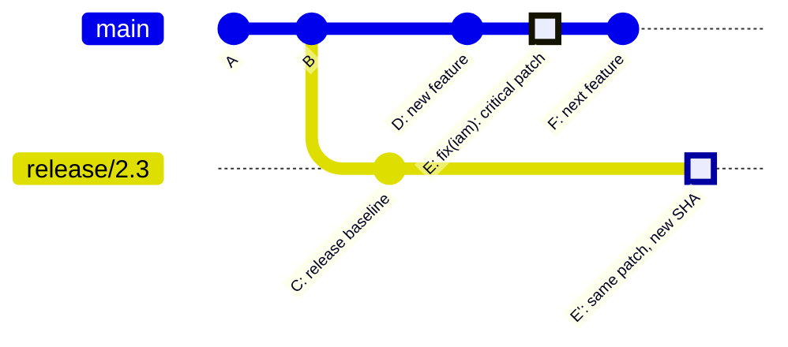

# Git Cherry-Pick — Selective Commit Application

> **Related sections:** [`merging/`](../merging/) when you want to bring in an entire branch; [`rebasing/`](../rebasing/) when you want to replay a series of commits; [`recovery/`](../recovery/) for recovering commits that need to be cherry-picked from a deleted branch; [`enterprise-workflows/`](../enterprise-workflows/) for cherry-pick in GitFlow hotfix workflows.
>
> **Navigation:** [⌂ Index](../) | [← `stash/`](../stash/) | [`tags/` →](../tags/)

---

## Overview

Cherry-pick applies one or more specific commits from one branch to another, creating new commits with the same changes but different SHAs. It is a surgical tool for situations where you need a specific change without bringing along everything else in a branch.



> `E'` on `release/2.3` has the identical diff as `E` on `main` but a **different SHA** — cherry-pick creates a new commit object, not a reference. The original `E` on `main` is unchanged.

---

## Why Cherry-Pick Matters

| Use case | Why cherry-pick is the right tool |
|---|---|
| Applying a production hotfix to an older release branch | The release branch should not receive all of `main`, just the fix |
| Backporting a security patch | Same reason — only the security fix, nothing else |
| Salvaging one good commit from an abandoned branch | Merge brings everything; cherry-pick brings one commit |
| Moving a commit that was applied to the wrong branch | Applied accidentally to `develop`, needed on `main` |

---

## When to Use It

- Hotfix applied to `main` must also reach `release/2024-q3`
- Security patch needs to land on multiple long-lived release branches simultaneously
- A feature is split across two PRs but one commit needs to ship first
- Recovering specific work from an abandoned branch

## When NOT to Use It

- When the full branch history needs to be integrated — use merge instead
- As a habit to avoid dealing with merge strategy decisions — it creates history debt
- When the same commit is cherry-picked into more than 2 branches repeatedly — this signals that your branch model is wrong. The same fix appearing in 4 release branches as 4 separate commits makes `git log` and `git blame` misleading
- When you cannot identify exactly which commit introduced a change — use `git log --cherry` first

---

## Finding Commits Not Yet Cherry-Picked

Before backporting to a release branch, verify which commits from `main` have not yet been applied:

```bash
# Show commits in main that are NOT yet in release/2024-q3
# (using symmetric difference: commits in main but not release/2024-q3)
git log --cherry-pick --right-only main...release/2024-q3 --oneline
# abc1234 fix(iam): correct role trust policy
# def5678 fix(security): rotate compromised key

# The inverse: what release/2024-q3 has that main does not
git log --cherry-pick --left-only main...release/2024-q3 --oneline
```

`--cherry-pick` filters out commits that have equivalent patches on both sides — i.e., commits that were already cherry-picked. This prevents double-applying a fix and getting a confusing "nothing to commit" result.

---

## How Cherry-Pick Works Internally

Cherry-pick computes the diff introduced by a commit (comparing it to its parent) and applies that diff as a new commit on the current branch.

New commit has:
- Same author, message, and diff as the original
- A new SHA (because the parent is different)
- A new committer entry (you, at this moment)

---

## Practical Examples

### Cherry-pick a single commit

```bash
git checkout release/2024-q3
git cherry-pick abc1234
```

### Cherry-pick with a custom message

```bash
git cherry-pick abc1234 -e
# Opens editor — you can add backport reference
```

### Cherry-pick multiple commits

```bash
git cherry-pick abc1234 def5678 789abcd
# Applied in order
```

### Cherry-pick a range of commits

```bash
# Apply commits from abc1234 up to and including def5678
git cherry-pick abc1234..def5678
# Note: abc1234 itself is excluded

# Include abc1234:
git cherry-pick abc1234^..def5678
```

### Cherry-pick without committing (stage only)

```bash
git cherry-pick --no-commit abc1234
# Applies the diff to the staging area without creating a commit
# Useful when you want to combine multiple cherry-picks into one commit
```

---

### Cherry-pick with signoff (for regulated projects)

```bash
git cherry-pick --signoff abc1234
# Appends: Signed-off-by: Akash Khurana <akash@example.com>
```

Required in projects following the Developer Certificate of Origin (DCO) process — common in Linux kernel contributions and some regulated enterprise environments.

---

## Expected Output

```bash
$ git cherry-pick abc1234
[release/2024-q3 3f8a2b1] fix(security): rotate compromised API key
 Date: Tue Jul 1 18:30:00 2025 +0000
 1 file changed, 2 insertions(+), 2 deletions(-)
```

### When a conflict occurs

```bash
$ git cherry-pick abc1234
error: could not apply abc1234... fix(security): rotate compromised API key
hint: After resolving the conflicts, mark them with
hint: "git add/rm <pathspec>", then run
hint: "git cherry-pick --continue"

# Edit conflicting files, then:
git add config/credentials.tf
git cherry-pick --continue

# Or abort entirely:
git cherry-pick --abort
```

---

## Hotfix Workflow — Full Example

Scenario: A critical security issue is fixed on `main` and must reach the current production release (`release/2024-q3`) within the hour.

```bash
# Identify the fix commit on main
git log main --oneline | grep "SEC-220"
# abc1234 fix(iam): remove wildcard from production role [SEC-220]

# Switch to the release branch
git checkout release/2024-q3
git pull origin release/2024-q3

# Apply the fix
git cherry-pick abc1234

# If the commit message needs a backport marker:
git cherry-pick abc1234 -e
# Add: Backport-of: abc1234 (main)
# Resolves: SEC-220

# Push
git push origin release/2024-q3

# Open a PR or notify the release manager, depending on your process
```

---

## Backport Convention

In teams that maintain multiple release branches, document cherry-picks clearly:

```
fix(iam): remove wildcard from production role [SEC-220]

Backport of: abc1234 from main
Release: 2024-q3
Resolves: SEC-220
Reviewed-by: security-team
```

This makes future `git log` searches fast and makes audit trails complete.

---

## Real Enterprise Use Cases

**Security Operations team**

CVE identified in a library used across 4 release branches. The fix commit from `main` is cherry-picked to each release branch in sequence. Each cherry-pick commit includes the CVE reference and a link to the security advisory.

**SRE hotfix process**

Production is on `release/2024-q3`. A memory leak fix is committed to `main` via standard PR. SRE on-call cherry-picks the commit to `release/2024-q3`, triggers the deployment pipeline, and closes the incident.

**Feature flagging split**

A large feature PR is broken into two: infrastructure commits that can ship now, and application logic commits blocked on a dependency. Cherry-pick the infrastructure commits to `main` directly. The rest stays in the feature branch.

---

## Common Mistakes

| Mistake | Consequence |
|---|---|
| Cherry-picking a merge commit without `-m` | Git doesn't know which parent to use for the diff |
| Cherry-picking to many branches manually | Creates duplicate history — automate with a script |
| Not noting cherry-picks in commit messages | Future engineers can't tell why the same fix appears in multiple branches |
| Cherry-picking instead of fixing a broken branch strategy | Masks the root cause |

### Handling merge commits

```bash
# -m 1 means "use the first parent as the mainline"
# For a standard PR merge commit, -m 1 is almost always correct
git cherry-pick -m 1 <merge-commit-sha>
```

---

## Best Practices

- Always note the source commit SHA in the cherry-pick commit message
- Use `--no-commit` when combining multiple cherry-picks into a single logical commit
- For recurring backport patterns, write a script instead of doing it manually
- After cherry-picking, run tests on the target branch before pushing
- Prefer cherry-pick for single commits; for multiple sequential commits, consider merging a dedicated backport branch

---

## Troubleshooting

### "Cherry-pick applied but the change doesn't look right"

The diff was applied but the context around it changed since the original commit. Review the resulting file carefully.

```bash
git show HEAD  # Review what was actually committed
git diff HEAD~1  # Compare to the state before cherry-pick
```

### "I cherry-picked the wrong commit"

```bash
# Before pushing:
git reset --hard HEAD~1

# After pushing (creates a revert commit):
git revert HEAD
```

### "Cherry-pick says 'nothing to commit'"

The change from that commit is already present on the current branch (from a previous merge or cherry-pick).

```bash
git cherry-pick --skip
```

---

## Interview Questions

**Q: When would you use cherry-pick over merge or rebase?**
A: Cherry-pick when you need to apply a specific fix to a different branch without bringing in other work. Classic example: a security fix is committed to `main`. You need it in the `release/1.4` branch immediately. You cherry-pick just that commit rather than merging all of `main` into the release branch.

**Q: You cherry-pick a commit and get a conflict. How do you resolve it?**
A: Resolve the conflict files normally, then `git add <resolved-files>`, then `git cherry-pick --continue`. If you want to abandon: `git cherry-pick --abort`. If the change is no longer applicable, use `--skip` to skip that specific commit and continue the range.

**Q: What happens to the original commit SHA when you cherry-pick?**
A: Cherry-pick creates a brand new commit object with a new SHA. The content is the same (subject to conflict resolution), but the parent is different — the cherry-picked commit's parent is the target branch tip, not the original parent. The original commit still exists on the source branch unchanged.

**Q: How do you determine which commits from `main` have not yet been backported to a release branch?**
A: Use `git log --cherry-pick --right-only main...release/2024-q3 --oneline`. The `--cherry-pick` flag filters out commits whose patches already exist on the other side, so only genuinely un-backported commits appear.

**Q: You need to cherry-pick a merge commit. What is the `-m` flag for?**
A: A merge commit has two parents. `-m 1` tells cherry-pick to use the first parent (the branch that was merged into, typically `main`) as the mainline for computing the diff. Without `-m`, cherry-pick doesn't know which parent to use and fails. `-m 1` is almost always the correct choice for a standard GitHub PR merge commit.

---

## Engineering Insight

**Cherry-pick is a point solution for exceptions, not a substitute for a branching strategy.** The canonical use case is backporting a specific fix to a release branch that cannot be updated by merging. If you find yourself cherry-picking the same fix to 4 different release branches on a weekly basis, that is a signal that your release strategy needs to change.

**`git log --cherry-pick --right-only origin/release-v2.3...main` is the backport audit command.** It shows commits on `main` that have no equivalent on the release branch. Run this before every release cut to catch fixes that were never backported. This single command has prevented multiple production incidents where a known fix was not deployed to the maintenance branch.

**Cherry-pick preserves the original commit message but creates a new SHA.** This is important for traceability. Always append `(cherry-picked from <sha>)` or reference the source PR in the commit message — `git cherry-pick -x` does this automatically. Without it, the audit trail between release branches and `main` is broken.

**A sequence of cherry-picks that reconstitutes 80% of `main` is a merge.** If you are regularly cherry-picking large numbers of commits to a branch, you should be merging (or rebasing) instead. Cherry-pick has higher cognitive overhead than merge and should be reserved for the cases where merge is genuinely inappropriate.

**Conflicts during cherry-pick are more confusing than merge conflicts.** The conflict is between the cherry-picked commit's delta and the target branch's current state. The common ancestor may be very different from either. When a cherry-pick produces conflicts, prefer `git merge` with manual conflict resolution — the conflict semantics are clearer.

---

## References

| Resource | URL |
|---|---|
| git cherry-pick | https://git-scm.com/docs/git-cherry-pick |
| Advanced Merging | https://git-scm.com/book/en/v2/Git-Tools-Advanced-Merging |
| Revert vs Cherry-pick | https://git-scm.com/docs/git-revert |
