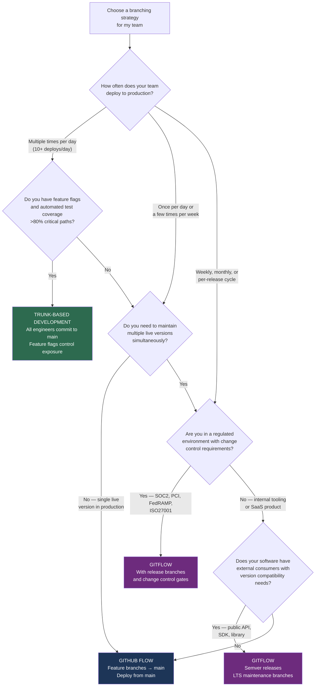
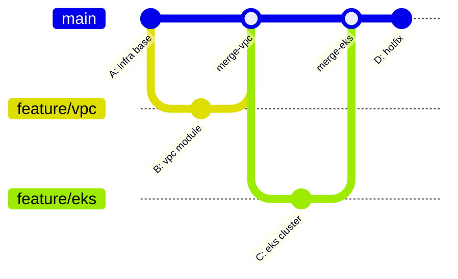
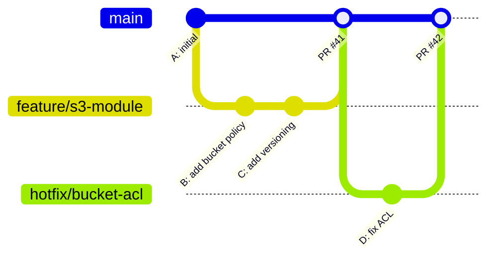
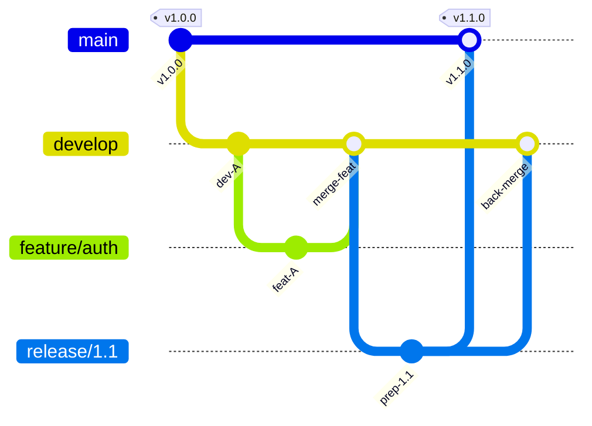

# Decision Guide — Which Branching Strategy?

> **Navigation:** [`← Squash or Not?`](squash-or-not.md) | [`← Decision Guides Index`](README.md)
>
> **Related:** [`branching/`](../branching/) | [`enterprise-workflows/`](../enterprise-workflows/) | [`tags/`](../tags/)

---

## The Question

Your team is adopting or changing a branching strategy. Which one fits your deployment model, team size, and regulatory environment?

This decision shapes your entire CI/CD pipeline, release cadence, and code review process. It is not easily reversed once adopted.

---

## Decision Flowchart

---

## Strategy Comparison

| Factor | Trunk-Based | GitHub Flow | GitFlow |
|---|---|---|---|
| Deploy cadence | 10+/day | Daily to weekly | Weekly to monthly |
| Branch lifetime | Hours to 2 days | Days to weeks | Weeks to months |
| Release branches | None | None | Yes — `release/*` |
| Hotfix process | Commit to main + flag | PR to main | Branch from production tag |
| CI/CD complexity | High — needs flags | Medium | High — multiple branches |
| Audit trail | Commit history | Merge commits | Merge commits + release branches |
| Team size fit | Any (needs maturity) | 3–50 engineers | 10–200 engineers |
| Recommended for | Platform/SRE | SaaS products | Enterprise software, APIs |

---

## Trunk-Based Development

**Requirements before adopting:**
- Automated test coverage on critical paths
- Feature flag system (env vars, LaunchDarkly, AppConfig)
- CI that runs on every commit, results in under 10 minutes
- Engineers comfortable with frequent small commits

**What breaks it:** Low test coverage. A broken test in trunk stops every engineer. Without tests, trunk = constant production instability.

---

## GitHub Flow

**Requirements:**
- Protected `main` branch with required PR reviews
- CI status check required before merge
- Deploy from `main` (or from tags on `main`)

**What breaks it:** Long-lived feature branches. When branches live for weeks, merge conflicts grow and the model degrades into de-facto GitFlow without the structure.

---

## GitFlow

**Requirements:**
- Discipline to always fix on `main` first, cherry-pick to release branches
- Release manager role for branch cuts and back-merges
- Tooling that enforces the process (hooks, branch protection, CI)

**What breaks it:** Teams that fix on release branches and forget to back-merge to `develop`. Six months later, a bug that was "fixed" appears in the next major release because the fix never made it back.

---

## Switching Strategies

Changing branching strategies is a team migration, not a configuration change. Plan:

1. Document the current strategy and its pain points
2. Choose the target strategy based on deployment model
3. Set a migration date (start of a sprint or release cycle)
4. Update `CONTRIBUTING.md` before the migration
5. Update branch protection rules on the migration date
6. Archive or clean up old branches
7. Train the team with a 30-minute walkthrough

---

## Engineering Notes

The worst branching strategy is the one that evolved organically without being documented. Every team has one — `main`, some feature branches, an old `develop` that nobody quite knows the status of, and a `hotfix` branch from 8 months ago.

The second worst is applying GitFlow to a team that deploys daily. GitFlow is designed for versioned software releases. Using it for a continuously-deployed service creates bureaucratic overhead — release branches, back-merges, long-lived develop branches — for zero benefit.

**The honest assessment:** Most infrastructure teams should be on GitHub Flow or Trunk-Based. GitFlow is for library maintainers and enterprise software that ships quarterly. If you're running Terraform modules deployed by a CI pipeline, you don't need `develop` and `release/*` branches. You need protected `main`, short feature branches, and tags for deployment references.

Pick the simplest model that fits your deployment reality. The simplest model is always the easiest to enforce and explain.
