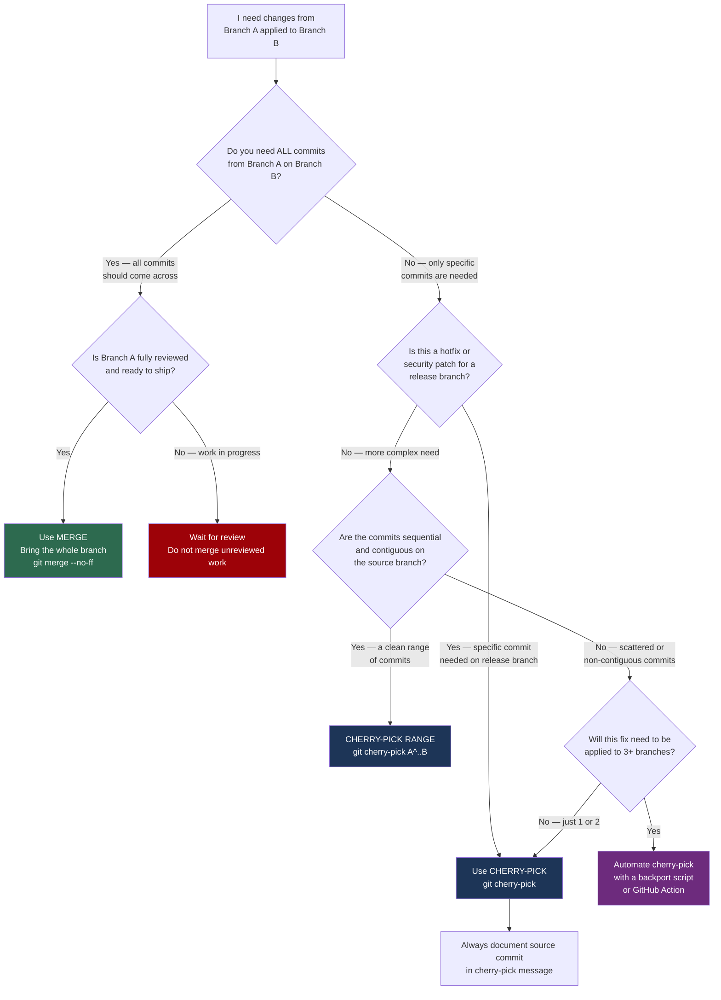

# Decision Guide — Cherry-Pick or Merge?

> **Navigation:** [`← Reset or Revert?`](reset-or-revert.md) | [`Stash or Branch? →`](stash-or-branch.md)
>
> **Related:** [`cherry-pick/`](../cherry-pick/) | [`merging/`](../merging/) | [`enterprise-workflows/`](../enterprise-workflows/)

---

## The Question

You need a change from one branch applied to another. Do you cherry-pick specific commits, or merge the entire branch?

The wrong choice creates either too much or too little — a full merge brings everything you don't want, a cherry-pick applied blindly creates duplicate history you can't reconcile.

---

## Decision Flowchart



---

## Outcomes Explained

### Use `git merge --no-ff`

When you need all commits from the source branch and the branch is fully reviewed:

```bash
git checkout main
git merge --no-ff feature/INFRA-1042-vpc-module
```

This preserves the full commit history and creates a merge commit showing when the integration happened.

---

### Use `git cherry-pick` for specific commits

The standard hotfix backport pattern:

```bash
# Find the fix on main
git log main --oneline | grep "SEC-220"
# abc1234 fix(iam): remove wildcard from production role [SEC-220]

# Apply to the release branch
git checkout release/2024-q3
git cherry-pick abc1234 -e
# Add backport reference in editor:
# Backport-of: abc1234 (main) | Resolves: SEC-220

git push origin release/2024-q3
```

---

### Use `git cherry-pick` for a commit range

```bash
# Find the range
git log main --oneline | grep "INFRA-1099"
# def5678 feat(eks): add spot instance support [INFRA-1099]
# cba9876 feat(eks): add managed node group [INFRA-1099]
# abc1234 feat(eks): initial EKS module [INFRA-1099]

# Cherry-pick the range (abc1234 exclusive, def5678 inclusive)
git cherry-pick abc1234^..def5678
```

---

### Find what hasn't been backported yet

Before cherry-picking, verify which commits from `main` are not yet on the release branch:

```bash
git log --cherry-pick --right-only main...release/2024-q3 --oneline
# abc1234 fix(iam): production role wildcard [SEC-220]
# def5678 fix(vpc): subnet CIDR overlap [INFRA-1099]
```

---

## Quick Reference

| Scenario | Decision | Command |
|---|---|---|
| All of feature branch, reviewed | Merge | `git merge --no-ff feature/` |
| Security hotfix to release branch | Cherry-pick | `git cherry-pick <sha>` |
| Range of sequential commits | Cherry-pick range | `git cherry-pick A^..B` |
| Same fix to 3+ branches | Script | Backport script or GitHub Action |
| Partial work, not all commits | Cherry-pick specific | `git cherry-pick <sha1> <sha2>` |
| Merge commit cherry-pick | Cherry-pick with `-m` | `git cherry-pick -m 1 <merge-sha>` |

---

## Warning Signs

**You are cherry-picking too much if:**
- The same commit SHA appears in 4+ branches
- You are cherry-picking entire feature branches commit-by-commit
- Your `git log` has the same commit message on multiple branches with different SHAs

These are signs your branch model is wrong, not that you need more cherry-picks. Cherry-pick is a surgical tool. Using it to move entire features means you need a better release branch strategy.

---

## Engineering Notes

Cherry-pick is most valuable in two precise scenarios: hotfix backporting and salvaging specific commits from abandoned branches. Outside of these two cases, a merge or rebase is almost always the cleaner choice.

The most common cherry-pick mistake is applying the same commit to multiple branches without documenting which branch it came from. Three months later, nobody knows which is the canonical version. Always include the source SHA and branch in the cherry-pick commit message.

Automate backport workflows when your team is applying the same fix to more than two release branches. A GitHub Action that cherry-picks on PR label is 30 minutes of setup and saves hours per release cycle. See [`enterprise-workflows/`](../enterprise-workflows/) for patterns.
