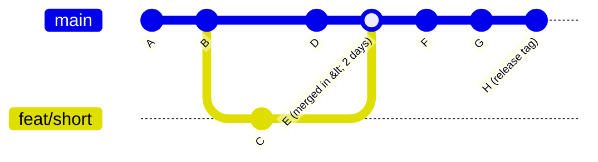
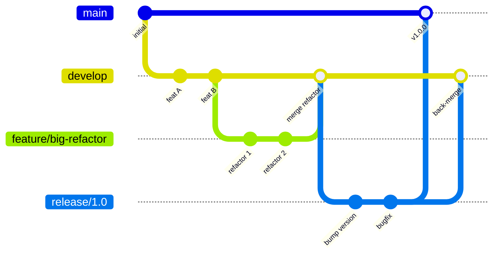
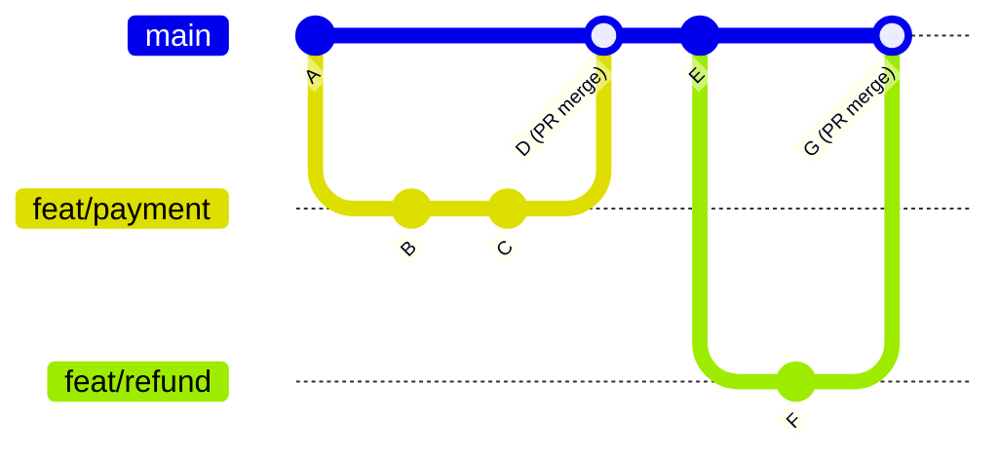

# Decision Guide: GitFlow vs Trunk-Based Development

Two fundamentally different answers to the same question: how should a team manage parallel development work and coordinate releases?

---

## Quick Decision

```
Are you deploying to production more than once per week?
└─ Yes → Trunk-Based Development
└─ No → GitFlow (or GitHub Flow as a middle ground)

Do you maintain multiple production versions simultaneously?
└─ Yes → GitFlow (you need release/ and hotfix/ branches)
└─ No → TBD or GitHub Flow

Is your team > 20 engineers on a single service?
└─ Yes → TBD with feature flags + merge queue
└─ No → Either works; choose based on deployment frequency

Are you a regulated industry requiring change control windows?
└─ Yes → GitFlow (release branches enforce the window)
└─ No → TBD
```

---

## The Models

### Trunk-Based Development (TBD)

All engineers commit to a single shared branch (`main` / `trunk`) frequently. Feature branches exist, but they are short-lived (< 2 days). Code that isn't ready for users is hidden behind **feature flags**, not in a separate branch.



**Principles:**
- `main` is always deployable — CI must pass before merge
- Feature branches live for hours to 2 days, not weeks
- Incomplete features go behind flags (`if featureEnabled("new-checkout"): ...`)
- Every merge to `main` is potentially a production deployment
- Hotfixes go directly to `main` (which is production)

---

### GitFlow

A structured branching model with long-lived branches for each lifecycle phase. Vincent Driessen's original model from 2010.



**Branches:**
- `main`: production code, tagged at each release
- `develop`: integration branch, always one step ahead of `main`
- `feature/*`: individual features, branch from `develop`, merge back to `develop`
- `release/*`: release candidate, branch from `develop`, merge to `main` + `develop`
- `hotfix/*`: emergency fix, branch from `main`, merge to `main` + `develop`

---

### GitHub Flow (Middle Ground)

A simplified model: just `main` and short-lived feature branches. No `develop`, no `release/`, no `hotfix/`. Suitable for teams that deploy less frequently than TBD but don't need GitFlow's full structure.



- Every PR is deployed to a preview environment before merge
- Merge to `main` triggers deployment to production
- No `develop` branch — `main` is the source of truth

---

## Comparison Matrix

| Criteria | TBD | GitHub Flow | GitFlow |
|----------|-----|------------|---------|
| Deployment frequency | Multiple per day | Daily to weekly | Weekly to monthly |
| Branch lifespan | Hours to 2 days | Days to 1 week | Days to weeks |
| Supports multiple production versions | No | Difficult | Yes (release branches) |
| Merge conflict frequency | Very low | Low | High |
| Feature flags required | Yes | Recommended | No |
| Rollback mechanism | Feature flags + `git revert` | `git revert` | Back-merge + hotfix |
| CI/CD complexity | Lower | Medium | Higher |
| Team size sweet spot | 2–200+ | 2–30 | 5–30 |
| Regulated environments | Difficult | Medium | Well-supported |

---

## When GitFlow Fails

GitFlow was designed for scheduled releases in 2010. It creates friction in modern continuous delivery contexts:

1. **Long-lived feature branches cause merge conflicts.** A 2-week feature branch with 50 commits on `develop` in between will have complex conflicts.
2. **`develop` is rarely stable.** Multiple feature branches merging simultaneously means `develop` is frequently broken, which delays release branches.
3. **Release branches delay feedback.** A bug found during release testing means a commit to `release/`, back-merged to `develop`, while `main` waits. The cycle is slow.
4. **Hotfix back-merge complexity.** A hotfix applied to `main` must be back-merged to `develop` and any in-progress `release/` branches. This is error-prone.
5. **Too many moving parts for small teams.** A 5-person team does not need `develop`, `release/`, and `hotfix/` branches.

---

## When TBD Fails

TBD requires engineering discipline that is difficult to enforce:

1. **Feature flags are mandatory.** Without them, incomplete features reach production. This requires a feature flag infrastructure (LaunchDarkly, Unleash, custom) that has its own cost and complexity.
2. **CI must be fast.** If CI takes 45 minutes, "merge to main multiple times per day" is unrealistic. TBD requires a CI investment.
3. **Team culture must support it.** Engineers accustomed to "don't touch my branch" resist TBD's shared trunk ownership.
4. **Long-running migrations are hard.** A 3-month database schema migration cannot be done in 2-day branches without careful flag-gating at each step.

---

## Hybrid Approaches

For teams that cannot go fully TBD but want shorter feedback loops than GitFlow:

**Scaled TBD (suitable for monorepos, 50+ engineers):**
- `main` = trunk
- Feature branches capped at 3 days
- Merge queue (GitHub's native or Mergify) to serialize merges
- Per-team CI that runs only affected paths

**Simplified GitFlow (drop develop):**
- Remove `develop` — use `main` as the integration branch
- `feature/` branches merge to `main` via PR
- `release/` branches still cut from `main` when needed
- Hotfixes go to `main` then to any open `release/` branch

---

## Decision Summary

| Your situation | Recommendation |
|----------------|---------------|
| SaaS, continuous deployment, < 50 engineers | Trunk-Based Development |
| Open source, release every 1–4 weeks | GitHub Flow |
| Software product with versioned releases (v1.x, v2.x) | GitFlow |
| Enterprise with change control windows | GitFlow |
| SaaS, > 50 engineers, monorepo | Scaled TBD + merge queue |
| Regulated (HIPAA, PCI, SOX) requiring audit trail | GitFlow or GitHub Flow with required PR reviews |

---

## Related

- [Branching Reference](../branching/README.md)
- [Enterprise Workflows](../enterprise-workflows/README.md)
- [Branching Strategy Decision Guide](branching-strategy.md)
- [Decision Guides Index](README.md)

---

[← SSH vs HTTPS](ssh-vs-https.md) | [Submodule vs Subtree →](submodule-vs-subtree.md)
