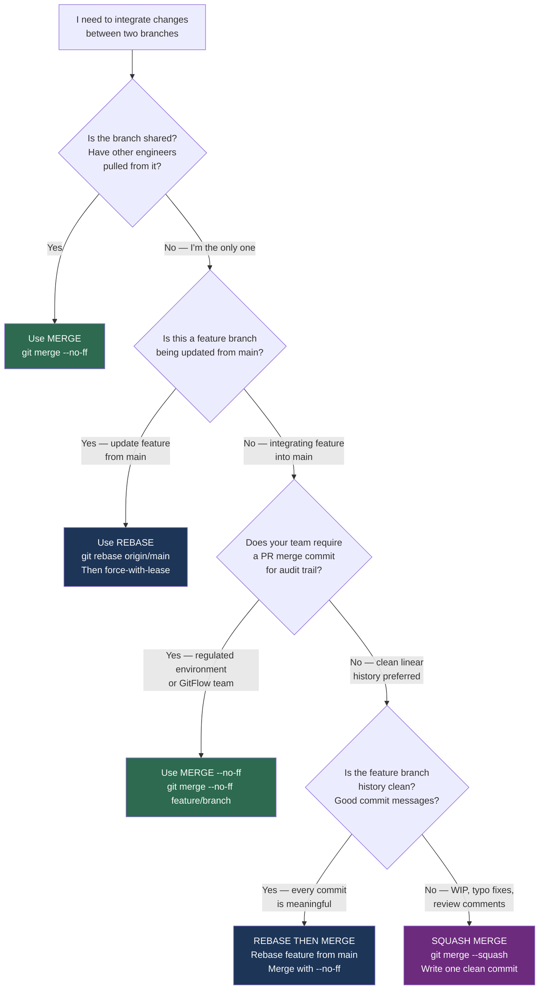

# Decision Guide — Merge or Rebase?

> **Navigation:** [`← Decision Guides Index`](README.md) | [`Reset or Revert? →`](reset-or-revert.md)
>
> **Related:** [`merging/`](../merging/) | [`rebasing/`](../rebasing/) | [`branching/`](../branching/)

---

## The Question

You have a feature branch with commits that need to be integrated. Do you merge or rebase?

This is the most common Git decision in daily engineering. Get it wrong on a shared branch and you rewrite history for your teammates.

---

## Decision Flowchart



---

## Outcomes Explained

### Use `git merge --no-ff`
**When:** Shared branches. Other engineers have pulled. Any branch in a GitFlow `develop` or `release` pattern. Back-merging hotfixes.

```bash
git checkout main
git merge --no-ff feature/INFRA-1042-vpc-module \
  -m "feat: merge VPC module [INFRA-1042]"
```

**History produced:**
```
*   a1b2c3d (HEAD -> main) feat: merge VPC module [INFRA-1042]
|\
| * 3f8a2b1 feat(vpc): add transit gateway outputs
| * 2e7d9c0 feat(vpc): add flow log configuration
| * 1a6c8b4 feat(vpc): initial VPC module
|/
* def5678 chore: update provider versions
```

The merge commit shows that this work arrived together, at a specific point in time.

---

### Use `git rebase origin/main` (feature branch update)
**When:** You want to keep your feature branch current without a merge commit. You are the only one using this branch.

```bash
git checkout feature/INFRA-1042-vpc-module
git fetch origin
git rebase origin/main
git push --force-with-lease origin feature/INFRA-1042-vpc-module
```

**Never** rebase a branch other people have pulled. Their next `git pull` will produce duplicate commits or conflicts.

---

### Use squash merge
**When:** Feature branch has 8 WIP commits, 3 "fix review comments" commits, and 2 "typo" commits. Main branch history should not carry this noise.

```bash
git checkout main
git merge --squash feature/INFRA-1042-vpc-module
git commit -m "feat(vpc): add production VPC module [INFRA-1042]

Adds reusable VPC module with:
- Multi-AZ subnet configuration
- Flow log integration
- Transit gateway attachment outputs

PR: #142"
```

**Trade-off:** Individual commit authorship is lost on main. The PR thread on GitHub retains the original commits for reference.

---

## Quick Reference

| Scenario | Command | Rationale |
|---|---|---|
| Update feature branch from main | `git rebase origin/main` | Clean history, no merge commits |
| Merge reviewed PR, need audit trail | `git merge --no-ff` | Preserves branch existence in history |
| Merge PR, messy branch history | `git merge --squash` | One clean commit per feature |
| Back-merge hotfix to develop | `git merge --no-ff` | Explicit record that fix was merged |
| Shared release branch | Never rebase | Rewriting shared history breaks teammates |

---

## The One Rule

> **Never rebase commits that other engineers have based work on.**

Everything else is a tradeoff. The shared-branch rule is absolute. Breaking it requires a team-wide emergency recovery.

---

## Engineering Insight

The merge vs rebase debate is the most over-argued topic in Git. Most teams spend more time debating this than it is worth.

**Pragmatic take from production:**

1. **Default to merge for anything touching a shared branch.** The risk of breaking a teammate's history is not worth the aesthetic benefit of a linear graph.

2. **Rebase your own feature branches before opening a PR.** Clean history makes review faster and makes `git bisect` more reliable.

3. **Use squash merge when the branch has exploratory commits.** Reviewers see the intent; the history sees one clean unit.

4. **Pick one strategy per repository and document it.** The cost of inconsistency is higher than the cost of choosing the "wrong" strategy.

5. **`--force-with-lease` instead of `--force` always.** The lease checks that nobody pushed to the remote since you last fetched. `--force` does not.

The teams that argue longest about merge vs rebase are usually the ones that haven't documented their choice. Once it's in `CONTRIBUTING.md`, the debate ends.
