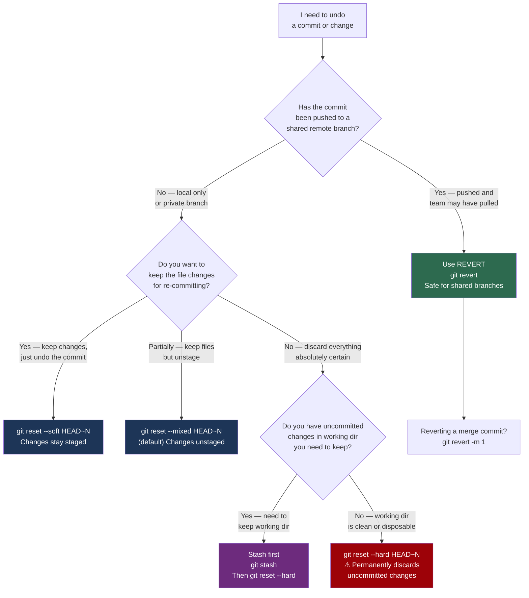

# Decision Guide — Reset or Revert?

> **Navigation:** [`← Merge or Rebase?`](merge-or-rebase.md) | [`Cherry-Pick or Merge? →`](cherry-pick-or-merge.md)
>
> **Related:** [`recovery/`](../recovery/) | [`fundamentals/`](../fundamentals/) | [`troubleshooting/`](../troubleshooting/)

---

## The Question

Something went wrong. A commit needs to be undone. Do you `git reset` or `git revert`?

This is the most dangerous Git decision. `git reset --hard` on a shared branch is a production incident. `git revert` is always safe. Choosing wrong costs the team hours.

---

## Decision Flowchart



---

## Outcomes Explained

### `git revert` — Always Safe on Shared Branches

Creates a new commit that reverses the changes. Does not rewrite history. Teammates are unaffected.

```bash
# Revert a single commit
git revert abc1234
# Opens editor for revert commit message
# Press :wq to accept default message

# Revert without opening editor
git revert --no-edit abc1234

# Revert a range (reverting in reverse order to avoid conflicts)
git revert HEAD~3..HEAD

# Push immediately — teammates see the reverting commit
git push origin main
```

**Revert a merge commit:**

```bash
# -m 1 = use first parent (the branch that was merged INTO) as the mainline
git revert -m 1 <merge-commit-sha>
git push origin main
```

**History produced:**
```
* f9a8b7c (HEAD -> main) Revert "feat(vpc): add VPC module [INFRA-1042]"
* a1b2c3d feat(vpc): add VPC module [INFRA-1042]
```

---

### `git reset --soft HEAD~N` — Undo Commits, Keep Work Staged

```bash
# Undo the last 2 commits, keep all changes staged and ready to re-commit
git reset --soft HEAD~2

git status
# Changes to be committed:
#   modified: modules/vpc/main.tf
#   modified: modules/vpc/outputs.tf

# Re-commit as one clean commit
git commit -m "feat(vpc): add VPC module with flow log integration [INFRA-1042]"
```

**Use case:** You made 3 commits that should have been 1. `--soft` lets you recommit as a single, clean unit.

---

### `git reset --mixed HEAD~N` — Undo Commits, Keep Work Unstaged

```bash
# Undo the last commit, keep changes in working directory but unstaged
git reset HEAD~1

git status
# Changes not staged for commit:
#   modified: modules/vpc/main.tf

# Re-stage selectively
git add -p modules/vpc/main.tf
git commit -m "feat(vpc): add subnet configuration"
```

**Use case:** You staged everything with `git add .` and committed, but the commit mixed multiple concerns. `--mixed` lets you re-stage more carefully.

---

### `git reset --hard HEAD~N` — Nuclear Option

```bash
# ⚠ Permanently destroys uncommitted changes in working directory
# Only use on private branches or when you are certain

git reset --hard HEAD~1
# HEAD is now at def5678 chore: update provider versions

# If this was a mistake — check reflog immediately (before GC runs)
git reflog
# HEAD@{0}: reset: moving to HEAD~1
# HEAD@{1}: commit: feat(vpc): add VPC module   ← this is what you lost
git reset --hard HEAD@{1}  # Restore
```

---

## Quick Reference

| Scenario | Command | Risk |
|---|---|---|
| Undo pushed commit on shared branch | `git revert <sha>` | Zero — safe for teams |
| Undo pushed merge commit | `git revert -m 1 <sha>` | Zero — safe for teams |
| Undo local commit, keep changes staged | `git reset --soft HEAD~1` | Local only |
| Undo local commit, unstage changes | `git reset --mixed HEAD~1` | Local only |
| Nuke local commit and all changes | `git reset --hard HEAD~1` | HIGH — unrecoverable working dir |
| Undo last N commits on shared branch | `git revert HEAD~N..HEAD` | Zero — creates revert commits |

---

## The Inviolable Rule

> **Never `git reset --hard` a branch that has been pushed to a shared remote.**

This requires a force push to fix, which rewrites history your teammates have pulled. This is a production incident. Always use `git revert` on shared branches.

---

## Engineering Notes

`git reset --hard` is one of the most misused commands in Git. Engineers reach for it when they should reach for `git revert`, because `--hard` *feels* cleaner — it removes the mistake from history. But on a shared branch, that cleanliness comes at the cost of every teammate's local clone.

**Hard lessons from production:**

- `git revert` looks messy in the log but it is transparent. Future engineers can see what was reverted, when, and why. `git reset --hard` + force push makes the mistake invisible — but also makes the history a lie.
- If you must force push after a reset, always use `--force-with-lease`. It fails if someone else pushed since you last fetched — saving you from overwriting a teammate's commits.
- If you reset the wrong thing, act immediately. `git reflog` retains the previous state for 90 days. `git gc --prune=now` destroys it permanently — never run that after a mistake.
- Document the reason for a revert in the commit message. "Revert feat(vpc)" with no explanation forces every engineer who reads the log to dig into the PR thread to understand why.
