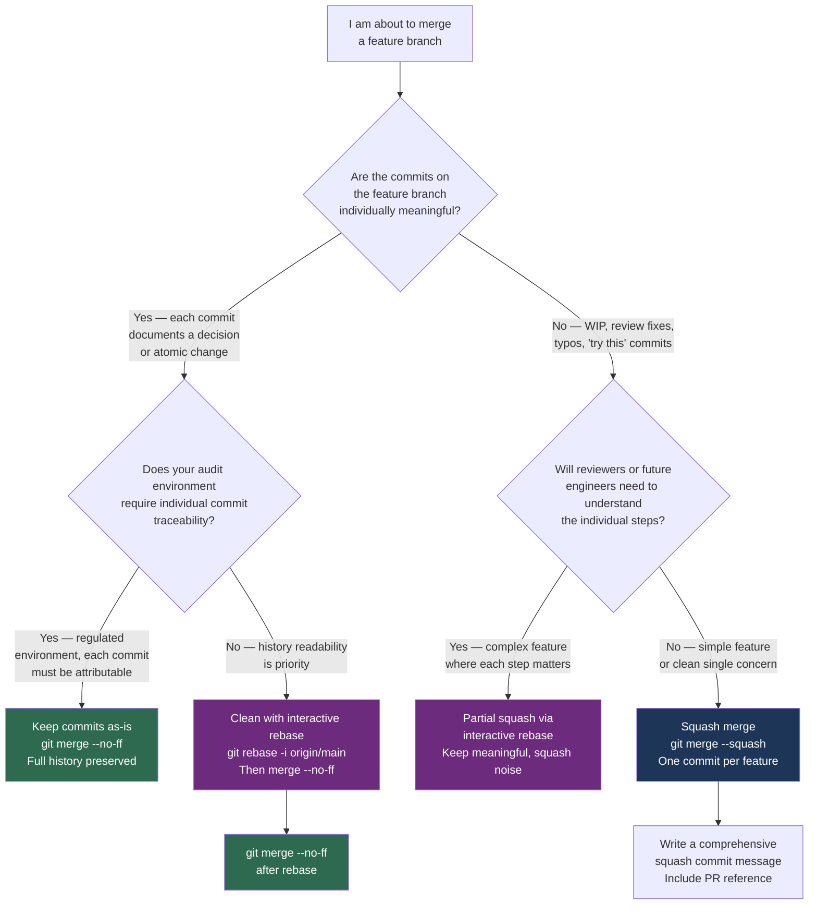

# Decision Guide — Squash or Not?

> **Navigation:** [`← Stash or Branch?`](stash-or-branch.md) | [`Branching Strategy →`](branching-strategy.md)
>
> **Related:** [`rebasing/`](../rebasing/) | [`merging/`](../merging/) | [`best-practices/`](../best-practices/)

---

## The Question

Before merging a feature branch, should you squash its commits into one, keep them as-is, or clean them up with interactive rebase?

This affects the permanent record of what happened in your codebase. There is no universal right answer — but there are clear wrong answers depending on your context.

---

## Decision Flowchart



---

## Outcomes Explained

### Keep commits — Clean, meaningful branch history

When each commit on the feature branch stands alone as a unit of intent:

```bash
# Feature branch history is already clean:
# 3f8a2b1 feat(vpc): add multi-AZ subnet configuration
# 2e7d9c0 feat(vpc): add flow log integration
# 1a6c8b4 feat(vpc): add transit gateway attachment

git checkout main
git merge --no-ff feature/INFRA-1042-vpc-module
```

Future `git bisect` can identify which specific change introduced a regression. Each commit is individually revertable. The history tells a story.

---

### Squash merge — One commit per feature

When the branch has noise that shouldn't be immortalized:

```bash
# Feature branch history is messy:
# 7 commits total: fix, wip, fix review comment, fix, another fix, final, done

git checkout main
git merge --squash feature/INFRA-1042-vpc-module
git commit -m "feat(vpc): add production VPC module [INFRA-1042]

Implements reusable VPC module for production environments:
- Multi-AZ subnet configuration with configurable CIDR ranges
- VPC flow log integration with S3 destination
- Transit gateway attachment with configurable route table

Closes: INFRA-1042
PR: #142
Reviewed-by: @platform-team"
```

The squash message should be comprehensive — it's the permanent record. The original commits remain accessible in the PR thread on GitHub.

---

### Interactive rebase — Clean up, then merge

When the branch is partly meaningful and partly noise:

```bash
git checkout feature/INFRA-1042-vpc-module
git fetch origin
git rebase -i origin/main

# In the editor:
# pick 1a6c8b4 feat(vpc): add transit gateway attachment
# fixup 2e7d9c0 fix: typo in variable name
# pick 3f8a2b1 feat(vpc): add flow log integration
# fixup 4b7d8e9 fix: address review comment on log retention

# Result: 2 clean commits instead of 4 noisy ones

git checkout main
git merge --no-ff feature/INFRA-1042-vpc-module
```

Use `git commit --fixup <sha>` during development to mark commits for squashing, then `git rebase -i --autosquash` to arrange them automatically.

---

## Commit Quality Assessment

Ask this about each commit before deciding to squash or keep:

| Commit passes if... | Commit should be squashed if... |
|---|---|
| Message explains a decision, not just a change | Message is "fix", "wip", "update", "review comments" |
| The diff is one logical unit | The diff mixes concerns (bug fix + formatting + new feature) |
| It could be individually reverted with a clear purpose | Reverting it would break other commits in the same branch |
| A future engineer reading it would understand why | A future engineer would ask "what was this fixing?" |

---

## Engineering Notes

Squashing is not about hiding work. It is about leaving the right signal for future engineers.

A commit message that reads "fix review comments" in `git log` from 2023 tells the engineer reading it nothing about what changed, why the review found the issue, or what the correct state is. The diff shows what, but no future reader will understand why.

The goal of commit history is to answer "what was the team thinking when this changed?" Squashing noise commits into meaningful ones serves that goal. Squashing meaningful commits into one giant commit defeats it.

**The test:** Can you `git revert <sha>` the commit and have the codebase in a sensible state? If yes, the commit is meaningful. If reverting it would immediately break other commits in the same branch, it's noise.

**One more thing:** If you squash, write a good squash commit message. A squash with a one-line message is worse than keeping the noisy commits — you lose both the detail and the summary.
