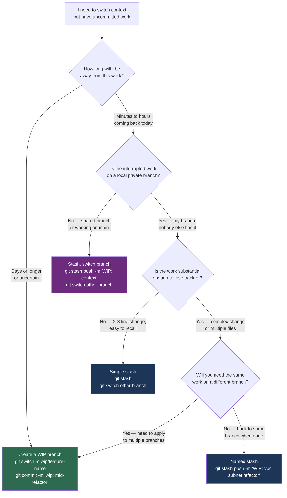

# Decision Guide — Stash or Branch?

> **Navigation:** [`← Cherry-Pick or Merge?`](cherry-pick-or-merge.md) | [`Squash or Not? →`](squash-or-not.md)
>
> **Related:** [`stash/`](../stash/) | [`branching/`](../branching/) | [`recovery/`](../recovery/)

---

## The Question

You're mid-work and need to switch context. Do you stash your changes or commit them to a temporary branch?

This sounds trivial. It is not. The wrong choice leads to lost work, forgotten stashes, or confusing WIP commits polluting shared branches.

---

## Decision Flowchart



---

## Outcomes Explained

### Use a WIP Branch (for long-running interruptions)

```bash
# Commit current state to a WIP branch
git switch -c wip/INFRA-1042-vpc-module
git add -A
git commit -m "wip: mid-refactor of subnet module — incomplete, do not merge"
git push origin wip/INFRA-1042-vpc-module  # Optional: backup to remote

# Handle the interruption on a different branch
git switch main
git switch -c hotfix/SEC-220

# Return to WIP later
git switch wip/INFRA-1042-vpc-module
# Use interactive rebase to clean up before opening PR
git rebase -i origin/main
```

**Advantages over stash:**
- Backed up to remote — survives machine failure
- Visible in `git branch` — won't be forgotten
- Can be pushed and reviewed by a teammate if needed
- Reflog tracks it separately from stash

---

### Use a Named Stash (for short interruptions)

```bash
# Save with a descriptive message — anonymous stashes are traps
git stash push -m "WIP: vpc subnet CIDR refactor — halfway through outputs"

# Handle the interruption
git switch main

# Return and restore
git switch feature/INFRA-1042-vpc-module
git stash pop

# Review what is in your stash list before popping
git stash list
git stash show -p stash@{0}  # Full diff before applying
```

---

### Use Stash for Quick Branch Switch

```bash
# Accidental work on main — move to correct branch
git stash push -m "WIP: accidentally started on main"
git switch -c feature/INFRA-1042-vpc-module
git stash pop
```

---

## Quick Reference

| Scenario | Decision | Command |
|---|---|---|
| Leaving work for minutes/hours | Named stash | `git stash push -m "WIP: description"` |
| Leaving work for days | WIP branch | `git switch -c wip/<name>` + commit |
| Work needed on multiple branches | WIP branch | Branch is shareable; stash is not |
| Accidental work on wrong branch | Stash + switch | `git stash` then `git switch <correct>` |
| Quick switch, trivial change | Anonymous stash | `git stash` |
| Uncertain return timeline | WIP branch | Safety — it's backed up |

---

## The Stash Trap

Stash has a deceptive simplicity. `git stash` takes 1 second. Recovering from a forgotten stash 3 weeks later takes 30 minutes and produces anxiety.

Signs you are misusing stash:
- `git stash list` has more than 3 entries
- Any entry is older than 7 days
- You have entries with no message (`WIP on main: abc1234 feat: ...`)

If stash list grows, the work in it is WIP branch work being stored in the wrong place.

---

## Engineering Insight

The stash-vs-branch decision is ultimately about how much you trust your memory and your machine.

A stash is stored in your local `.git/` directory. It is not pushed anywhere unless you explicitly turn a stash into a branch and push it. If your machine dies, a laptop is replaced, or you `git stash clear` by mistake, the work is gone.

A WIP branch pushed to remote is durable. It's visible to teammates who might be able to help. It is reviewable. It does not require perfect memory of what you were doing.

**Default to WIP branches for anything more than a 2-hour interruption.** The extra 10 seconds to commit and push is worth it every time you've ever lost a stash.

One practical note: WIP commits should always have a clear marker (`wip:` prefix) so you remember to clean them up before opening a PR. Use `git rebase -i --autosquash` before review to flatten the WIP commits into production-quality commits.
