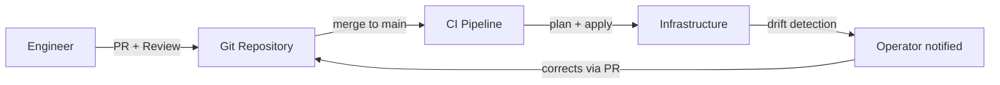
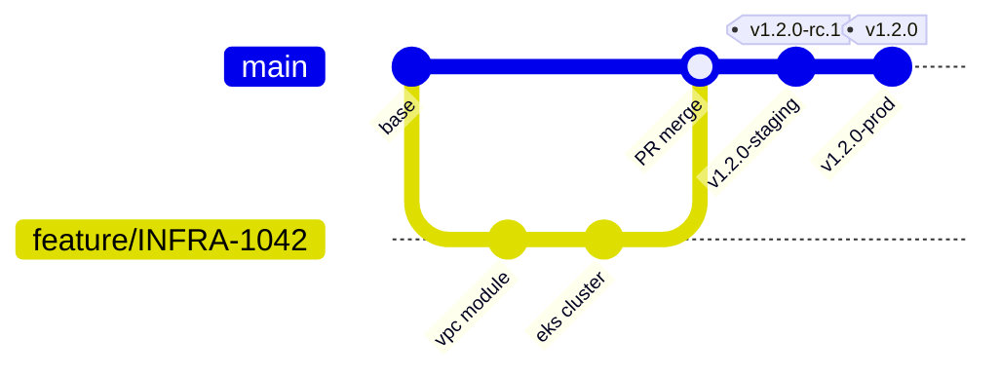

# Git Enterprise Workflows — Team-Scale Patterns and Production Operations

## Overview

Individual Git skills become enterprise engineering when applied with discipline across teams, pipelines, and regulated environments. This document covers the patterns used in Platform Engineering, SRE, and DevSecOps contexts — where Git is not just version control but the control plane for infrastructure and deployment.

---

## GitOps — Git as the Source of Truth

GitOps treats the Git repository as the definitive source of truth for system state. Changes to infrastructure or application configuration happen through Git, not through direct system access.



**Core principle**: If it is not in Git, it does not exist. If the system drifts from Git state, automation corrects it or raises an alert.

### Requirements for GitOps

| Component | Purpose |
|---|---|
| Branch protection on `main` | All changes go through PR and review |
| CI runs on every PR | `terraform plan`, `ansible lint`, `kubectl dry-run` |
| CD runs on merge to `main` | Automatically applies the desired state |
| Drift detection | Periodic reconciliation against live system |
| Immutable artifacts | Build once, deploy same artifact across environments |

---

## Environment Promotion Model

The most common model for infrastructure and platform teams:

```
feature/INFRA-1042 → main → staging tag → production tag
```



Environments are not branches. Environments are controlled by tags and pipeline configuration. `main` represents desired state. Tags control which state reaches which environment.

---

## Release Branching — When You Must Support Multiple Versions

Used when multiple release versions are active in production simultaneously (enterprise software, versioned APIs, regulated SaaS).

```
main
  └── release/2.0
  └── release/1.9 (LTS)
  └── release/1.8 (end-of-life)
```

### Release branch lifecycle

```bash
# Cut a release branch from main
git checkout main
git pull origin main
git checkout -b release/2.0
git push -u origin release/2.0

# Protect the release branch the same as main

# Apply fixes: always commit to main first, then cherry-pick
git checkout main
# Fix committed here
git log --oneline | head -1
# abc1234 fix(api): correct pagination offset [BUG-555]

git checkout release/2.0
git cherry-pick abc1234
git push origin release/2.0
```

**Rule**: Fixes go to `main` first. Never fix on the release branch only. That fix must exist in `main` or it will be lost in the next release cycle.

---

## Monorepo Patterns

A monorepo hosts multiple services or modules in one repository. Git operations must be scoped appropriately.

### Changed path detection in CI

```bash
# Detect which modules changed in a PR
git diff --name-only origin/main...HEAD | grep "^modules/"
# modules/vpc/main.tf
# modules/eks/variables.tf

# Trigger only relevant pipelines based on changed paths
```

### GitHub Actions — path filtering

```yaml
on:
  push:
    paths:
      - 'modules/vpc/**'
jobs:
  plan-vpc:
    runs-on: ubuntu-latest
    steps:
      - uses: actions/checkout@v4
      - name: Terraform plan for VPC
        working-directory: modules/vpc
        run: terraform plan
```

### Sparse checkout for large monorepos

```bash
git clone --filter=blob:none --no-checkout https://github.com/org/monorepo.git
cd monorepo
git sparse-checkout set modules/vpc modules/eks
git checkout main
```

---

## Compliance and Audit Workflows

In regulated environments (SOC 2, ISO 27001, PCI-DSS, FedRAMP), Git history is an audit artifact.

### Requirements

| Requirement | Git implementation |
|---|---|
| Every change traceable to an identity | Signed commits or enforced GitHub login |
| Changes reviewed before deployment | Branch protection — required PR approvals |
| Change records with ticket references | Commit message policy + PR template |
| No unauthorized direct changes to production config | Branch protection — no direct push to `main` |
| Change history is immutable | No force push to `main` or `release/*` |

### PR template for compliance

```markdown
<!-- .github/pull_request_template.md -->
## Change Summary

## Ticket Reference
Resolves: INFRA-

## Type of Change
- [ ] Feature
- [ ] Fix
- [ ] Hotfix
- [ ] Configuration change
- [ ] Security patch

## Testing
- [ ] Tested in dev
- [ ] Tested in staging
- [ ] Terraform plan reviewed
- [ ] Peer reviewed

## Rollback Plan
```

### Generating a change log for auditors

```bash
# All changes between two releases
git log v1.1.0..v1.2.0 --pretty=format:"%h | %ad | %an | %s" --date=short

# All changes touching a specific directory
git log --oneline -- modules/iam/

# Who changed a file and when
git log --follow --oneline -- modules/vpc/main.tf
```

---

## Git Hooks for Team-Wide Enforcement

Hooks that run before commits reach the repository are the last line of defense.

### commit-msg hook — enforce conventional commits

```bash
#!/bin/sh
# .git/hooks/commit-msg
COMMIT_MSG=$(cat "$1")
PATTERN="^(feat|fix|docs|refactor|test|chore|ci|perf|revert|security)(\(.+\))?: .{1,72}"
if ! echo "$COMMIT_MSG" | grep -qP "$PATTERN"; then
    echo "ERROR: Commit message does not follow Conventional Commits format."
    echo "Expected: feat(scope): description"
    exit 1
fi
```

### pre-push hook — run tests before push

```bash
#!/bin/sh
# .git/hooks/pre-push
echo "Running pre-push validation..."
terraform validate ./modules/ && echo "Terraform valid" || exit 1
ansible-lint ./playbooks/ && echo "Ansible lint passed" || exit 1
```

### Server-side enforcement (GitHub)

For team-wide enforcement, use GitHub Actions status checks rather than client-side hooks. Client hooks can be bypassed with `--no-verify`.

---

## Incident Response — Git Operations Under Pressure

When production is down, Git operations happen fast. The risk of mistakes is highest.

### Hotfix checklist

```bash
# 1. Never force-push shared branches
# 2. Create a hotfix branch from the deployed tag, not from main
git checkout -b hotfix/SEC-220-api-key v1.2.0

# 3. Apply the minimal fix — no refactoring
# 4. Commit with full context
git commit -m "fix(security): rotate compromised API key [SEC-220]

Incident: INC-4421
Root cause: API key was exposed in a public repository
Fix: Rotated key, updated secret reference in Vault
Rollback: Revert to v1.2.0 configuration — note: rotated key cannot be re-used"

# 5. Push and open PR — even under pressure, get one reviewer
git push -u origin hotfix/SEC-220-api-key

# 6. After merge to main, cherry-pick to active release branches
# 7. Tag the release
git tag -a v1.2.1 -m "Hotfix v1.2.1 — SEC-220 API key rotation"
git push origin v1.2.1

# 8. Document the incident timeline using git log + tags as references
```

---

## Repository Access and Hygiene at Scale

```bash
# Audit recent changes by author
git log --oneline --author="engineer@example.com" --since="30 days ago"

# Find commits that changed a specific variable or string
git log -S "aws_access_key_id" --oneline

# Find commits that changed a specific line
git log -G "10\.0\.0\.0/16" --oneline

# Clean up merged remote branches
git fetch --prune
git branch -r --merged main | grep -v "main\|HEAD" | xargs git push origin --delete
```

---

## References

| Resource | URL |
|---|---|
| GitOps Principles | https://opengitops.dev |
| GitHub Flow | https://docs.github.com/en/get-started/quickstart/github-flow |
| GitHub Actions — Path filtering | https://docs.github.com/en/actions/writing-workflows/choosing-when-your-workflow-runs/events-that-trigger-workflows |
| Git Hooks | https://git-scm.com/book/en/v2/Customizing-Git-Git-Hooks |
| GitHub Branch Protection | https://docs.github.com/en/repositories/configuring-branches-and-merges/about-protected-branches |
| Trunk Based Development | https://trunkbaseddevelopment.com |
