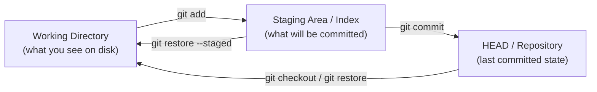
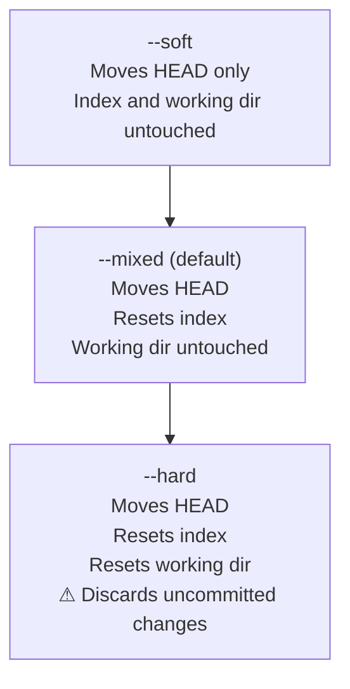
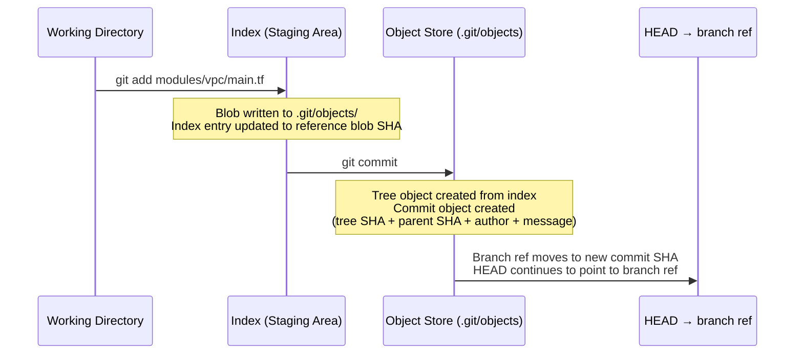

# Git Fundamentals — The Three Trees and How Git Thinks

> **Related sections:** [`internals/`](../internals/) covers object storage, packfiles and SHA mechanics; [`recovery/`](../recovery/) applies reflog knowledge to real failure recovery; [`rebasing/`](../rebasing/) depends on understanding how HEAD and refs move.
>
> **Navigation:** [⌂ Index](../) | [← `internals/`](../internals/) | [`branching/` →](../branching/)

---

## Overview

The single most useful mental model for Git is the three-tree model. Most Git confusion — conflicts that shouldn't exist, resets that went wrong, staging area surprises — comes from not knowing which of the three trees a command is operating on.

Git is not a diff-tracking system. It stores snapshots. Every command either reads from or writes to one or more of three distinct areas.

---

## Why This Matters

When you understand the three trees and how HEAD works:

- `git reset --soft`, `--mixed`, and `--hard` become completely predictable
- Detached HEAD is an understandable state, not a scary error
- Staging surprises disappear
- You can explain exactly what `git checkout`, `git restore`, and `git switch` each do
- You understand why `git add -p` is one of the most powerful daily commands

---

## Learning Objectives

- Articulate the three-tree model and what each area holds
- Use `git status` to reason about the state of all three areas simultaneously
- Use `git reset` correctly without fear
- Navigate detached HEAD state confidently
- Use `git add -p` for atomic, intentional commits
- Understand the relationship between HEAD, branch refs, and commits

---

## The Three Trees

| Tree | Also called | Holds |
|---|---|---|
| Working directory | Working tree | Files as they appear on disk |
| Staging area | Index | What the next commit will contain |
| HEAD | Repository | The last committed snapshot |



---

## Reset — The Most Misunderstood Command

`git reset` moves HEAD and optionally modifies the index and working directory. The flag determines how far the effect reaches.



```bash
# Undo last commit, keep staged changes ready to re-commit
git reset --soft HEAD~1

# Undo last commit, keep file changes but unstage them
git reset --mixed HEAD~1

# Undo last commit and discard all associated file changes
git reset --hard HEAD~1
```

**When `--hard` is dangerous:** If you have uncommitted changes in your working directory, `--hard` destroys them without warning. They are not recoverable via reflog. Stash or commit first.

---

## HEAD — What It Is and Why It Matters

HEAD is a pointer. It points to a branch ref (normal state) or directly to a commit SHA (detached state).

```bash
# Normal state
cat .git/HEAD
# ref: refs/heads/main

# Detached HEAD state (you checked out a commit directly)
cat .git/HEAD
# 3f8a2b1c4d5e6f7a8b9c0d1e2f3a4b5c6d7e8f90
```

When HEAD points to a branch, committing moves the branch ref forward.
When HEAD points directly to a commit (detached), committing creates a commit with no branch — effectively orphaned unless you create a branch from it.

```bash
# You are in detached HEAD — you made commits — now recover them
git checkout -b recover/my-work
# Creates a branch pointing at the commit you are on — work preserved
```

---

## The Staging Area — Granular Commit Control

Most engineers treat staging as `git add .` and move on. This creates noisy commit history.

```bash
# Stage specific files
git add modules/vpc/main.tf

# Stage specific hunks within a file
git add -p modules/vpc/main.tf
# Presents each changed hunk:
# Stage this hunk [y,n,q,a,d,s,?]?
# y = yes, n = no, s = split into smaller hunks

# See exactly what is staged vs. what is not
git diff           # working dir vs index
git diff --staged  # index vs HEAD (what will be committed)

# See the raw index contents
git ls-files --stage
```

**Production pattern:** Use `git add -p` before any commit touching more than one logical change. This produces atomic commits that are individually reviewable and revertable.

---

## Commands Reference

| Command | Effect on working dir | Effect on index | Effect on HEAD |
|---|---|---|---|
| `git add <file>` | None | Adds file | None |
| `git commit` | None | None | Advances to new commit |
| `git reset --soft HEAD~1` | None | None | Moves back one commit |
| `git reset --mixed HEAD~1` | None | Resets to HEAD | Moves back one commit |
| `git reset --hard HEAD~1` | Resets to HEAD | Resets to HEAD | Moves back one commit |
| `git checkout <branch>` | Updates to branch state | Updates to branch state | Points to branch |
| `git restore <file>` | Resets file to index state | None | None |
| `git restore --staged <file>` | None | Resets to HEAD state | None |

---

## Architecture — How a Commit Is Built



---

## `git switch` vs `git checkout` (Git 2.23+)

Git 2.23 split `git checkout` into two dedicated commands to reduce confusion:

| Old command | New command | Purpose |
|---|---|---|
| `git checkout <branch>` | `git switch <branch>` | Switch to a branch |
| `git checkout -b <branch>` | `git switch -c <branch>` | Create and switch to a branch |
| `git checkout <file>` | `git restore <file>` | Discard working directory changes |
| `git checkout --staged <file>` | `git restore --staged <file>` | Unstage a file |

`git checkout` still works. But `git switch` and `git restore` are explicit — each command does exactly one thing.

```bash
# Preferred in Git 2.23+
git switch main
git switch -c feature/INFRA-1042-vpc-module
git restore modules/vpc/main.tf          # discard working dir changes
git restore --staged modules/vpc/main.tf # unstage
```

---

## Reading `git status` Output

`git status` shows the state of all three trees simultaneously. Every engineer should be able to read it precisely.

```bash
$ git status
On branch feature/INFRA-1042
Your branch is up to date with 'origin/feature/INFRA-1042'.

Changes to be committed:          ← IN THE INDEX (staged)
  (use "git restore --staged <file>..." to unstage)
        modified:   modules/vpc/main.tf

Changes not staged for commit:    ← IN WORKING DIR, not in index
  (use "git add <file>..." to update what will be committed)
  (use "git restore <file>..." to discard working directory changes)
        modified:   modules/vpc/outputs.tf

Untracked files:                  ← NOT tracked by Git at all
  (use "git add <file>..." to include in what will be committed)
        modules/vpc/locals.tf
```

`git status --short` condenses this:
```bash
M  modules/vpc/main.tf       # M in column 1 = staged
 M modules/vpc/outputs.tf    # M in column 2 = unstaged
?? modules/vpc/locals.tf     # ?? = untracked
```

Column 1 = index vs HEAD. Column 2 = working dir vs index.

---

## Real Enterprise Use Cases

**Staged partial changes for audit-clean history**

A platform engineer changes three files during an investigation. Two are the actual fix; one is an unrelated whitespace cleanup. Using `git add -p`, they stage only the fix-related changes and commit separately. The audit trail shows intentional, single-purpose commits.

**Reset to unstage accidentally staged credentials**

An engineer accidentally `git add`s an `.env` file:

```bash
git reset HEAD .env          # unstage (Git < 2.23)
git restore --staged .env    # unstage (Git >= 2.23)
```

The file remains on disk but is no longer staged. The credentials never enter a commit.

**Detached HEAD for testing a specific release**

```bash
git checkout v1.4.2
# HEAD detached at v1.4.2

# Run tests, investigate behaviour
# Return without keeping any changes
git checkout main
```

---

## Best Practices

- Always run `git diff --staged` before `git commit` — confirm exactly what is going in
- Use `git add -p` for any commit that touches more than one logical area
- Learn `git status` output deeply — it shows the state of all three trees
- Never run `git reset --hard` if you have uncommitted changes you need
- Use `git restore` instead of `git checkout` for file-level operations (Git 2.23+)

---

## Common Mistakes

| Mistake | Consequence | Fix |
|---|---|---|
| `git add .` with unrelated changes | Noisy commits mixing multiple concerns | Use `git add -p` or `git add <specific-files>` |
| `git reset --hard` with uncommitted changes | Permanently lose working dir changes | Stash first: `git stash`, then reset |
| Committing in detached HEAD state | Orphaned commits with no branch | Immediately run `git checkout -b <name>` |
| Assuming `git checkout` is always safe | In older Git, `git checkout <file>` overwrites working dir silently | Use `git restore` — it is explicit |

---

## Troubleshooting

### "I don't know what state my repository is in"

```bash
git status
git log --oneline --graph --all | head -15
git stash list
git diff
git diff --staged
```

Run these in order. They tell you the state of all three trees, recent history, any stashed work, and what has changed.

### "My staged changes disappeared"

```bash
git reflog
# Shows every HEAD movement — including resets
git stash list
# Maybe they got stashed accidentally
```

### "I can't tell what the last commit contains"

```bash
git show HEAD
git show HEAD --stat       # files changed
git show HEAD --name-only  # file names only
```

---

## Interview Questions

**Q: Explain the three-tree model in Git.**
A: Git manages three areas: the working directory (files on disk), the staging area or index (what the next commit will contain), and HEAD (the last committed snapshot). `git add` moves content from working directory to index. `git commit` moves content from index to HEAD, creating a new commit object.

**Q: What is the difference between `git reset --soft`, `--mixed`, and `--hard`?**
A: All three move HEAD to a specified commit. `--soft` only moves HEAD, leaving the index and working directory unchanged. `--mixed` (the default) also resets the index to match HEAD, but leaves the working directory. `--hard` resets all three trees to match HEAD — uncommitted changes in the working directory are permanently lost.

**Q: What is detached HEAD state and when does it occur?**
A: Detached HEAD occurs when HEAD points directly to a commit SHA rather than to a branch ref. This happens when you `git checkout <commit>`, `git checkout <tag>`, or check out a remote-tracking branch directly. Commits made in this state are not on any branch and become unreferenced if you switch away without creating a branch first.

**Q: Why does `git add .` make commit history harder to maintain?**
A: It stages all changes indiscriminately, including unrelated modifications. This produces commits that mix multiple concerns, making it harder to review, revert, or cherry-pick specific changes later. `git add -p` allows staging by hunk for atomic, intention-revealing commits.

---

## Engineering Insight

**The three-tree model is the single concept that unblocks most Git confusion.** Every question of "why did that happen" or "how do I undo this" becomes answerable once an engineer understands that Git maintains three separate states and that each command moves changes between them deliberately.

**`git switch` and `git restore` are the intentional split of `git checkout`.** The Git maintainers recognized that `checkout` did two conceptually different things (switch branches, restore files) and separated them in Git 2.23. Prefer the new commands in scripts and documentation — they communicate intent clearly and are less error-prone.

**`git status --short` in scripts, `git status` for humans.** The porcelain output (`--short`) is stable across Git versions. The default output changes between versions. Any script that parses `git status` output should use `--short` or `--porcelain`.

**Commit message quality is a long-term investment.** A well-written commit message is read once when written and many times over the lifetime of a codebase. The 50/72 rule (50-char subject, 72-char body) is widely supported by tooling and should be considered a hard constraint, not a guideline.

**`git add -p` should be the default, not `git add .`.** Reviewing every hunk before staging catches accidental debug statements, console logs, and unrelated changes that would otherwise pollute the commit. The discipline of reviewing what you stage is the same discipline as reviewing what you deploy.

---

## References

| Resource | URL |
|---|---|
| Git Reset Demystified | https://git-scm.com/book/en/v2/Git-Tools-Reset-Demystified |
| git reset | https://git-scm.com/docs/git-reset |
| git add | https://git-scm.com/docs/git-add |
| git restore | https://git-scm.com/docs/git-restore |
| git status | https://git-scm.com/docs/git-status |
