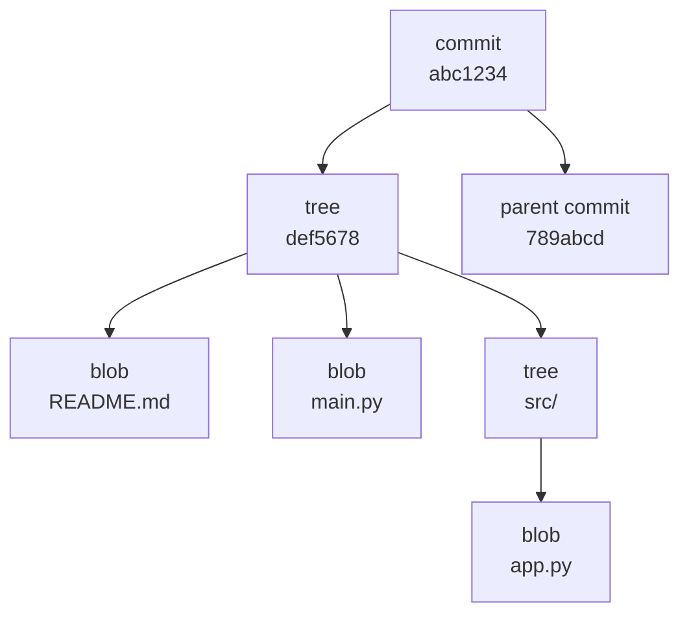

# Git Fundamentals — How Git Actually Works

## Overview

Most engineers use Git every day without understanding what it is actually doing. That gap causes confusion during merges, rebases, and conflict resolution. This document explains Git's internal model so you can reason clearly about any Git operation.

Git is not a diff-tracking system. It is a **content-addressable filesystem** that stores snapshots, not diffs.

---

## Why This Matters

When you understand Git's object model, the following operations become obvious rather than mysterious:

- Why `git reset` behaves differently with `--soft`, `--mixed`, and `--hard`
- Why rebasing rewrites commit hashes
- Why `git reflog` can recover work that appears deleted
- Why merging creates a new commit but fast-forward does not
- Why detached HEAD is a state, not an error

---

## The Git Object Model

Git stores four types of objects. Every object is identified by its SHA-1 hash.

| Object | What it represents |
|---|---|
| `blob` | File content (a single version of a file) |
| `tree` | A directory — maps filenames to blob or tree hashes |
| `commit` | A snapshot — points to a tree, parent commit(s), author, message |
| `tag` | An annotated reference to a specific commit |



Every commit points to exactly one tree. The tree points to blobs (files) and other trees (subdirectories). This means Git stores full snapshots, not diffs between versions.

---

## Refs — How Git Tracks Branches and Tags

A branch is not a container. It is a **pointer to a commit**.

```
refs/heads/main       → abc1234
refs/heads/feature/x  → def5678
refs/tags/v1.0.0      → 789abcd
HEAD                  → refs/heads/main
```

When you commit, Git moves the branch pointer forward to the new commit. The branch is just a file containing a SHA-1 hash.

```bash
cat .git/refs/heads/main
# abc1234...

cat .git/HEAD
# ref: refs/heads/main
```

---

## The Three Trees

Git manages three distinct areas. Understanding these explains every staging and reset operation.

| Area | Description |
|---|---|
| Working directory | Files on your filesystem as you see them |
| Staging area (Index) | What will be included in the next commit |
| Repository (HEAD) | The last committed snapshot |


### What reset does to these three trees

```bash
git reset --soft HEAD~1   # moves HEAD only — staging and working dir unchanged
git reset --mixed HEAD~1  # moves HEAD + unstages — working dir unchanged (default)
git reset --hard HEAD~1   # moves HEAD + unstages + discards working dir changes
```

---

## Practical Examples

### Inspect any Git object

```bash
# See the type of an object
git cat-file -t abc1234
# commit

# See the content of a commit
git cat-file -p abc1234
# tree def5678
# parent 789abcd
# author Akash Khurana <email> 1719859200 +0000
# committer Akash Khurana <email> 1719859200 +0000
#
# feat(terraform): add VPC module for prod environment

# See the tree a commit points to
git ls-tree HEAD
# 100644 blob a1b2c3d4  README.md
# 100644 blob e5f6a7b8  main.tf
# 040000 tree c9d0e1f2  modules/
```

### Understand what HEAD is pointing to

```bash
git rev-parse HEAD
# Returns the full SHA of the current commit

git symbolic-ref HEAD
# Returns the branch name: refs/heads/main

# In detached HEAD state, symbolic-ref fails — that is the signal
```

### See the staging area

```bash
git ls-files --stage
# Shows what is currently in the index with their blob hashes
```

---

## Expected Output Examples

```bash
$ git log --oneline --graph --all
* abc1234 (HEAD -> main, origin/main) feat: add Terraform VPC module
* def5678 refactor: extract subnet logic into module
* 789abcd fix: correct CIDR block for prod
```

```bash
$ git cat-file -p HEAD
tree 3f8a2b1c4d5e6f7a8b9c0d1e2f3a4b5c
parent a1b2c3d4e5f6a7b8c9d0e1f2a3b4c5d6
author Akash Khurana <akash@example.com> 1719859200 +0000
committer Akash Khurana <akash@example.com> 1719859200 +0000

feat(terraform): add VPC module for prod environment

Extracted VPC configuration into a reusable module.
Resolves: INFRA-1042
```

---

## When to Use This Knowledge

- When a colleague says "I lost my commits" — use reflog, they are in the object store
- When diagnosing merge conflicts — understand which trees are being compared
- When debugging CI failures after a rebase — understand why hashes changed
- When auditing repository history — understand what each object represents

## When NOT to Over-Engineer This

You do not need to inspect objects daily. Use `git log`, `git status`, and `git diff` in normal workflows. Drop to the object level when something breaks or needs investigation.

---

## Common Mistakes

| Mistake | Consequence |
|---|---|
| Treating branches as folders | Causes confusion about what deleting a branch does |
| Confusing staging with saving | Leads to incomplete commits |
| Assuming `git reset --hard` is safe | Discards uncommitted working directory changes permanently |
| Not understanding HEAD | Makes detached HEAD state confusing and scary |

---

## Best Practices

- Run `git log --oneline --graph --all` regularly to understand your branch topology
- Use `git diff --staged` before committing to verify what is actually going in
- Learn `git reflog` — it is your undo history for HEAD movements
- After a complex operation, run `git status` to confirm the state of all three trees

---

## Troubleshooting

### "I don't know what HEAD is pointing to"

```bash
git status
# On branch main — or — HEAD detached at abc1234

cat .git/HEAD
# ref: refs/heads/main — or — abc1234...
```

### "I accidentally reset and lost commits"

```bash
git reflog
# Shows every HEAD movement with timestamps

git reset --hard abc1234
# Restore to a specific reflog entry
```

### "I can't tell what changed between two commits"

```bash
git diff abc1234 def5678
git diff abc1234 def5678 -- path/to/file
```

---

## References

| Resource | URL |
|---|---|
| Git Internals — Plumbing and Porcelain | https://git-scm.com/book/en/v2/Git-Internals-Plumbing-and-Porcelain |
| Git Objects | https://git-scm.com/book/en/v2/Git-Internals-Git-Objects |
| Git References | https://git-scm.com/book/en/v2/Git-Internals-Git-References |
| git cat-file | https://git-scm.com/docs/git-cat-file |
| git reflog | https://git-scm.com/docs/git-reflog |
