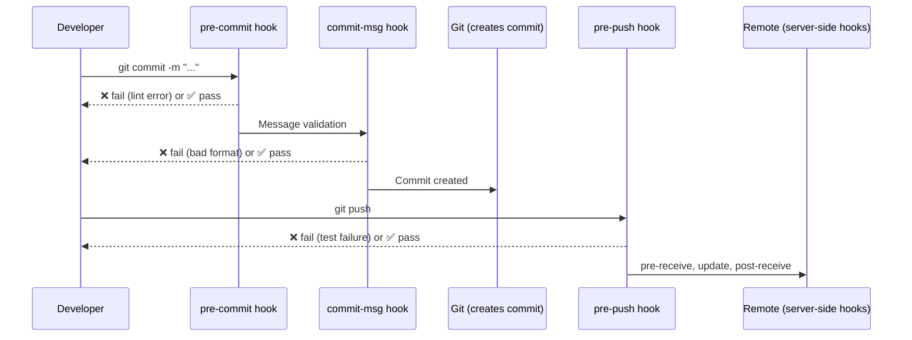
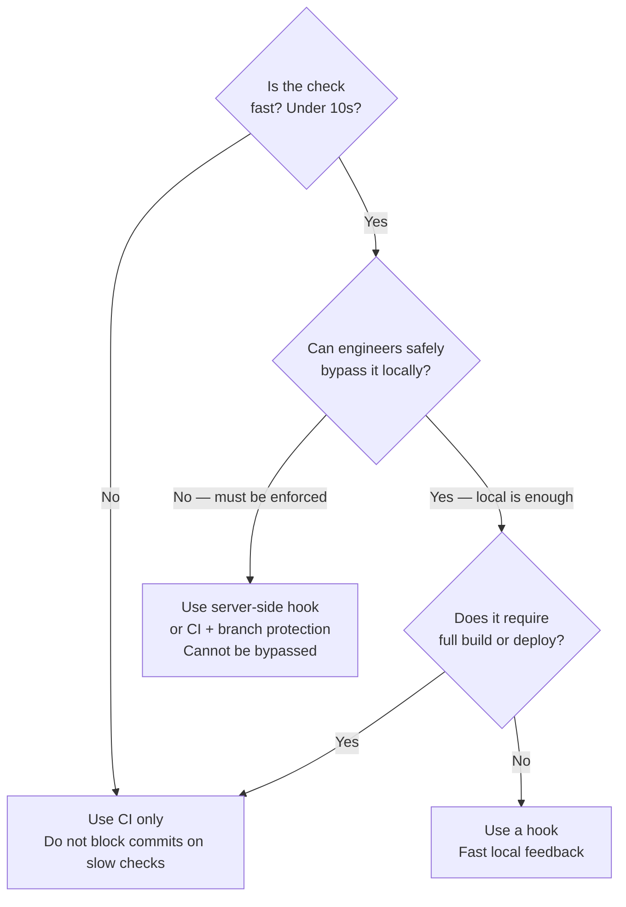

# Git Hooks — Automating Quality Gates at the Commit Level

> **Related sections:** [`security/`](../security/) for secrets scanning hooks; [`best-practices/`](../best-practices/) for commit message standards that hooks enforce; [`enterprise-workflows/`](../enterprise-workflows/) for CI vs hooks decision making.

---

## Overview

Git hooks are scripts that Git executes automatically at specific points in the workflow — before a commit is created, after a push, when a message is written. They are the last line of enforcement before code enters the shared repository.

The distinction that matters in production: **client-side hooks can be bypassed**. Engineers can use `--no-verify` to skip them. **Server-side hooks cannot be bypassed**. If team-wide enforcement matters, it belongs on the server or in CI.

---

## Why This Matters

Hooks enforce standards at the moment they are violated — not when CI runs five minutes later. Catching a missing ticket reference, a secrets leak, or a syntax error before the commit is created saves time and protects shared branches.

But hooks have a maintenance cost. A poorly written hook that breaks on macOS or Windows, produces false positives, or adds 30 seconds to every commit will be bypassed or removed. Hooks must be fast, accurate, and portable.

---

## Learning Objectives

- Understand all client-side and server-side hook types
- Write hooks that are fast, portable, and useful
- Use the pre-commit framework for team-wide, version-controlled hooks
- Know when to use hooks vs. CI checks
- Understand `--no-verify` and its implications

---

## Hook Types

### Client-Side Hooks

| Hook | When it runs | Common use |
|---|---|---|
| `pre-commit` | Before commit message is entered | Lint, secret scan, format check |
| `prepare-commit-msg` | After default message is created, before editor | Auto-populate ticket references |
| `commit-msg` | After commit message is written | Enforce message format |
| `post-commit` | After commit is created | Notifications, local triggers |
| `pre-rebase` | Before a rebase starts | Prevent rebasing protected branches |
| `post-checkout` | After branch switch | Auto-install dependencies |
| `post-merge` | After a merge completes | Prompt for dependency install |
| `pre-push` | Before push to remote | Run tests, prevent pushing to protected branches |

### Server-Side Hooks

| Hook | When it runs | Common use |
|---|---|---|
| `pre-receive` | Before refs are updated on the server | Enforce policies on incoming commits |
| `update` | Per-ref update, before acceptance | Per-branch policy enforcement |
| `post-receive` | After refs are updated | Trigger CI, notifications, deployments |

---

## Architecture — Hook Execution Order



---

## Hook Location and Installation

Hooks live in `.git/hooks/`. They are not committed to the repository by default — which means they do not propagate to clones automatically.

```bash
ls .git/hooks/
# pre-commit.sample  commit-msg.sample  pre-push.sample ...

# Create a real hook by removing .sample suffix
cp .git/hooks/pre-commit.sample .git/hooks/pre-commit
chmod +x .git/hooks/pre-commit

# Or write one directly
cat > .git/hooks/commit-msg << 'EOF'
#!/bin/sh
# Content here
EOF
chmod +x .git/hooks/commit-msg
```

---

## Useful Hook Examples

### `commit-msg` — Enforce Conventional Commits format

```bash
#!/bin/sh
# .git/hooks/commit-msg

COMMIT_MSG_FILE="$1"
COMMIT_MSG=$(cat "$COMMIT_MSG_FILE")

# Allow merge commits and fixup commits
if echo "$COMMIT_MSG" | grep -qE "^(Merge|fixup!|squash!)"; then
  exit 0
fi

PATTERN="^(feat|fix|docs|refactor|test|chore|ci|perf|revert|security)(\(.+\))?: .{1,100}"

if ! echo "$COMMIT_MSG" | grep -qE "$PATTERN"; then
  echo ""
  echo "ERROR: Commit message does not follow Conventional Commits."
  echo "Expected format: feat(scope): short description"
  echo "Received: $COMMIT_MSG"
  echo ""
  exit 1
fi
```

### `pre-commit` — Secrets scanning with gitleaks

```bash
#!/bin/sh
# .git/hooks/pre-commit

if command -v gitleaks >/dev/null 2>&1; then
  gitleaks detect --staged --exit-code 1
  if [ $? -ne 0 ]; then
    echo ""
    echo "ERROR: Potential secrets detected in staged files."
    echo "Review the output above. Add a false-positive exception in .gitleaks.toml if needed."
    echo ""
    exit 1
  fi
else
  echo "WARN: gitleaks not installed. Skipping secrets scan."
  echo "Install: brew install gitleaks"
fi
```

### `pre-push` — Prevent direct push to protected branches

```bash
#!/bin/sh
# .git/hooks/pre-push

PROTECTED="main master release"
CURRENT_BRANCH=$(git symbolic-ref HEAD 2>/dev/null | sed 's|refs/heads/||')

for branch in $PROTECTED; do
  if [ "$CURRENT_BRANCH" = "$branch" ]; then
    echo ""
    echo "ERROR: Direct push to '$branch' is not allowed."
    echo "Open a pull request instead."
    echo ""
    exit 1
  fi
done
```

### `prepare-commit-msg` — Auto-populate ticket reference from branch name

```bash
#!/bin/sh
# .git/hooks/prepare-commit-msg

COMMIT_MSG_FILE="$1"
COMMIT_SOURCE="$2"

# Only modify when not amending or merging
if [ "$COMMIT_SOURCE" = "message" ] || [ "$COMMIT_SOURCE" = "" ]; then
  BRANCH=$(git symbolic-ref --short HEAD 2>/dev/null)
  TICKET=$(echo "$BRANCH" | grep -oE '[A-Z]+-[0-9]+' | head -1)
  if [ -n "$TICKET" ]; then
    # Cross-platform: use a temp file instead of sed -i which behaves differently on macOS vs Linux
    TMPFILE=$(mktemp)
    sed "1s/$/ [$TICKET]/" "$COMMIT_MSG_FILE" > "$TMPFILE" && mv "$TMPFILE" "$COMMIT_MSG_FILE"
  fi
fi
```

### `post-checkout` — Prompt to install dependencies after branch switch

```bash
#!/bin/sh
# .git/hooks/post-checkout
# Arguments: previous HEAD, new HEAD, branch-checkout flag (1) or file-checkout flag (0)

PREV_HEAD="$1"
NEW_HEAD="$2"
BRANCH_CHECKOUT="$3"

# Only run on branch checkouts, not file checkouts
[ "$BRANCH_CHECKOUT" = "0" ] && exit 0

# If requirements files changed between branches, remind to reinstall
if git diff --name-only "$PREV_HEAD" "$NEW_HEAD" | grep -qE '^(requirements.*\.txt|package\.json|Pipfile)$'; then
  echo ""
  echo "NOTICE: Dependency file changed since last checkout."
  echo "You may need to run: pip install -r requirements.txt  or  npm install"
  echo ""
fi
```

---

## The pre-commit Framework — Team-Wide Enforcement

Individual hook files in `.git/hooks/` do not propagate to clones. The [pre-commit framework](https://pre-commit.com) solves this by version-controlling hooks as configuration.

### Setup

```bash
pip install pre-commit

# Or via Homebrew
brew install pre-commit
```

### `.pre-commit-config.yaml`

```yaml
repos:
  - repo: https://github.com/gitleaks/gitleaks
    rev: v8.18.4
    hooks:
      - id: gitleaks

  - repo: https://github.com/pre-commit/pre-commit-hooks
    rev: v4.5.0
    hooks:
      - id: trailing-whitespace
      - id: end-of-file-fixer
      - id: check-yaml
      - id: check-added-large-files
        args: ['--maxkb=500']
      - id: detect-private-key

  - repo: https://github.com/compilerla/conventional-pre-commit
    rev: v3.1.0
    hooks:
      - id: conventional-pre-commit
        stages: [commit-msg]
```

```bash
# Install hooks into .git/hooks/
pre-commit install
pre-commit install --hook-type commit-msg

# Run all hooks manually against all files
pre-commit run --all-files

# Update hook revisions
pre-commit autoupdate
```

### Team adoption

Add `.pre-commit-config.yaml` to the repository. Document installation in `CONTRIBUTING.md`. Hook installation is per-developer — it cannot be forced, but `pre-push` CI checks serve as the backstop.

---

## Hooks vs CI — Decision Framework



| Check type | Where it belongs |
|---|---|
| Commit message format | `commit-msg` hook |
| Secret scanning (fast) | `pre-commit` hook + CI |
| Unit tests (30s+) | CI only |
| Branch protection policy | Server-side or branch protection rules |
| Linting (fast) | `pre-commit` hook |
| Integration tests | CI only |
| Terraform validate | `pre-push` hook or CI |

---

## Real Enterprise Use Cases

**Platform team enforcing standards across 50 repositories**

Rather than installing hooks manually in each repo, the team distributes a `.pre-commit-config.yaml` as part of a repository template. A weekly CI job runs `pre-commit run --all-files` on every repository to catch drift.

**Regulated environment preventing secrets from reaching GitHub**

gitleaks runs as both a `pre-commit` hook and a GitHub Actions workflow. The hook catches 95% of cases locally. The CI check is the enforceable backstop that produces an audit trail.

**Preventing accidental direct pushes to main**

The `pre-push` hook blocks pushes to `main` locally. GitHub branch protection rules block it at the server. Both layers operate independently — if one is bypassed, the other catches it.

---

## When NOT to Use Hooks

- Do not run slow checks in hooks — anything over 10 seconds will be bypassed
- Do not use hooks as a substitute for CI — hooks can be bypassed with `--no-verify`
- Do not write hooks that only work on one OS (bash-only, macOS paths hardcoded)
- Do not use hooks to enforce access control — use server-side rules or branch protection

---

## Common Mistakes

| Mistake | Consequence |
|---|---|
| Hooks not committed to repo | Every new clone needs manual setup |
| Using `--no-verify` as a habit | Bypasses all protections, normalises skipping enforcement |
| Hook scripts not executable | Hook silently does nothing |
| Slow hooks (30s+) | Engineers bypass with `--no-verify` |
| Hooks breaking on different OS | Engineers on Windows or macOS experience inconsistent failures |

---

## Troubleshooting

### "My hook is not running"

```bash
ls -la .git/hooks/pre-commit
# Must be executable: -rwxr-xr-x

chmod +x .git/hooks/pre-commit

# Test the hook directly
.git/hooks/pre-commit
```

### "Hook passes locally but CI fails"

The hook is probably not in the repository. CI clones do not have `.git/hooks/` scripts from source. Use the pre-commit framework with `pre-commit run --all-files` in CI instead.

### "pre-commit framework not finding hooks after clone"

```bash
pre-commit install
pre-commit install --hook-type commit-msg
```

Each engineer must run this after cloning. Document it in `CONTRIBUTING.md`.

---

## Interview Questions

**Q: What is the difference between `pre-commit` and `commit-msg` hooks?**
A: `pre-commit` runs before the commit message is entered, typically used for code quality checks. `commit-msg` runs after the message is written, used to validate the format of the message itself.

**Q: Can Git hooks be bypassed? How would you prevent that?**
A: Client-side hooks can be bypassed with `git commit --no-verify`. To enforce policies that cannot be bypassed, use server-side hooks (`pre-receive`) or CI status checks combined with branch protection rules that require CI to pass before merging.

**Q: Why doesn't `.git/hooks/` propagate when you clone a repository?**
A: The `.git/` directory is local and not tracked. It is never cloned or pushed. To distribute hooks, use the pre-commit framework with a `.pre-commit-config.yaml` file committed to the repository, or use a `Makefile`/`setup` script that installs hooks on first run.

---

## References

| Resource | URL |
|---|---|
| Git Hooks | https://git-scm.com/book/en/v2/Customizing-Git-Git-Hooks |
| git hooks reference | https://git-scm.com/docs/githooks |
| pre-commit framework | https://pre-commit.com |
| gitleaks | https://github.com/gitleaks/gitleaks |
| Conventional Commits | https://www.conventionalcommits.org |
