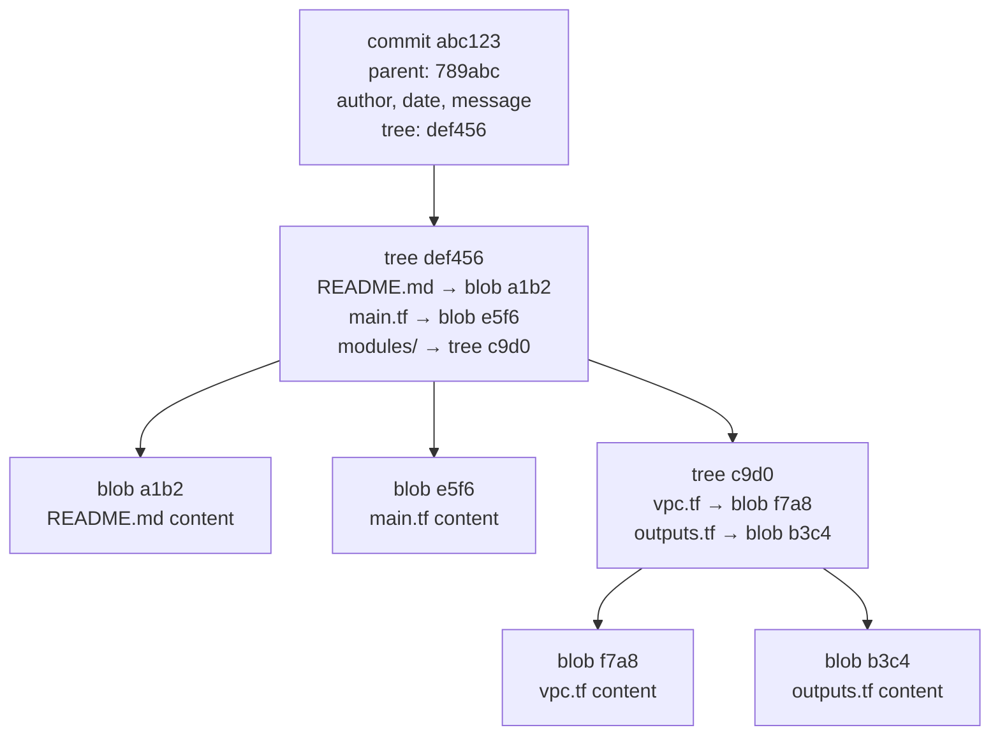

# Git Internals — What Git Actually Stores and Why It Matters

> **Related sections:** [`fundamentals/`](../fundamentals/) covers the three-tree model; [`recovery/`](../recovery/) uses reflog and object store knowledge for real recovery; [`performance/`](../performance/) covers packfile optimization and GC.

---

## Overview

Every Git operation — commit, merge, rebase, reset — is a transformation on a small set of object types stored in `.git/objects/`. Engineers who understand this layer can diagnose any Git failure, recover any lost work, and make informed decisions about workflow design.

This is not academic. It is the layer that explains why `git reset --hard` is dangerous, why rebasing changes SHAs, why force push breaks teammates, and why the reflog can recover work that appears permanently deleted.

---

## Why This Matters

| If you understand Git internals | You can |
|---|---|
| Object model | Explain exactly what every command does |
| How refs work | Diagnose and fix detached HEAD, missing branches |
| How packfiles work | Optimize large repositories, troubleshoot slow clones |
| How GC works | Know when objects are truly unrecoverable |
| SHA mechanics | Understand why rebasing creates new commits |

---

## Learning Objectives

- Understand the four Git object types and their relationships
- Inspect live Git objects using plumbing commands
- Understand how refs map to commits
- Understand loose objects vs packfiles
- Understand when garbage collection runs and what it removes
- Know the difference between SHA-1 and SHA-256 repositories

---

## The Four Object Types

Git is a content-addressable key-value store. Every object has a SHA hash as its key and the compressed content as its value. Objects are immutable — once written, they never change.

| Type | Description | Created by |
|---|---|---|
| `blob` | Raw file content — no filename, no path | `git add` |
| `tree` | Directory listing — maps names to blob/tree SHAs | `git commit` |
| `commit` | Snapshot metadata — tree SHA, parent SHA, author, message | `git commit` |
| `tag` | Annotated reference — points to a commit with signature metadata | `git tag -a` |



**Parent SHA is stored inside the commit object — not as a separate node.** The parent field is a SHA reference to the previous commit object. This is what makes the DAG: each commit knows its parent(s), forming a chain.

**Key insight:** Git stores complete snapshots, not diffs. When a file does not change between commits, the new commit's tree reuses the same blob SHA. No duplication — just a new pointer to the same object.

---

## Inspecting Objects Directly

These are plumbing commands. You will rarely need them in daily work, but they are essential for deep debugging.

```bash
# See the type of any object
git cat-file -t abc1234
# blob / tree / commit / tag

# See the raw content of any object
git cat-file -p abc1234

# See what a commit points to
git cat-file -p HEAD
# tree 3f8a2b1c4d5e6f7a8b9c0d1e2f3a4b5c
# parent a1b2c3d4e5f6a7b8c9d0e1f2a3b4c5d6
# author Akash Khurana <akash@example.com> 1719859200 +0000
# committer Akash Khurana <akash@example.com> 1719859200 +0000
#
# feat(vpc): add multi-AZ subnet configuration

# See what a tree contains
git ls-tree HEAD
# 100644 blob a1b2c3d README.md
# 100644 blob e5f6a7b main.tf
# 040000 tree c9d0e1f modules/

# Recursive tree listing
git ls-tree -r HEAD --name-only
```

---

## How Refs Work

A branch is a file containing a SHA. A tag is either a file containing a SHA (lightweight) or a full tag object (annotated).

```bash
# Branch as a file
cat .git/refs/heads/main
# 3f8a2b1c4d5e6f7a8b9c0d1e2f3a4b5c6d7e8f90

# HEAD — points to a branch or directly to a commit (detached)
cat .git/HEAD
# ref: refs/heads/main        ← normal state
# 3f8a2b1c4d5e6f...           ← detached HEAD state

# All refs in one view
git show-ref
# 3f8a2b1c... refs/heads/main
# a1b2c3d4... refs/remotes/origin/main
# e5f6a7b8... refs/tags/v1.2.0
```

**Why this matters for rebasing:** When you rebase, Git creates new commit objects with new SHAs (because the parent SHA is part of the commit content and changes). The branch ref then points to the new commit. Old commits become unreferenced — but they exist in the object store until GC runs.

---

## Loose Objects vs Packfiles

Git stores objects in two formats:

**Loose objects** — one file per object, stored in `.git/objects/xx/yyyyyy...`

```bash
ls .git/objects/3f/
# 8a2b1c4d5e6f7a8b9c0d1e2f3a4b5c6d7e8f90
```

**Packfiles** — many objects compressed together with delta encoding. Stored in `.git/objects/pack/`

```bash
ls .git/objects/pack/
# pack-a1b2c3d4...idx   ← index for fast lookup
# pack-a1b2c3d4...pack  ← compressed object data
```

### Delta compression

Packfiles do not just compress each object independently. They store **deltas** — the difference between similar objects. If two versions of a large file differ by 5 lines, the packfile stores the full first version plus a delta for the second. This is why a packfile is dramatically smaller than the sum of its loose objects.

```bash
# See the compression ratio
git count-objects -vH
# count: 0               ← loose objects
# size: 0 bytes          ← loose object size
# in-pack: 2847          ← objects in packfile
# packs: 1
# size-pack: 14.23 MiB   ← packfile total size
# prune-packable: 0
# garbage: 0
```

Git automatically packs loose objects when their count exceeds a threshold (default: 6700). Trigger manually:

```bash
git gc
git gc --aggressive  # More delta compression, significantly slower
```

---

## packed-refs — When Refs Are Packed

When a repository has many refs (branches, tags), Git can pack them into a single file for performance:

```bash
cat .git/packed-refs
# # pack-refs with: peeled fully-peeled sorted
# 3f8a2b1c4d5e6f7a8b9c0d1e2f3a4b5c6d7e8f90 refs/heads/main
# a1b2c3d4e5f6a7b8c9d0e1f2a3b4c5d6 refs/remotes/origin/main
# e5f6a7b8c9d0e1f2a3b4c5d6e7f8a9b0 refs/tags/v1.2.0
```

When you see an empty `refs/heads/` directory despite having branches, the refs have been packed. Git reads both locations and merges them. This is also why searching `refs/heads/` directly for branch names does not always work — use `git show-ref` instead:

```bash
git show-ref
# 3f8a2b1c... refs/heads/main
# a1b2c3d4... refs/remotes/origin/main
# e5f6a7b8... refs/tags/v1.2.0
```

---

## Garbage Collection and Object Expiry

Objects without references are called **dangling objects**. Git does not remove them immediately. This is why the reflog can recover work that appears deleted.

GC removes dangling objects that are:
- Older than `gc.pruneExpire` (default: 2 weeks)
- Not referenced by the reflog

```bash
# See dangling objects
git fsck --unreachable

# Manually expire reflog and run GC (dangerous — do not run on shared repos)
git reflog expire --expire=now --all
git gc --prune=now

# Check repository health
git fsck
```

**Recovery window:** After you delete a branch, reset, or abandon commits, they remain recoverable via `git reflog` for up to 90 days (the `gc.reflogExpire` default). After `git gc --prune=now`, they are gone permanently.

See [`recovery/`](../recovery/) for the full recovery playbook.

---

## SHA-1 vs SHA-256

Historical Git uses SHA-1 for object identification. SHA-256 support was added in Git 2.29 for repositories that require collision resistance (government, financial, regulated sectors).

```bash
# Initialize a SHA-256 repository
git init --object-format=sha256

# Check what format a repository uses
git rev-parse --show-object-format
# sha1 or sha256
```

SHA-256 repositories are not compatible with SHA-1 repositories. As of 2024, SHA-1 remains the default for compatibility reasons.

---

## Real Enterprise Use Cases

**Debugging a repository corruption**

A CI runner reports `fatal: loose object ... is corrupt`. Knowing that loose objects are files in `.git/objects/` lets you identify whether the issue is disk corruption, a failed network transfer, or a bad clone.

```bash
git fsck --full
# Identifies specific corrupt objects
```

**Understanding why a clone is 4 GB**

```bash
# Find the largest objects in the repository
git rev-list --objects --all \
  | git cat-file --batch-check='%(objecttype) %(objectname) %(objectsize) %(rest)' \
  | awk '/^blob/' \
  | sort -k3 -rn \
  | head -20
```

This identifies large files that should have been excluded or stored in Git LFS. See [`performance/`](../performance/).

**Explaining why a rebase "loses" commits**

The commits are not lost — they exist as unreferenced objects in the object store. The branch ref now points to the new rebased commits. The originals are accessible via `git reflog` until GC removes them.

---

## Interview Questions

**Q: What is a Git blob and what does it store?**
A: A blob stores the raw content of a single version of a file — no filename, no path, no metadata. The filename lives in the tree object that references the blob.

**Q: Why does rebasing change commit SHAs?**
A: A commit SHA is computed from the commit's content: tree SHA, parent SHA(s), author, committer, message, and timestamp. When you rebase, the parent SHA changes (the commits land on a new base), so the SHA of every rebased commit changes, even if the diff is identical.

**Q: What happens to commits after a hard reset?**
A: They become unreferenced objects. They still exist in `.git/objects/` and are visible in `git reflog`. They are only permanently removed after GC runs and the reflog entry expires.

**Q: What is the difference between a lightweight tag and an annotated tag?**
A: A lightweight tag is a ref file pointing directly to a commit SHA. An annotated tag is a full Git object (type `tag`) that contains the tagger name, date, message, and optionally a GPG signature, and which then points to the commit.

**Q: Why can two different files produce the same blob SHA?**
A: If two files have identical content, they will have identical blob SHAs. Git deduplicates storage automatically — only one blob is stored. This is a feature of content-addressable storage.

---

## Common Mistakes

| Mistake | Consequence |
|---|---|
| Running `git gc --prune=now` prematurely | Permanently destroys unreferenced work before recovery window closes |
| Assuming deleted branches are gone | They are recoverable via reflog until GC |
| Treating SHA as a permanent identifier for a version | Rebasing changes SHAs; use tags for permanent references |
| Ignoring `.git/objects/` disk growth | Large repos with no LFS or GC policy grow without bound |

---

## References

| Resource | URL |
|---|---|
| Git Internals — Git Objects | https://git-scm.com/book/en/v2/Git-Internals-Git-Objects |
| Git Internals — Packfiles | https://git-scm.com/book/en/v2/Git-Internals-Packfiles |
| git cat-file | https://git-scm.com/docs/git-cat-file |
| git fsck | https://git-scm.com/docs/git-fsck |
| git gc | https://git-scm.com/docs/git-gc |
| SHA-256 transition | https://git-scm.com/docs/hash-function-transition |
