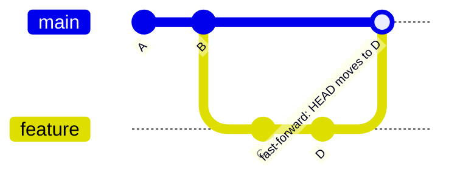
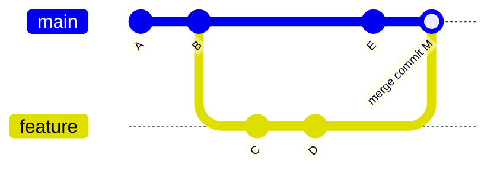

# Git Merging — Strategies, Tradeoffs, and Enterprise Decisions

> **Related sections:** [`branching/`](../branching/) for how branch models determine merge strategy; [`rebasing/`](../rebasing/) for the alternative to merge for branch integration; [`cherry-pick/`](../cherry-pick/) for selective commit application across branches; [`enterprise-workflows/`](../enterprise-workflows/) for GitFlow merge conventions.
>
> **Navigation:** [⌂ Index](../) | [← `branching/`](../branching/) | [`rebasing/` →](../rebasing/)

---

## Overview

Merging is the act of integrating one line of development into another. Git offers multiple merge strategies, and the wrong choice creates history that is either unreadable or unauditable. This document covers every merge type, when to use each, and what the history looks like after.

---

## Why Merge Strategy Matters

| Choosing wrong merge strategy causes | Example |
|---|---|
| Unreadable history | Hundreds of "Merge branch 'feature/x' into main" commits |
| Lost traceability | Squash merges hide which individual commits introduced a regression |
| Conflicts on every PR | Long-lived branches diverging from main |
| Audit failures | Regulated environments need to trace every change to an author |

Choose your merge strategy once per repository type. Document it. Enforce it with branch protection rules.

---

## Merge Strategies

### Fast-Forward Merge

If no new commits have been made on the target branch since the feature branch diverged, Git moves the branch pointer forward without creating a merge commit.



```bash
git checkout main
git merge feature/INFRA-1042-vpc-module
# Fast-forward
```

**Result**: Linear history. No merge commit. The feature branch commits become part of `main` directly.

**When to use**: When history readability is the priority and the feature branch is up to date with main.

**When NOT to use**: When you need a record that this work arrived from a feature branch (audit trail). Use `--no-ff` instead.

---

### 3-Way Merge (No Fast-Forward)

Creates a merge commit even when fast-forward is possible. Preserves the fact that a branch existed and was merged at a point in time.



```bash
git merge --no-ff feature/INFRA-1042-vpc-module -m "feat: merge vpc module [INFRA-1042]"
```

**When to use**: When you need a clear record that a feature or change set was merged as a unit. Standard in regulated environments and GitFlow.

**When NOT to use**: Trunk-based development where every commit to main is small and atomic.

---

### Squash Merge

Collapses all commits from a feature branch into a single commit on the target branch. The individual commits disappear from the main branch history.

```bash
git merge --squash feature/INFRA-1042-vpc-module
git commit -m "feat(vpc): add reusable VPC module [INFRA-1042]

Squashes 7 commits. See PR #142 for full commit history."
```

**When to use**: When feature branch commits are messy (WIP, typo fixes, "fix review comments") and you want clean main branch history.

**When NOT to use**: When individual commits carry audit significance. Squash destroys individual commit authorship on the target branch.

---

### Octopus Merge

Merges more than two branches simultaneously. Rare in normal workflows.

```bash
git merge feature/vpc feature/eks feature/iam
```

**When to use**: Integrating multiple completed feature branches simultaneously in a release candidate. Limited to situations where there are no conflicts between branches.

**When NOT to use**: Any situation with conflicts — octopus merge aborts if conflicts exist.

---

## Merge Strategy Comparison

| Strategy | History shape | Merge commit | Use case |
|---|---|---|---|
| Fast-forward | Linear | No | Small, up-to-date branches |
| No-FF (3-way) | Explicit branch merge | Yes | Audit trail, GitFlow |
| Squash | Linear, single commit | No (manual commit) | Clean main from messy feature branches |
| Octopus | Multiple parents | Yes | Multi-branch integration |

---

## Resolving Merge Conflicts

Conflicts occur when the same lines have been changed differently in both branches.

```bash
git merge feature/INFRA-1042-vpc-module
# CONFLICT (content): Merge conflict in modules/vpc/main.tf
# Automatic merge failed; fix conflicts and then commit the result.
```

### Conflict markers

```
<<<<<<< HEAD
  cidr_block = "10.0.0.0/16"
=======
  cidr_block = "10.1.0.0/16"
>>>>>>> feature/INFRA-1042-vpc-module
```

`HEAD` is the current branch. The section below `=======` is the incoming branch.

### Resolving

```bash
# After editing the file to the correct state:
git add modules/vpc/main.tf
git merge --continue
# Or just:
git commit
```

### Abort a merge in progress

```bash
git merge --abort
```

### Use a merge tool

```bash
git mergetool
# Opens configured tool (vimdiff, VSCode, IntelliJ, etc.)
```

### Configure VS Code as merge tool

```bash
git config --global merge.tool vscode
git config --global mergetool.vscode.cmd 'code --wait $MERGED'
```

### Diagnose what is causing a conflict

```bash
# Show commits from both sides that touch the conflicting paths
git log --merge --oneline
# abc1234 (HEAD -> main) fix: update CIDR block
# def5678 (feature/vpc) feat: add subnet configuration
```

`git log --merge` shows exactly which commits on each side contribute to the conflict — essential for understanding what actually disagrees before resolving.

---

## rerere — Reuse Recorded Resolutions

`rerere` records how you resolved a conflict. If the same conflict appears again — common in release branches receiving repeated cherry-picks — Git automatically applies the recorded resolution.

```bash
# Enable globally
git config --global rerere.enabled true

# Where rerere stores its data
ls .git/rr-cache/
# SHA-of-conflict-state/
#   preimage   ← what the file looked like before resolution
#   postimage  ← what you resolved it to

# See recorded conflicts
git rerere status

# Clear a recorded resolution (if your resolution was wrong)
git rerere forget path/to/conflicted-file
```

**Most useful for**: Teams maintaining multiple release branches that all receive the same security hotfixes. After resolving a conflict once on `release/1.8`, rerere resolves the identical conflict on `release/1.9` and `release/2.0` automatically.

---

## Practical Examples

### Check what will be merged before doing it

```bash
# Show commits in feature branch not yet in main
git log main..feature/INFRA-1042-vpc-module --oneline

# Show what files changed
git diff main...feature/INFRA-1042-vpc-module --stat
```

### Merge with a descriptive commit message

```bash
git merge --no-ff feature/INFRA-1042-vpc-module \
  -m "feat: merge VPC module [INFRA-1042]

Adds production-grade VPC module with:
- Multi-AZ subnet configuration
- Flow log integration
- Transit gateway attachment outputs

PR: #142
Reviewed-by: platform-team"
```

---

## Expected Output

```bash
$ git log --oneline --graph | head -6
*   a1b2c3d (HEAD -> main) feat: merge VPC module [INFRA-1042]
|\
| * 3f8a2b1 feat(vpc): add transit gateway outputs
| * 2e7d9c0 feat(vpc): add flow log configuration
| * 1a6c8b4 feat(vpc): initial VPC module structure
|/
* def5678 chore: update provider versions
```

---

## Real Enterprise Use Cases

**Regulated environment — merge audit trail required**

All merges use `--no-ff`. Every merge commit message contains ticket reference, PR number, and reviewer. Audit tools parse merge commits to build change logs.

**High-velocity platform team**

Squash merge from all feature branches into `main`. Each squash commit is one deployable unit. The individual commits exist only in the PR thread on GitHub.

**Release branch reconciliation**

Hotfixes applied to `release/2024-q3` are back-merged to `main` using `--no-ff` to preserve the fact they were hotfixes.

---

## Common Mistakes

| Mistake | Consequence |
|---|---|
| Mixing merge strategies in the same repo | Inconsistent history shape, confusing `git log --graph` |
| Committing without resolving all conflicts | `<<<<` markers end up in production files |
| Using fast-forward exclusively | No record of which commits belonged to which feature |
| Running `git merge` without reviewing what is being merged first | Surprises in the merge commit |
| Forgetting to back-merge hotfixes | The fix exists in production but not in develop/main |

---

## Best Practices

- Decide on one merge strategy per repository — document it in `CONTRIBUTING.md`
- Use `--no-ff` when traceability matters (compliance, regulated sectors)
- Always run `git log main..feature/branch` before merging to know what is coming in
- Keep feature branches short — the longer they live, the more painful the merge
- Set up branch protection to require PR approval before merge
- When squash merging, write a comprehensive squash commit message with PR reference

---

## Troubleshooting

### "Merge says 'Already up to date' but the feature should have new commits"

```bash
# Check the actual state
git log main..feature/my-branch --oneline
# If empty, the commits are already on main (maybe via squash)
```

### "Merge conflicts on every single PR"

```bash
# The feature branch is diverging too far from main
# Rebase the feature branch more frequently:
git rebase origin/main
```

### "I merged the wrong branch"

```bash
# Undo the merge commit (before push)
git reset --hard HEAD~1

# After push (creates a new commit that reverses the merge)
git revert -m 1 <merge-commit-hash>
```

---

## Interview Questions

**Q: When would you choose a squash merge over a no-FF merge?**
A: Squash merge when the feature branch has messy intermediate commits (WIP, typo fixes, review changes) and you want one clean, intentional commit on `main`. Use no-FF when you need an audit trail showing that specific commits arrived together as a feature or fix — such as in regulated environments where change records reference PR merge commits.

**Q: What is `git rerere` and when is it useful?**
A: `rerere` stands for "reuse recorded resolution." When enabled, Git records how you resolved a conflict. If the same conflict appears again (common in long-lived release branches receiving repeated cherry-picks), Git automatically applies the recorded resolution. Enable with `git config rerere.enabled true`.

**Q: You merged the wrong branch into main and it was already pushed. What do you do?**
A: Run `git revert -m 1 <merge-commit-sha>`. This creates a new commit that reverses the merge without rewriting history — safe for shared branches. Never `git reset --hard` a shared branch after it has been pushed.

**Q: What is the difference between `git merge --ff-only` and `git merge --no-ff`?**
A: `--ff-only` fails the merge if a fast-forward is not possible — useful for enforcing that feature branches are always rebased before merging. `--no-ff` forces a merge commit even when fast-forward is possible — useful for always leaving a record that a branch existed.

---

## Engineering Notes

**The merge strategy debate (merge vs rebase) is mostly a question of what your `git log` should communicate.** Merge commits preserve branch topology — `git log --graph` shows where branches diverged and rejoined. Rebase produces a linear history where every commit is directly on `main`. Neither is objectively correct; choose based on what the team needs to see in `git log` during a production incident.

**Enable `rerere` by default in teams with long-lived branches.** If the same conflict appears repeatedly (common in long-running release branches), `rerere` resolves it automatically after the first manual resolution. Run `git config --global rerere.enabled true` once and forget about it. This is one of the most underused Git features in enterprise teams.

**Three-way merges are Git's superpower over simpler VCS systems.** By recording the common ancestor alongside both changed versions, Git can automatically resolve changes to different parts of the same file. Conflicts only occur when both sides modified the same lines. Understanding this makes conflict resolution less mysterious — you are looking at two genuine concurrent changes that Git cannot automatically combine.

**`git log --merge` during conflict resolution shows exactly what caused the conflict.** This is the most useful diagnostic command during a complex merge conflict. It filters the log to only commits that touch conflicting files on either side, showing you exactly what each side was trying to accomplish.

**Squash merges lose authorship traceability.** When a PR with 12 commits is squash-merged, the 12 individual commit authors and messages are collapsed into one. For open source or cross-team contributions, this erases the granular audit trail. Use squash merge for cleanup of messy work-in-progress history, not as a blanket policy.

---

## References

| Resource | URL |
|---|---|
| Git Merging | https://git-scm.com/book/en/v2/Git-Branching-Basic-Branching-and-Merging |
| git merge | https://git-scm.com/docs/git-merge |
| git mergetool | https://git-scm.com/docs/git-mergetool |
| Advanced Merge Strategies | https://git-scm.com/book/en/v2/Git-Tools-Advanced-Merging |
| git rerere | https://git-scm.com/docs/git-rerere |
