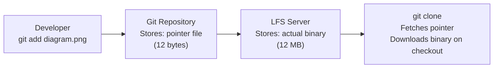

# Git Performance — Large Repositories, LFS, and Optimized Clones

> **Related sections:** [`internals/`](../internals/) for packfile mechanics and GC; [`enterprise-workflows/`](../enterprise-workflows/) for monorepo patterns; [`troubleshooting/`](../troubleshooting/) for slow operation diagnosis.

---

## Overview

Git was designed for source code, not binary assets, build artifacts, or large data files. Repositories that grow unbounded — through large files, accumulated history, or no pack optimization — become slow to clone, slow to fetch, and painful to work with on every push.

This section covers the full toolkit: Git LFS for binary files, sparse checkout for monorepos, partial clone for CI environments, shallow clone for fast pipeline clones, and GC tuning for repository health.

---

## Why This Matters

A 4 GB repository clone in a CI pipeline that runs 100 times per day wastes hours of compute time and creates developer friction. A monorepo with 20,000 files where every checkout touches every file is a recurring complaint in every standup.

The solutions exist. They require deliberate configuration.

---

## Learning Objectives

- Identify what is making a repository large or slow
- Configure Git LFS for binary files
- Use sparse checkout to work with subsets of monorepos
- Configure partial and shallow clones for CI environments
- Run GC and pack optimization for repository health

---

## Diagnosing a Large Repository

```bash
# Overall repository size
git count-objects -vH

# Detailed analysis with git-sizer (install separately)
brew install git-sizer
git-sizer --verbose

# Find the largest objects by size
git rev-list --objects --all \
  | git cat-file --batch-check='%(objecttype) %(objectname) %(objectsize) %(rest)' \
  | grep '^blob' \
  | sort -k3 -rn \
  | head -20 \
  | awk '{print $3, $4}'
# Output: size_in_bytes path/to/file
```

---

## Git LFS — Large File Storage

Git LFS replaces large files in the repository with pointer files. The actual file content is stored on a separate LFS server (GitHub, GitLab, self-hosted). The repository stays small; large files are fetched on demand.



### Setup

```bash
# Install
brew install git-lfs

# Initialize LFS in your repository (runs once per machine)
git lfs install

# Track specific file types
git lfs track "*.png"
git lfs track "*.pdf"
git lfs track "*.zip"
git lfs track "diagrams/*.drawio"
git lfs track "*.tfstate"     # Terraform state files (if not using remote backend)

# Always commit .gitattributes — this is what activates LFS
git add .gitattributes
git commit -m "chore: configure Git LFS tracking"

# Verify what is tracked
git lfs track
```

### `.gitattributes` for LFS (committed to repository)

```gitattributes
# Binary assets
*.png filter=lfs diff=lfs merge=lfs -text
*.jpg filter=lfs diff=lfs merge=lfs -text
*.gif filter=lfs diff=lfs merge=lfs -text
*.pdf filter=lfs diff=lfs merge=lfs -text
*.zip filter=lfs diff=lfs merge=lfs -text
*.tar.gz filter=lfs diff=lfs merge=lfs -text

# Architecture and diagrams
*.drawio filter=lfs diff=lfs merge=lfs -text
*.pptx filter=lfs diff=lfs merge=lfs -text

# Build artifacts (if tracked)
*.jar filter=lfs diff=lfs merge=lfs -text
*.war filter=lfs diff=lfs merge=lfs -text
```

### Useful LFS commands

```bash
# List all LFS-tracked files
git lfs ls-files

# See LFS status
git lfs status

# Fetch LFS files explicitly
git lfs fetch --all

# Push LFS files separately if push was interrupted
git lfs push --all origin

# Migrate existing large files to LFS
git lfs migrate import --include="*.png" --everything
```

---

## Sparse Checkout — Working with Subsets of Large Repositories

Sparse checkout allows you to check out only a subset of directories from a repository. This is essential for monorepos where checking out 50,000 files when you only need one service is wasteful.

```bash
# Clone without checking out files
git clone --no-checkout https://github.com/org/monorepo.git
cd monorepo

# Initialize sparse checkout in cone mode (recommended)
git sparse-checkout init --cone

# Specify the directories you need
git sparse-checkout set modules/vpc modules/eks pipelines/vpc

# Check out
git checkout main

# Add more directories later
git sparse-checkout add modules/iam

# See what is currently in the sparse checkout
git sparse-checkout list
```

```bash
# Expected output after set
$ git sparse-checkout list
modules/eks
modules/vpc
pipelines/vpc
```

---

## Partial Clone — Fetch History Without Blobs or Trees

Partial clone defers downloading object content until it is actually needed. Useful in CI where you often only need files at HEAD, not the full history.

```bash
# Clone without blob content (fetch blobs on demand)
git clone --filter=blob:none https://github.com/org/repo.git

# Clone without tree content (most aggressive — fetch trees and blobs on demand)
git clone --filter=tree:0 https://github.com/org/repo.git

# Combine with sparse checkout for maximum efficiency
git clone --filter=blob:none --no-checkout https://github.com/org/monorepo.git
cd monorepo
git sparse-checkout init --cone
git sparse-checkout set modules/vpc
git checkout main
```

**When to use:**
- CI pipelines that only need current HEAD state
- Engineers working on one module of a large monorepo
- Security scanning jobs that need file content without full history

**When NOT to use:**
- When you need full history for `git log`, `git blame`, or `git bisect`
- When working offline — partial clone requires network access for missing objects

---

## Shallow Clone — CI/CD Fast Clones

Shallow clone fetches only a specified depth of history. The most common CI optimization.

```bash
# Clone with only the last commit (no history at all)
git clone --depth=1 https://github.com/org/repo.git

# Clone with last 10 commits (useful for changelog generation)
git clone --depth=10 https://github.com/org/repo.git

# Shallow clone a specific branch
git clone --depth=1 --branch main https://github.com/org/repo.git

# Unshallow an existing shallow clone
git fetch --unshallow
```

**GitHub Actions shallow clone by default:**

```yaml
- uses: actions/checkout@v4
  with:
    fetch-depth: 0   # 0 = full history, 1 = shallow (default)
```

**When you need full history in CI** (changelog generation, release notes, semantic versioning):
```yaml
- uses: actions/checkout@v4
  with:
    fetch-depth: 0
```

---

## git maintenance — Scheduled Repository Optimization (Git 2.31+)

`git maintenance` is the modern replacement for manually running `git gc`. It runs background maintenance tasks on a schedule without blocking your terminal.

```bash
# Register the current repository for maintenance
git maintenance start

# This adds the repository to your global maintenance schedule
# Tasks run in the background via launchd (macOS) or cron (Linux)

# Run maintenance manually (all tasks)
git maintenance run --task=gc --task=commit-graph --task=loose-objects --task=incremental-repack

# Individual tasks
git maintenance run --task=commit-graph   # Speeds up git log, git status
git maintenance run --task=gc             # Pack loose objects
git maintenance run --task=loose-objects  # Pack objects exceeding threshold
git maintenance run --task=incremental-repack  # Repack without full repack

# Stop scheduled maintenance
git maintenance stop

# View status
git maintenance run --task=gc --dry-run
```

**Why this matters**: On large repositories, `git gc` can take several minutes and blocks the terminal. `git maintenance` runs incrementally in the background, keeping the repository optimized without interruption.

---

## Garbage Collection and Pack Optimization

```bash
# Basic GC — runs automatically but you can trigger it
git gc

# Aggressive GC — more delta compression, significantly slower
# ⚠ Only run on servers or CI — not on developer machines (can take 30+ minutes on large repos)
git gc --aggressive

# Prune unreferenced objects immediately
# ⚠ WARNING: destroys objects not in reflog — close the recovery window
# Only safe if you are certain nothing needs to be recovered
git gc --prune=now

# Check current state before GC
git count-objects -vH

# Check for and repair corruption
git fsck --full
```

**GC configuration:**

```bash
# Control how many loose objects trigger auto-GC (default: 6700)
git config gc.auto 256   # Trigger more aggressively for large-team repos

# Reflog expiry (default: 90 days — when unreachable objects become candidates for pruning)
git config gc.reflogExpire 90.days.ago

# Unreachable object expiry after reflog expiry (default: 30 days)
git config gc.pruneExpire 30.days.ago
```

---

## Repository Size Reduction — Removing Large Files from History

If large files were committed without LFS:

```bash
pip install git-filter-repo

# Remove specific file from all history
git filter-repo --path path/to/large-file.bin --invert-paths

# Remove all files larger than 10 MB from history
git filter-repo --strip-blobs-bigger-than 10M

# After filter-repo, the repository has been rewritten
# Force push to remote (COORDINATE WITH TEAM FIRST)
git push origin --force --all
git push origin --force --tags
```

---

## Performance Comparison Table

| Technique | Clone speed | Disk space | Offline capability | Use case |
|---|---|---|---|---|
| Standard clone | Slow | Full | Full | Daily development |
| Shallow `--depth=1` | Very fast | Minimal | Limited | CI pipelines |
| Partial `--filter=blob:none` | Fast | Medium | Limited | Large repo dev |
| Sparse checkout | Fast | Partial | Full (after checkout) | Monorepo modules |
| Combined (filter + sparse) | Very fast | Minimal | Limited | CI + monorepo |

---

## Real Enterprise Use Cases

**Platform team with a 15 GB monorepo**

CI jobs use `--depth=1 --filter=blob:none` combined with sparse checkout to only fetch the specific module being tested. Clone time went from 4 minutes to 12 seconds.

**Infrastructure team with large Terraform diagrams**

Architecture diagrams (`.drawio`, `.pptx`) are moved to Git LFS. The repository size drops from 800 MB to 12 MB. Engineers cloning the repository for code work do not download binaries.

**Security scanning pipeline**

A nightly security scan uses partial clone to fetch only current file content without history. The scan runs against the blob content of every file in `HEAD` without the overhead of downloading historical blobs.

---

## Common Mistakes

| Mistake | Consequence |
|---|---|
| Adding binary files without LFS | Repository grows with every version of every binary |
| Not committing `.gitattributes` | LFS tracking only applies locally, not for other cloners |
| Using shallow clone for `git bisect` | `bisect` requires history — shallow clone breaks it |
| Running `git gc --prune=now` on a shared repo | Destroys objects that other clones haven't fetched yet |
| Using `git lfs migrate` without coordinating with team | Rewrites history — force push required, breaks everyone's clones |

---

## Troubleshooting

### "Clone is taking forever"

```bash
GIT_TRACE_PACKET=1 git clone ... 2>&1 | grep -E "clone|upload"
# Identifies where time is being spent
# If it's pack negotiation, try --depth=1
# If it's LFS, try --skip-smudge initially
GIT_LFS_SKIP_SMUDGE=1 git clone ...
git lfs fetch --all  # Fetch LFS content separately afterward
```

### "Repository is 4 GB but source code is 50 MB"

```bash
git rev-list --objects --all \
  | git cat-file --batch-check='%(objecttype) %(objectname) %(objectsize) %(rest)' \
  | awk '/^blob/ {print substr($0,6)}' \
  | sort -k2 -rn \
  | head -10
# Identifies the largest blobs — these need LFS migration or removal
```

---

## Interview Questions

**Q: What is the difference between shallow clone and partial clone?**
A: Shallow clone limits history depth — you get fewer commits but full content for the commits you do get. Partial clone defers downloading object content (blobs, trees) until it is accessed — you can have full history with content fetched on demand.

**Q: When would you NOT use a shallow clone?**
A: When you need full history for operations like `git bisect`, `git log` analysis, `git blame` on older code, changelog generation, or semantic versioning tools that parse commit history.

**Q: What happens if someone commits a 500 MB binary without LFS?**
A: It enters the repository history permanently. Even if deleted in a subsequent commit, the blob exists in the object store and is cloned by everyone. It must be removed using `git filter-repo` and the history must be force-pushed — which disrupts everyone's local clones.

---

## References

| Resource | URL |
|---|---|
| Git LFS | https://git-lfs.com |
| Sparse Checkout | https://git-scm.com/docs/git-sparse-checkout |
| Partial Clone | https://git-scm.com/docs/partial-clone |
| git filter-repo | https://github.com/newren/git-filter-repo |
| git-sizer | https://github.com/github/git-sizer |
| GitHub — Working with large files | https://docs.github.com/en/repositories/working-with-files/managing-large-files |
