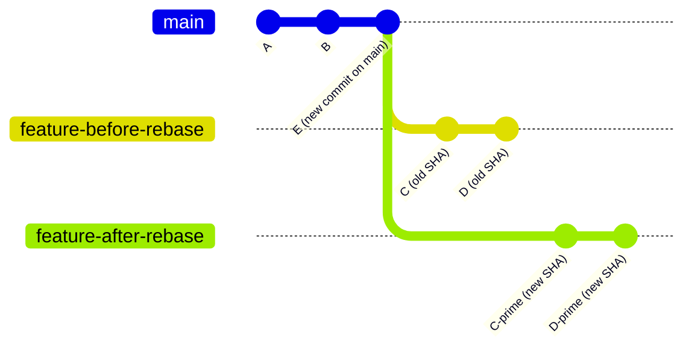

# Git Rebasing — History Rewriting with Intent

> **Related sections:** [`merging/`](../merging/) for when merge is the right choice over rebase; [`cherry-pick/`](../cherry-pick/) for applying specific commits rather than replaying a whole branch; [`recovery/`](../recovery/) for recovering from a rebase that went wrong; [`fundamentals/`](../fundamentals/) for understanding why rebasing changes commit SHAs.

---

## Overview

Rebasing replays your commits on top of a new base. It is the most misunderstood Git operation — and the most powerful one for maintaining clean, readable commit history in a production codebase.

This document covers the mechanics, the interactive mode, the golden rule, and the scenarios where rebase is the right and wrong tool.

---

## Why Rebasing Matters

Merge-only workflows produce history that looks like this:

```
*   Merge branch 'feature/x' into main
|\
| * fix: review comments
| * fix: more review comments
| * wip: halfway through
| * feat: initial implementation
|/
*   Merge branch 'feature/y' into main
|\
...
```

Rebased workflows produce:

```
* feat(vpc): add production VPC module [INFRA-1042]
* feat(eks): add managed node group configuration [INFRA-1039]
* fix(iam): correct role trust policy for cross-account access [SEC-114]
```

The second history answers the question "what changed in this codebase and why" in seconds. The first requires reading dozens of commits to find signal in noise.

---

## How Rebase Works Internally

Rebase does three things:

1. Identifies the commits on your branch that are not on the target
2. Saves those commits as patches
3. Resets your branch to the new base and re-applies each patch as a new commit

Because new commits are created, **all rebased commit SHAs change**. This is the golden rule consequence.



C and D become C' and D' — identical diffs, new parent, new SHA.

---

## The Golden Rule of Rebase

**Never rebase a branch that other people have based their work on.**

If you rebase commits that are already on a shared remote branch, you rewrite history that other engineers have pulled. Their next `git pull` breaks or creates a mess of duplicate commits.

Safe to rebase:
- Your local feature branch before opening a PR
- A branch only you are working on

Never rebase:
- `main`
- `develop`
- Any branch others have pulled

---

## Basic Rebase — Update from Main

```bash
git checkout feature/INFRA-1042-vpc-module
git fetch origin
git rebase origin/main
```

This replays your feature commits on top of the latest `main`. When you push:

```bash
git push --force-with-lease origin feature/INFRA-1042-vpc-module
```

Use `--force-with-lease` not `--force`. It aborts if someone else pushed to the branch since you last pulled.

---

## Interactive Rebase — Rewrite Before PR

Interactive rebase lets you edit, squash, reorder, and drop commits before they go into review.

```bash
git rebase -i origin/main
```

This opens an editor showing your commits:

```
pick 1a2b3c4 wip: initial vpc structure
pick 2b3c4d5 fix: typo in variable name
pick 3c4d5e6 fix: review comment — add description
pick 4d5e6f7 feat(vpc): complete VPC module implementation
pick 5e6f7a8 docs: add vpc module documentation
```

### Actions

| Action | Effect |
|---|---|
| `pick` | Keep commit as-is |
| `squash` / `s` | Merge into previous commit, edit combined message |
| `fixup` / `f` | Merge into previous commit, discard this message |
| `reword` / `r` | Keep commit but edit message |
| `edit` / `e` | Pause rebase at this commit to amend |
| `drop` / `d` | Delete commit entirely |

### Example: Squash WIP commits, keep meaningful ones

```
pick 1a2b3c4 feat(vpc): complete VPC module implementation
fixup 2b3c4d5 fix: typo in variable name
fixup 3c4d5e6 fix: review comment — add description
pick 5e6f7a8 docs: add vpc module documentation
```

Result: two clean commits instead of five messy ones.

---

## Rebase vs. Merge Decision Matrix

| Scenario | Use rebase | Use merge |
|---|---|---|
| Updating feature branch from main before PR | ✅ | — |
| Cleaning up WIP commits before PR review | ✅ | — |
| Integrating a reviewed PR into main | — | ✅ |
| Back-merging a hotfix to develop | — | ✅ |
| Long-lived release branch receiving fixes | — | ✅ |
| Shared branch multiple engineers push to | ❌ Never | ✅ |

---

## Practical Examples

### Squash all commits on a feature branch into one

```bash
# Count commits ahead of main
git log --oneline origin/main..HEAD | wc -l
# 5

git rebase -i HEAD~5
# Mark all but the first as fixup or squash
```

### Reorder commits

In the interactive editor, cut and paste lines to reorder. Git replays them in the order you specify.

### Edit a commit mid-rebase

```bash
# Mark the commit as 'edit' in the interactive editor
# Git pauses at that commit

git add forgotten-file.tf
git commit --amend --no-edit

git rebase --continue
```

### Abort a rebase

```bash
git rebase --abort
# Returns branch to exactly the state before rebase started
```

---

## autosquash — Automated Fixup Commits (the Right Way)

Instead of manually finding fixup targets in the interactive editor, use `git commit --fixup`:

```bash
# You have a commit with a problem
git log --oneline
# 3f8a2b1 feat(vpc): complete VPC module implementation
# 2e7d9c0 feat(vpc): initial structure

# Create a fixup commit that auto-targets the correct commit
git add modules/vpc/main.tf
git commit --fixup 3f8a2b1
# Creates: "fixup! feat(vpc): complete VPC module implementation"

# Also works for rewording
git commit --squash 3f8a2b1

# Rebase with autosquash — no manual editor navigation needed
git rebase -i --autosquash origin/main
# Git automatically marks the fixup commit in the right position
```

This workflow removes the need to manually cut and paste lines in the interactive editor. Mark the fix as a fixup when you commit it, then let `--autosquash` arrange it.

---

## `git rebase --exec` — Validate Each Commit

`--exec` runs a command after each replayed commit. Use this to ensure every individual commit in your history passes validation — not just the final state.

```bash
# Run terraform validate after each commit
git rebase -i --exec "terraform validate ./modules/" origin/main

# Run tests after each commit during rebase
git rebase -i --exec "python -m pytest tests/unit/" origin/main

# If a command fails, rebase pauses at that commit
# Fix the issue, amend, then continue:
git add .
git commit --amend --no-edit
git rebase --continue
```

This is how you guarantee that `git bisect` will work cleanly on your branch — every commit is individually valid.

---

## Expected Output

```bash
$ git rebase origin/main
Successfully rebased and updated refs/heads/feature/INFRA-1042-vpc-module.

$ git log --oneline origin/main..HEAD
3f8a2b1 docs: add VPC module documentation
2e7d9c0 feat(vpc): complete VPC module implementation
```

### Conflict during rebase

```bash
$ git rebase origin/main
CONFLICT (content): Merge conflict in modules/vpc/main.tf
error: could not apply 1a2b3c4... feat(vpc): initial structure
hint: Resolve all conflicts manually, then run "git rebase --continue"
hint: Run "git rebase --abort" to abort
```

```bash
# Edit the conflicting file, then:
git add modules/vpc/main.tf
git rebase --continue
```

---

## Real Enterprise Use Cases

**Platform team PR discipline**

Every PR is rebased on `main` before review. The reviewer sees clean, intentional commits. After approval, a squash merge to `main` produces one commit per feature.

**Hotfix backport**

A critical fix is committed on `main`. The `release/2024-q3` branch needs the same fix. Cherry-pick (see `cherry-pick/`) handles this, but if the entire commit history of a hotfix branch needs porting, rebase onto the release branch achieves it cleanly.

**Cleaning up exploratory work before sharing**

An engineer spends a day exploring three approaches. Before opening a PR, they use interactive rebase to drop the dead ends and keep only the approach that worked, with a coherent commit sequence.

---

## Common Mistakes

| Mistake | Consequence |
|---|---|
| Rebasing `main` or shared branches | Rewrites history others depend on — team-wide disruption |
| Using `--force` instead of `--force-with-lease` | Overwrites commits from teammates |
| Abandoning a rebase mid-way | Repository left in a broken mid-rebase state |
| Rebasing after the PR is reviewed | Changes commit SHAs, GitHub marks previous review comments as outdated |
| Not verifying after rebase | Rebase can silently apply a patch incorrectly if context has changed |

---

## Best Practices

- Rebase feature branches on `main` before opening a PR — not during review
- Use `--force-with-lease` whenever force-pushing a rebased branch
- Run the full test suite after a rebase before pushing
- Squash WIP commits in interactive rebase — keep only commits that explain a decision
- Document your rebase policy in `CONTRIBUTING.md`
- Configure pull to rebase by default for your own workflow: `git config --global pull.rebase true`

---

## Troubleshooting

### "After rebase, my PR shows 200 changed files instead of 5"

```bash
# The rebase went wrong or the wrong base was used
git rebase --abort
git fetch origin
git rebase origin/main
```

### "Rebase paused with conflicts on every single commit"

The branch has diverged too far. Consider:
1. Merging instead of rebasing
2. Doing a squash-then-rebase (flatten your commits first, then rebase once)

### "I rebased and now my commits are duplicated"

You rebased a branch that was already pushed without force-pushing, then pulled. You now have both the old and new versions.

```bash
# Hard reset to the remote state
git fetch origin
git reset --hard origin/feature/my-branch
```

---

## Interview Questions

**Q: What is the golden rule of rebasing?**
A: Never rebase commits that have been pushed to a shared branch that other engineers have based work on. Rebasing changes commit SHAs — engineers who have pulled the old SHAs will have a broken history after a force push.

**Q: When would you use `git rebase --onto`?**
A: When a branch was accidentally cut from the wrong base. `git rebase --onto <correct-base> <wrong-base> <branch>` replays the commits that are on `branch` but not on `wrong-base`, applying them on top of `correct-base`.

**Q: You have 8 messy commits on a feature branch. How do you clean them up before opening a PR?**
A: Use `git rebase -i origin/main`. In the interactive editor, mark the first meaningful commit as `pick` and all the cleanup/WIP commits as `fixup`. This collapses them into intentional commits without the noise. Alternatively, use `reword` to clean up commit messages that will appear in the main branch history.

**Q: What is the difference between `squash` and `fixup` in interactive rebase?**
A: Both merge the commit into the previous one. `squash` opens the editor so you can compose a new combined message. `fixup` discards the commit's message entirely and uses only the previous commit's message. Use `fixup` for typo fixes and review corrections that add no information to the commit message.

---

## References

| Resource | URL |
|---|---|
| Git Rebasing | https://git-scm.com/book/en/v2/Git-Branching-Rebasing |
| Interactive Rebase | https://git-scm.com/book/en/v2/Git-Tools-Rewriting-History |
| git rebase | https://git-scm.com/docs/git-rebase |
| When NOT to rebase | https://git-scm.com/book/en/v2/Git-Branching-Rebasing#_rebase_peril |
