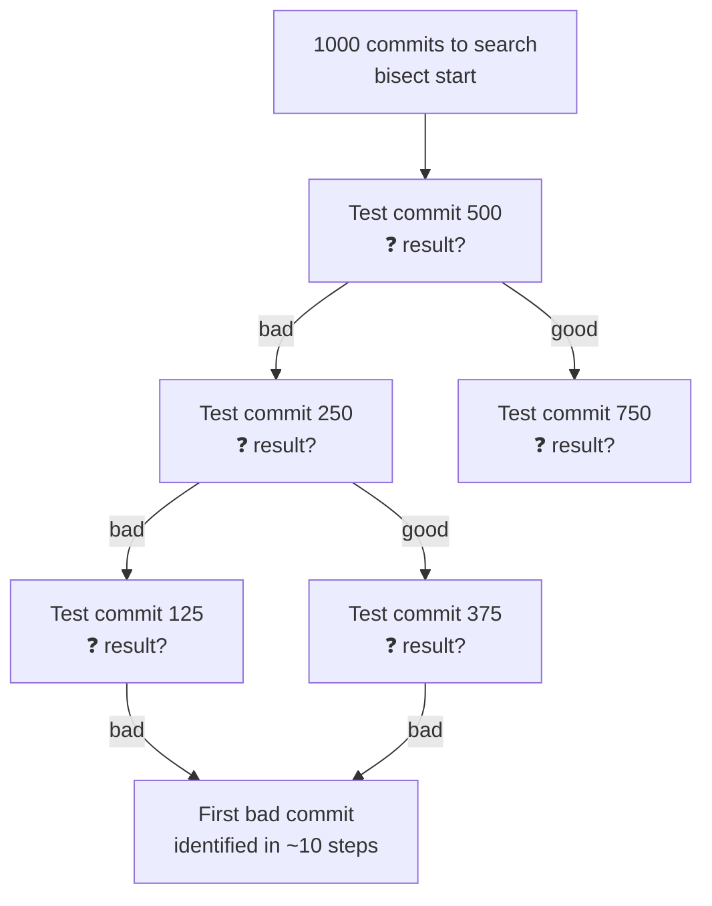
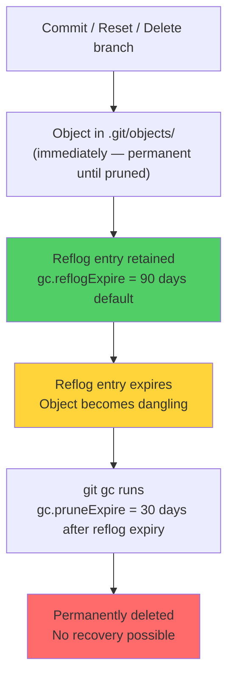

# Git Recovery — Reflog, Bisect, and Getting Back What You Lost

> **Related sections:** [`internals/`](../internals/) explains why lost objects are recoverable; [`fundamentals/`](../fundamentals/) covers the three-tree model underlying reset mechanics; [`troubleshooting/`](../troubleshooting/) is the broader field guide for failures.
>
> **Navigation:** [⌂ Index](../) | [← `hooks/`](../hooks/) | [`security/` →](../security/)

---

## Overview

Almost nothing is permanently lost in Git. The object store retains every committed object until GC prunes it. The reflog records every HEAD movement for 90 days by default. Between these two mechanisms, recovery from nearly any mistake is possible — including accidental resets, deleted branches, dropped stash, and force pushes.

The exception: uncommitted changes in the working directory after `git reset --hard` are gone. The reflog only covers committed objects.

---

## Why This Matters

Engineers lose work unnecessarily because they do not know the reflog exists or how to use it. Every time someone says "I lost all my commits," the answer is almost always in `git reflog`. This document is the complete recovery playbook.

---

## Learning Objectives

- Use `git reflog` to find and recover any lost commit
- Recover from accidental `git reset --hard`
- Restore deleted branches
- Recover lost stash
- Use `git bisect` to identify regressions efficiently
- Understand when data is truly unrecoverable

---

## The Reflog — Your Primary Recovery Tool

The reflog is a local, append-only log of every HEAD movement. It captures checkout, commit, merge, rebase, reset, pull, cherry-pick — every operation that moves HEAD.

```bash
git reflog
# HEAD@{0}: reset: moving to HEAD~2
# HEAD@{1}: commit: feat(eks): add managed node group
# HEAD@{2}: commit: feat(vpc): add subnet configuration
# HEAD@{3}: checkout: moving from main to feature/INFRA-1042
# HEAD@{4}: commit: chore: update provider versions
# HEAD@{5}: pull: Fast-forward
```

**Reading reflog entries:**
- `HEAD@{0}` is the current state
- `HEAD@{N}` is N positions back in history
- The description after the colon explains what happened

```bash
# Reflog for a specific branch
git reflog show feature/INFRA-1042

# Reflog with timestamps
git reflog --date=iso

# Show reflog for the stash
git reflog show stash
```

---

## Recovery Scenarios

### Scenario 1 — Accidental `git reset --hard`

```bash
# What happened
git reset --hard HEAD~3
# Three commits appear to be gone

# Recovery
git reflog
# HEAD@{0}: reset: moving to HEAD~3
# HEAD@{1}: commit: feat(eks): node group config    ← this is what you want
# HEAD@{2}: commit: feat(vpc): subnet outputs
# HEAD@{3}: commit: feat(vpc): initial module

# Restore to the commit before the reset
git reset --hard HEAD@{1}
```

### Scenario 2 — Deleted a branch with unmerged commits

```bash
# What happened
git branch -D feature/my-important-work
# Branch deleted — commits appear gone

# Recovery — find the tip of the deleted branch in reflog
git reflog | grep "feature/my-important-work"
# HEAD@{7}: checkout: moving from feature/my-important-work to main

# The SHA just before checkout is the branch tip
git reflog
# HEAD@{6}: commit: feat: important work complete     ← this is the branch tip

# Recreate the branch
git checkout -b feature/my-important-work HEAD@{6}
# Or directly
git branch feature/my-important-work abc1234
```

### Scenario 3 — Commits made in detached HEAD state

```bash
# You checked out a tag, made commits, then switched branches
# Those commits are not on any branch

git reflog
# HEAD@{0}: checkout: moving from abc1234 to main
# HEAD@{1}: commit: fix: patched the issue in detached state
# HEAD@{2}: commit: test: verified fix
# HEAD@{3}: checkout: moving from main to v1.2.0 (detached)

# The commits at HEAD@{1} and HEAD@{2} are your detached work
git checkout -b recover/detached-fix HEAD@{1}
# Branch created — commits are now safe
```

### Scenario 4 — Bad rebase — commits disappeared or duplicated

```bash
# After a rebase gone wrong
git reflog
# HEAD@{0}: rebase (finish): returning to refs/heads/feature/vpc
# HEAD@{1}: rebase (pick): feat: vpc module
# HEAD@{3}: rebase (start): checkout origin/main
# HEAD@{4}: commit: feat: vpc module       ← pre-rebase state
# HEAD@{5}: commit: feat: initial vpc

# Restore to pre-rebase state
git reset --hard HEAD@{4}
# Now push with --force-with-lease to update the remote branch
git push --force-with-lease origin feature/vpc
```

### Scenario 5 — Recover a lost stash

```bash
# git stash drop removed the stash — but was it the right one?
git reflog show stash
# stash@{0}: WIP on main: abc1234 chore: update providers
# stash@{0}: On feature/vpc: WIP: subnet logic

# If the stash is gone from the list but the object exists
git fsck --unreachable | grep commit
# Each unreachable commit might be a dropped stash

# Inspect unreachable commits
git show <sha-from-fsck>

# If that's the stash, apply it
git stash apply <sha-from-fsck>
```

### Scenario 6 — Recover after force push overwrote remote branch

```bash
# Colleague force-pushed main and your commits are gone from remote

# If you have the commits locally
git log --oneline -5
# Your commits are still here in your local clone

# Push back (with coordination)
git push origin main --force-with-lease

# If your local is also wrong, check reflog on a CI machine
# or another colleague's clone — someone has the objects
```

---

## git bisect — Finding the Commit That Broke Something

`git bisect` uses binary search through commit history to identify the first commit that introduced a bug or regression. With 256 commits to search, it finds the answer in 8 steps.



### Manual bisect

```bash
git bisect start

# Tell Git the current state is broken
git bisect bad

# Tell Git a known good point (tag, branch, or SHA)
git bisect good v1.0.0

# Git checks out the midpoint commit
# Test whether the issue exists — then mark it
git bisect good   # This commit is fine
# or
git bisect bad    # This commit has the problem

# Continue until Git identifies the culprit
# bisect found: abc1234 is the first bad commit
git show abc1234

# End bisect
git bisect reset
```

### Automated bisect with a test script

```bash
git bisect start
git bisect bad
git bisect good v1.0.0

# Provide a script that exits 0 for good, non-zero for bad
git bisect run ./scripts/check-regression.sh

# Git runs the script automatically at each step
# Output:
# abc1234 is the first bad commit
# commit abc1234
# Author: ...
# feat: change that broke things

git bisect reset
```

**Example test script:**

```bash
#!/bin/bash
# scripts/check-regression.sh
# Returns 0 if healthy, 1 if broken

terraform validate ./modules/ > /dev/null 2>&1
exit $?
```

### Bisect log — saving and replaying

```bash
# Save your bisect session
git bisect log > bisect-session.log

# Replay on another machine
git bisect replay bisect-session.log
```

---

## Understanding the Recovery Window



**The two expiry settings are independent:**

| Setting | Default | What it controls |
|---|---|---|
| `gc.reflogExpire` | 90 days | How long reflog entries for reachable refs are kept |
| `gc.reflogExpireUnreachable` | 30 days | How long reflog entries for unreachable commits are kept |
| `gc.pruneExpire` | 2 weeks | How long dangling objects survive after reflog expiry |

Running `git gc --prune=now` bypasses all of these — it immediately removes any object not referenced by a reflog entry or branch/tag. Do not run this if you are trying to recover work.

---

## Useful Recovery Commands Reference

```bash
# See everything reflog tracks
git reflog --all

# Find all unreachable objects (potential lost commits)
git fsck --unreachable

# See content of a specific unreachable object
git show <sha>

# Create a branch from any SHA
git branch recover/branch-name <sha>

# Apply a stash SHA without it being in the stash list
git stash apply <sha>

# Find commits by message (even if branch is deleted)
git log --all --oneline --grep="feature name"

# Find commits by author
git log --all --oneline --author="engineer@example.com"
```

---

## git worktree — Investigate a Branch Without Stashing

When you need to check the state of another branch while keeping your current work intact, `git stash` is one option. `git worktree` is the better option for longer investigations — it checks out a second branch into a separate directory with no stashing required.

```bash
# Create a separate working directory for another branch
git worktree add ../investigate-main main

# Work in the investigation directory
cd ../investigate-main
git log --oneline -10
terraform plan

# Return to your original work
cd ../automation-lab
# Original branch is untouched — no stash, no pop

# Clean up the worktree when done
git worktree remove ../investigate-main
git worktree prune
```

This is especially useful during incidents where you need to reproduce a bug on `main` while a fix is in progress on a feature branch.

---

## Real Enterprise Use Cases

**On-call engineer recovers after wrong reset**

A platform engineer meant to undo their last commit but ran `git reset --hard HEAD~5`. Five commits of infrastructure work appeared gone. Using `git reflog`, they identified the commit SHA from before the reset and restored the branch in 30 seconds.

**CI identifies the commit that broke a Terraform plan**

A nightly `terraform plan` started failing. No one knows when it broke. `git bisect run` with a `terraform validate` script automatically identifies the exact commit in 8 iterations across 200 commits — without anyone reading any code.

**Deleted branch recovered during code review**

An engineer deleted a feature branch thinking it was merged. The PR was still open. They searched `git reflog` for the last checkout from that branch, recovered the SHA, and recreated the branch in under a minute.

---

## Common Mistakes

| Mistake | Consequence | Prevention |
|---|---|---|
| Running `git gc --prune=now` immediately after a mistake | Permanently destroys unreferenced objects | Wait — default 14-day window exists for recovery |
| Not knowing about `git reflog` | Engineers believe work is permanently gone | Make reflog part of every engineer's toolkit |
| Confusing `git bisect bad/good` direction | Tells bisect the wrong information | Start bisect from a known bad state and mark good explicitly |
| Running `git bisect` on a shallow clone | History is not available | Unshallow first: `git fetch --unshallow` |

---

## Interview Questions

**Q: An engineer runs `git reset --hard HEAD~5` and loses 5 commits. How do you recover?**
A: Run `git reflog`. Find the entry just before the reset — it shows the SHA the branch was on before the operation. Run `git reset --hard <that-sha>` to restore the branch to its original state. The 5 commits were never deleted from the object store.

**Q: What is `git bisect` and when would you use it?**
A: `git bisect` performs a binary search through commit history to find the first commit that introduced a bug. You mark a known-good commit and a known-bad state, then Git checks out midpoints for you to test. Use it when you have a regression and many commits to narrow down — it finds the culprit in O(log n) steps.

**Q: When is lost data in Git truly unrecoverable?**
A: When the object has been removed by garbage collection after the reflog entry for it has expired. The default reflog expiry is 90 days, with pruning of unreferenced objects after 14 days. Running `git gc --prune=now` immediately after losing data removes the safety window. Uncommitted working directory changes after `git reset --hard` are also unrecoverable — they were never in the object store.

---

## Engineering Notes

**The reflog is the recovery safety net. Understand it before you need it.** The reflog records every position HEAD and branch tips have pointed to. Most "lost" commits are trivially recoverable via `git reflog` within 90 days. Engineers who understand this are calm during incidents; those who don't are panicked.

**Never run `git gc --prune=now` during an active recovery.** This permanently removes unreachable objects — the objects you are trying to recover. If you realize you've lost commits, stop all GC-triggering operations (no `git gc`, `git maintenance`, or automatic GC) immediately.

**`git bisect run` is dramatically underused for regression diagnosis.** Manual bisect requires an engineer to test each step. `git bisect run` executes a test script automatically across the binary search. For a 1,000-commit search space, this reduces 10 bisect steps to a fully automated 10-minute run. The engineer only needs to write a script that exits 0 for good and non-zero for bad.

**`git worktree` eliminates context switching during recovery.** If you need to diagnose an issue on a release branch without abandoning in-progress work on your feature branch, `git worktree add` checks out the release branch to a separate directory. Both workspaces share the same `.git/` — no extra clone required.

**Document recovery procedures before incidents, not during them.** Under pressure, the wrong command is run. This is a known pattern. Have the `git reflog | grep`, `git stash apply`, and `git reset` commands written down and accessible. The production-incidents/ playbooks in this repository are an example of this.

---

## References

| Resource | URL |
|---|---|
| git reflog | https://git-scm.com/docs/git-reflog |
| git bisect | https://git-scm.com/docs/git-bisect |
| git fsck | https://git-scm.com/docs/git-fsck |
| Undoing Things | https://git-scm.com/book/en/v2/Git-Basics-Undoing-Things |
| Debugging with Git | https://git-scm.com/book/en/v2/Git-Tools-Debugging-with-Git |
