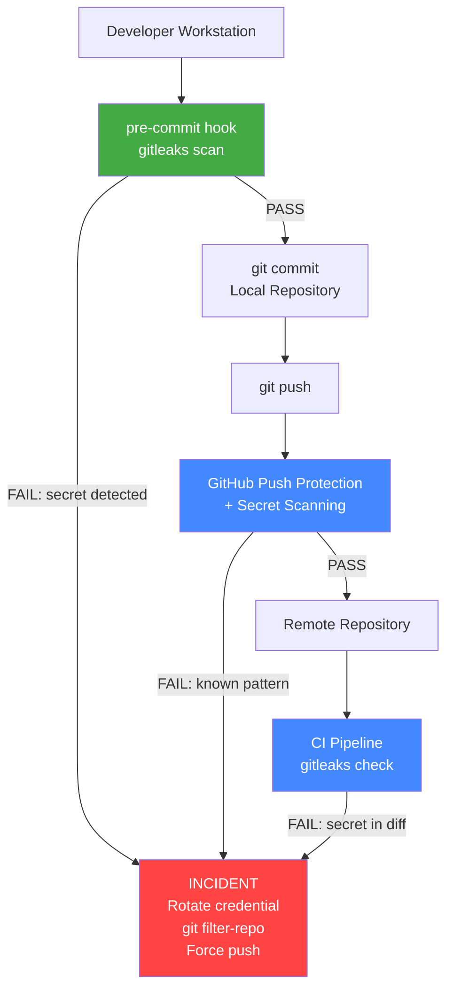

# Git Security — Protecting Repositories, Identities, and Supply Chains

> **Related sections:** [`hooks/`](../hooks/) for local secrets scanning enforcement; [`best-practices/`](../best-practices/) for .gitignore and credential hygiene; [`enterprise-workflows/`](../enterprise-workflows/) for compliance and audit requirements.
>
> **Navigation:** [⌂ Index](../) | [← `recovery/`](../recovery/) | [`performance/` →](../performance/)

---

## Overview

Git repositories are a high-value target. They contain source code, infrastructure definitions, pipeline configurations, and — when security practices fail — credentials, API keys, private keys, and secrets that should never have been committed.

This section covers the complete security surface: preventing secrets from entering repositories, verifying commit identity through signing, securing transport, and detecting supply chain risks.



> Secrets prevention works in layers. Local hooks catch most issues. GitHub Push Protection blocks at push time. CI scanning is the last line. If all three fail, the incident playbook in [`production-incidents/P002`](../production-incidents/P002-secret-committed-to-public-repo.md) applies.

---

## Why This Matters

A secret committed to a public repository is compromised the moment it is pushed — even if you delete it a minute later. GitHub's secret scanning, automated bots, and security researchers continuously monitor public repositories. The exposure window is seconds, not hours.

In private repositories, the risk is insider access and token leakage. A leaked GitHub PAT can give an attacker full write access to every repository the token has access to.

---

## Learning Objectives

- Prevent secrets from entering commit history
- Set up pre-commit and CI scanning with gitleaks
- Sign commits and tags with GPG
- Configure SSH vs HTTPS correctly for multi-account environments
- Understand GitHub's built-in security features
- Audit repository access and configuration

---

## Secrets in Git — Prevention First

### What gets committed accidentally

| Type | Examples |
|---|---|
| Cloud credentials | `AWS_ACCESS_KEY_ID`, Azure SAS tokens, GCP service account JSON |
| API keys | Stripe, SendGrid, Datadog, PagerDuty |
| Private keys | SSH private keys, TLS certificates |
| Database credentials | Connection strings with passwords |
| Infrastructure secrets | Vault tokens, Kubernetes secrets, Terraform state with sensitive outputs |
| Personal tokens | GitHub PATs, npm tokens, PyPI tokens |

### If it was already committed — Act Immediately

1. Rotate the credential before doing anything else. Assume it was already read.
2. Remove from history using `git filter-repo` (not `git filter-branch` — it is deprecated and slow)
3. Force push (requires coordination with the team)
4. Notify security team if the repository was public

```bash
pip install git-filter-repo

# Remove a specific file from all history
git filter-repo --path secrets/credentials.json --invert-paths

# Remove all files matching a pattern
git filter-repo --path-glob '*.pem' --invert-paths

# Remove a specific string from all files (e.g., a hardcoded token)
git filter-repo --replace-text <(echo 'ghp_REALTOKEN==>REDACTED')

# After filter-repo, force push (coordinate with team first)
git push origin --force --all
git push origin --force --tags
```

---

## SSH Commit Signing (Git 2.34+ Alternative to GPG)

Git 2.34 added the ability to sign commits with an SSH key — the same key you already use for authentication. No GPG required.

```bash
# Configure SSH signing
git config --global gpg.format ssh
# NOTE: SSH signing uses the PUBLIC key file path (unlike GPG which uses the key ID)
git config --global user.signingkey ~/.ssh/id_ed25519_personal.pub
git config --global commit.gpgsign true

# Sign a commit
git commit -S -m "feat: signed with SSH key"

# Verify: create an allowed_signers file
# Format: <email> <keytype> <key>
echo "akash@example.com $(cat ~/.ssh/id_ed25519_personal.pub)" > ~/.ssh/allowed_signers
git config --global gpg.ssh.allowedSignersFile ~/.ssh/allowed_signers

# Verify signatures
git log --show-signature | head -10
# Good "git" signature for akash@example.com with ED25519 key SHA256:...
```

SSH signing is simpler than GPG for most teams and uses infrastructure that already exists. GPG remains appropriate for environments that require traditional PGP key infrastructure.

---

## CODEOWNERS — Automatic Review Assignment

`CODEOWNERS` is a GitHub feature that automatically assigns reviewers to pull requests based on which files changed. It is a primary access control in enterprises with large teams.

```bash
# .github/CODEOWNERS
# Syntax: <pattern> <@user or @org/team>

# Default owner for everything
*                        @org/platform-team

# Security files require security team review
.github/workflows/       @org/security-team
modules/iam/             @org/security-team
*.tf                     @org/platform-team @org/security-team

# Secrets configuration requires explicit approval
.gitleaks.toml           @org/security-team
.pre-commit-config.yaml  @org/platform-team

# Documentation has lighter review requirements
docs/                    @org/platform-team
```

Configure in repository settings: `Settings → Code and Automation → Branches → Branch protection → Require review from Code Owners`.

Once enabled:
- PRs touching `modules/iam/` automatically request a review from `@org/security-team`
- A PR cannot be merged until all CODEOWNERS have approved
- This is the mechanism that prevents junior engineers from modifying security controls without senior sign-off

---

## Secrets Scanning

### gitleaks — Pre-Commit and CI

```bash
# Install
brew install gitleaks

# Scan the entire repository
gitleaks detect --source .

# Scan only staged files
gitleaks detect --staged

# Generate a report
gitleaks detect --report-format json --report-path gitleaks-report.json
```

**Custom rules in `.gitleaks.toml`**

```toml
title = "BuildWithAkash gitleaks config"

[allowlist]
  description = "Allowed patterns"
  regexes = [
    # Allow example/placeholder tokens in documentation
    "EXAMPLE_TOKEN",
    "your-token-here",
  ]

[[rules]]
  id = "vault-token"
  description = "Vault token"
  regex = '''hvs\.[a-zA-Z0-9_-]{24,}'''
  tags = ["vault", "secret"]
```

### detect-secrets — Python-based alternative

```bash
pip install detect-secrets

# Scan and create baseline
detect-secrets scan > .secrets.baseline

# Audit new findings
detect-secrets audit .secrets.baseline
```

### GitHub Secret Scanning

GitHub automatically scans public repositories for known token patterns (GitHub PATs, AWS keys, etc.) and notifies repository owners and the affected service provider. On GitHub Advanced Security, this works for private repositories too.

Enable in: `Settings → Code security and analysis → Secret scanning`

---

## Commit Signing with GPG

Signed commits prove that a commit was made by a specific person with a specific cryptographic key — not just by someone who configured `git config user.email`. This matters in regulated environments and for supply chain integrity.

### Setup GPG signing

```bash
# Generate a key (use your GitHub-registered email)
gpg --full-generate-key
# Choose: RSA and RSA, 4096 bits, no expiry (or set appropriate expiry)
# Use the same email as your GitHub account

# List keys
gpg --list-secret-keys --keyid-format=long
# [SC] rsa4096/3AA5C34371567BD2 2025-07-01 [expires: 2027-07-01]
#       Key fingerprint = A1B2 C3D4 E5F6 A7B8 C9D0 E1F2 A3B4 C5D6 E7F8 A9B0

# Export the public key to add to GitHub
gpg --armor --export 3AA5C34371567BD2
# Paste this in GitHub → Settings → SSH and GPG keys → New GPG key

# Configure Git to use this key
git config --global user.signingkey 3AA5C34371567BD2
git config --global commit.gpgsign true
git config --global tag.gpgsign true
```

### Sign commits

```bash
# Explicitly sign a commit (when auto-signing is off)
git commit -S -m "feat: signed commit"

# Verify commit signatures
git log --show-signature | head -30
# gpg: Signature made Tue Jul  1 18:00:00 2025 UTC
# gpg: Good signature from "Akash Khurana <akash@example.com>"
```

### Enforce signed commits on GitHub

`Settings → Branches → Branch protection rules → Require signed commits`

Once enforced, only commits with verified GPG or SSH signatures can be merged to the protected branch.

---

## SSH vs HTTPS — When to Use Which

| Factor | SSH | HTTPS |
|---|---|---|
| Authentication | SSH key pair | Username + PAT token |
| Multi-account | Clean — one key per account | Requires credential helper config |
| CI/CD environments | Deploy key or machine user key | Token with minimal scope |
| Corporate proxy | May be blocked on port 22 | Works through proxies on port 443 |
| Token expiry | SSH keys do not expire (unless set) | PATs have explicit expiry |
| Key rotation | Requires key replacement | Token replacement only |

### SSH for personal accounts

```bash
# Generate key
ssh-keygen -t ed25519 -C "akash@example.com" -f ~/.ssh/id_ed25519_personal

# Add to ssh-agent
ssh-add ~/.ssh/id_ed25519_personal

# Add public key to GitHub account
# Settings → SSH and GPG keys → New SSH key
pbcopy < ~/.ssh/id_ed25519_personal.pub

# Test
ssh -T git@github.com
# Hi username! You've successfully authenticated
```

### Multi-account SSH configuration

```bash
# ~/.ssh/config
Host github-personal
  HostName github.com
  User git
  IdentityFile ~/.ssh/id_ed25519_personal
  IdentitiesOnly yes
  AddKeysToAgent yes      # macOS: persist key in agent across sessions

Host github-work
  HostName github.com
  User git
  IdentityFile ~/.ssh/id_ed25519_work
  IdentitiesOnly yes
  AddKeysToAgent yes
```

```bash
# Personal repo remote
git remote set-url origin git@github-personal:username/repo.git

# Work repo remote
git remote set-url origin git@github-work:org/repo.git
```

### HTTPS with minimal-scope PATs

When using HTTPS, use fine-grained personal access tokens with the minimum permissions required.

```bash
# Enable per-URL credential storage (prevent cross-account token bleeding)
git config --global credential.useHttpPath true

# Include username in remote URL so Keychain stores separately per account
git remote set-url origin https://username@github.com/username/repo.git
```

---

## Minimum PAT Scopes by Use Case

| Use case | Required scopes |
|---|---|
| Clone and pull public repos | No token needed |
| Clone and pull private repos | `repo` (read) |
| Push to a repo | `repo` (write) |
| GitHub Actions (reading org packages) | `read:packages` |
| Managing webhooks | `admin:repo_hook` |
| Reading org members | `read:org` |

---

## Repository Access Audit

```bash
# Find commits from unexpected authors
git log --oneline --format="%an <%ae> %s" | sort | uniq | grep -v "expected-author"

# Find commits that modified sensitive paths
git log --oneline -- '*.pem' '*.key' 'secrets/' '.env*'

# Find when a specific string was added
git log -S "aws_access_key" --oneline --all

# Find all contributors
git shortlog -sne --all
```

GitHub audit log for organization events:
`Organization → Settings → Audit log`

---

## Real Enterprise Use Cases

**Financial services team — signed commits required**

All commits to `main` and `release/*` must have verified GPG signatures. Branch protection enforces this. The compliance team reviews the audit log monthly to verify that no unsigned commits bypassed the control.

**SRE team detecting an accidentally committed Vault token**

gitleaks runs in the `pre-commit` hook and as a GitHub Actions step. The hook catches the token before the commit is created. If `--no-verify` is used and the commit reaches GitHub, the Actions workflow fails and posts a comment on the PR with the finding.

**Multi-account engineer setup**

SSH aliases route pushes to personal or work GitHub accounts based on the remote URL. No cross-account credential leakage is possible because credentials are isolated to specific host aliases, not to `github.com` globally.

---

## Common Mistakes

| Mistake | Consequence |
|---|---|
| Using a single PAT with full `repo` scope | A leaked token has write access to all repositories |
| Committing `.env` files | Credentials enter version control and potentially public GitHub |
| Not rotating credentials after a public repository exposure | Attacker retains access even after the repository is made private |
| Global HTTPS credential storage without `useHttpPath` | Work token used for personal repos and vice versa |
| Using `--no-verify` to skip a failing hook | Bypasses the last local line of defense |

---

## Troubleshooting

### "GPG signing fails with 'secret key not available'"

```bash
# Check the configured key matches an available key
git config --global user.signingkey
gpg --list-secret-keys --keyid-format=long

# On macOS, GPG may need the agent
echo "pinentry-program /usr/bin/pinentry-curses" >> ~/.gnupg/gpg-agent.conf
gpgconf --kill gpg-agent
```

### "Permission denied (publickey) with SSH"

```bash
# Verify the agent has the key
ssh-add -l

# Add the key
ssh-add ~/.ssh/id_ed25519_personal

# Test with verbose output
ssh -vT git@github.com
```

### "403 on push using HTTPS"

macOS Keychain is sending the wrong credential. See [`troubleshooting/`](../troubleshooting/) Scenario 10 for the full resolution.

---

## Interview Questions

**Q: A developer committed an API key to a public repository. What do you do?**
A: First, rotate the credential immediately — before touching Git history. Assume it was already read. Then remove it from history using `git filter-repo`. Force push to all branches and tags. File an incident report. Implement a `pre-commit` gitleaks hook and CI scanning to prevent recurrence.

**Q: What is the difference between GPG-signed commits and SSH authentication?**
A: SSH authentication verifies that a push came from someone who holds a specific private key. GPG commit signing verifies that a specific commit object was created by someone with a specific GPG key. They operate at different layers — SSH secures the transport; GPG secures the content.

**Q: Why should PATs have minimum scope?**
A: A PAT with `repo` scope can read, write, and delete all private repositories accessible to the user. If that token is leaked, the attacker has full access. A token scoped to `repo:read` on one specific repository limits the blast radius.

---

## Engineering Notes

**Rotate credentials before cleaning Git history.** When a secret is committed to a repository, the instinct is to delete the commit and move on. The correct instinct is to rotate the credential immediately, then clean the history. Rotation invalidates the leaked credential in 30 seconds. History cleanup takes hours. Every second spent on history cleanup before rotation is a second the credential remains valid.

**SSH commit signing is worth the setup cost.** GPG signing has historically been complex to set up and maintain. SSH commit signing (Git 2.34+) uses the same key material engineers already have for repository access. For infrastructure repositories where an audit trail matters, signed commits provide cryptographic proof of authorship that a compromised GitHub password cannot undermine.

**CODEOWNERS is the most underused GitHub security feature.** It is a single file that enforces who must review changes to specific paths. For infrastructure repositories, requiring the security team to review changes to IAM, network, and secrets management directories is a control that takes 10 minutes to implement and eliminates an entire class of misconfiguration.

**Fine-grained PATs over classic PATs.** Classic PATs grant broad access. Fine-grained PATs are scoped to specific repositories and specific permissions. Use fine-grained PATs for all new automation. Audit existing classic PATs and replace them.

**`AddKeysToAgent yes` in SSH config is required on macOS.** Without it, the SSH key is not loaded into the agent across reboots, and `git push` will prompt for a passphrase in scripts and CI contexts. This is a macOS-specific requirement that catches engineers who set up SSH correctly on Linux but not on their Mac.

---

## References

| Resource | URL |
|---|---|
| GitHub Secret Scanning | https://docs.github.com/en/code-security/secret-scanning |
| gitleaks | https://github.com/gitleaks/gitleaks |
| git filter-repo | https://github.com/newren/git-filter-repo |
| GPG commit signing | https://docs.github.com/en/authentication/managing-commit-signature-verification |
| SSH key generation | https://docs.github.com/en/authentication/connecting-to-github-with-ssh |
| Fine-grained PATs | https://docs.github.com/en/authentication/keeping-your-account-and-data-secure/managing-your-personal-access-tokens |
