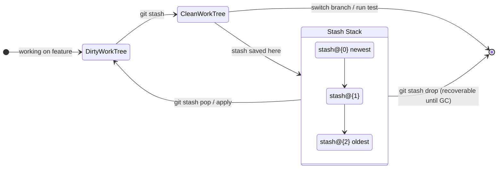

# Git Stash — Managing Work in Progress

> **Related sections:** [`fundamentals/`](../fundamentals/) for the three-tree model that explains where stash state lives; [`recovery/`](../recovery/) for recovering dropped stash; [`branching/`](../branching/) for when to stash vs create a quick branch.
>
> **Navigation:** [⌂ Index](../) | [← `rebasing/`](../rebasing/) | [`cherry-pick/` →](../cherry-pick/)

## Overview

Stash saves uncommitted changes (staged and unstaged) to a temporary storage area so you can switch context without committing incomplete work. Used correctly, it is the right tool for temporary interruptions. Used casually, it becomes a graveyard of forgotten work-in-progress.

Most engineers use `git stash` and `git stash pop` and stop there. This document covers the full capability and the discipline needed to use it safely in a team environment.

---

## Why Stash Matters

| Scenario | Without stash | With stash |
|---|---|---|
| Urgent hotfix needed while feature in progress | Forced to commit WIP or lose changes | Stash, switch, fix, pop |
| Wrong branch — started work on main | Have to reset and potentially lose changes | Stash, checkout correct branch, pop |
| Need a clean working tree for a test | Commit a dirty state | Stash, run test, pop |

---

## When to Use It

- Switching context temporarily while work is in progress
- Needs a clean working tree for a specific operation
- Moving uncommitted work to a different branch

## When NOT to Use It

- As a long-term storage mechanism — stashes are not named branches
- For work that should be committed even as WIP (use a WIP commit with `--no-verify`)
- Across session boundaries where you might forget it exists (save stashes with descriptive messages)

---

## How Stash Works Internally

Stash is implemented as a set of commits stored under `refs/stash`. When you run `git stash`, Git creates:

1. A commit for the index state (staged changes)
2. A commit for the working directory state (unstaged changes)
3. A merge commit combining them, stored as the new `refs/stash` tip



This is why `git fsck --unreachable` can find dropped stashes — the commit objects remain in `.git/objects/` until GC runs. See [`recovery/`](../recovery/) for the full recovery workflow.

```bash
# See what stash actually is in the object store
git cat-file -t refs/stash
# commit

git log refs/stash --oneline -3
# stash@{0}: index on feature/vpc: ...
# stash@{1}: untracked files on feature/vpc: ...
```

---

## Stash Operations

### Basic stash

```bash
git stash
# Stash is assigned an index: stash@{0}
```

This stages and stashes tracked modified files and staged changes. Untracked files are NOT stashed by default.

### Stash with untracked files

```bash
git stash -u
# or
git stash --include-untracked
```

### Stash with ignored files too

```bash
git stash -a
# or
git stash --all
```

### Stash with a descriptive message

```bash
git stash push -m "WIP: vpc module — mid-refactor of subnet logic"
```

Always use descriptive messages in a team environment. `stash@{0}` means nothing three hours later.

### Stash specific files only

```bash
git stash push modules/vpc/main.tf modules/vpc/outputs.tf \
  -m "WIP: vpc output refactor"
```

### Stash only staged changes (Git 2.35+)

```bash
# Stash only what is in the index, leave working directory alone
git stash --staged
# Requires Git 2.35 — check your version: git --version
```

---

## Viewing Stashes

```bash
git stash list
# stash@{0}: On feature/vpc: WIP: vpc module — mid-refactor of subnet logic
# stash@{1}: On main: WIP: scratch test for iam module

git stash show stash@{0}
# Summary of what changed (files + insertions/deletions)

git stash show -p stash@{0}
# Full diff — use this when you can't remember what's in a stash
# Essential before deciding whether to apply or drop
```

---

## Applying Stashes

```bash
# Apply and remove from stash list
git stash pop

# Apply a specific stash and remove it
git stash pop stash@{1}

# Apply but keep in stash list (useful if applying to multiple branches)
git stash apply stash@{0}
```

---

## Creating a Branch from a Stash

When work has grown too large for a stash:

```bash
git stash branch feature/vpc-subnet-refactor stash@{0}
# Creates a new branch from the commit where stash was made
# Applies the stash to the new branch
# Drops the stash if successful
```

---

## Cleaning Stashes

```bash
# Remove a specific stash
git stash drop stash@{0}

# Remove all stashes
git stash clear
```

---

## Expected Output

```bash
$ git stash push -m "WIP: vpc module — mid-refactor of subnet logic"
Saved working directory and index state On feature/vpc: WIP: vpc module — mid-refactor of subnet logic

$ git stash list
stash@{0}: On feature/vpc: WIP: vpc module — mid-refactor of subnet logic

$ git stash pop
On branch feature/vpc
Changes not staged for commit:
  (use "git add <file>..." to update what will be committed)
        modified:   modules/vpc/main.tf
        modified:   modules/vpc/outputs.tf

Dropped refs/stash@{0} (3f8a2b1c4d5e6f7a8b9c0d1e2f3a4b5c6d7e8f90)
```

---

## Real Enterprise Use Cases

**SRE on-call context switch**

Engineer is mid-way through a Terraform refactor when a production alert fires. They stash the refactor with a message, switch to a clean checkout of `main`, investigate the issue, apply and commit a fix, then return to the feature branch and pop the stash.

**CI/CD pipeline testing**

Before running a local pipeline simulation, an engineer stashes local changes to verify the pipeline against the last committed state, then pops after.

**Wrong branch recovery**

An engineer spent 30 minutes making changes on `main` instead of their feature branch:

```bash
git stash
git checkout feature/INFRA-1042-vpc-module
git stash pop
```

---

## Common Mistakes

| Mistake | Consequence |
|---|---|
| Using `git stash` without a message | Stack of anonymous stashes that are impossible to identify |
| `git stash clear` without reviewing | Permanently deletes all stashed work |
| Leaving stashes for weeks | Forgotten context, possible merge conflicts when popping |
| Stashing binary files or large files | Can cause slow stash operations |
| Relying on stash instead of committing WIP | Stash is not durable — a corrupted git repo loses stashes |

---

## Best Practices

- Always provide a message: `git stash push -m "descriptive context"`
- Review your stash list regularly: `git stash list`
- Prefer creating a WIP branch over a long-lived stash
- Use `git stash apply` instead of `pop` when applying across multiple branches
- If a stash is older than one week, either commit it or drop it

---

## Troubleshooting

### "Stash pop has conflicts"

```bash
git stash pop
# CONFLICT (content): Merge conflict in modules/vpc/main.tf

# Resolve conflicts, then:
git add modules/vpc/main.tf
# The stash has already been dropped — no need to run git stash drop
# If using apply:
git stash drop stash@{0}
```

### "I can't remember what is in each stash"

```bash
git stash list
git stash show -p stash@{0}
git stash show -p stash@{1}
```

### "Pop applied to the wrong branch"

```bash
git checkout correct-branch
git stash pop
# If you already popped on the wrong branch:
git stash  # Re-stash the changes
git checkout correct-branch
git stash pop
```

---

## Interview Questions

**Q: What is the difference between `git stash pop` and `git stash apply`?**
A: `git stash pop` applies the stash and removes it from the stash list. `git stash apply` applies the stash but leaves it in the list. Use `apply` when you want to apply the same stash to multiple branches or when you are unsure the apply will succeed and want the stash to remain as a fallback.

**Q: How do you stash only specific files, not all changes?**
A: Use `git stash push <file1> <file2>` to stash specific paths. This leaves all other modified files in the working tree untouched. Alternatively, stage only the files you want to keep separate and use `git stash --staged` to stash only the staged portion.

**Q: You accidentally dropped a stash with `git stash drop`. Is it recoverable?**
A: Yes, if GC has not run. The stash commit objects still exist as unreachable objects. Run `git fsck --unreachable` to find unreachable commits, inspect each with `git show <sha>`, and apply the correct one with `git stash apply <sha>`. See the [`recovery/`](../recovery/) section for the full workflow.

---

## Engineering Insight

**A stash older than a day is probably a branch.** If you are saving work in a stash with the intention of returning to it later, that work deserves a branch with a meaningful name. Stashes are not browsable in the standard `git log`, have no commit message by default, and are easy to forget. Name them if you must use them: `git stash push -m "WIP: auth token refresh logic"`.

**`git stash pop` and `git stash apply` are not the same.** `pop` removes the stash entry after applying it (can leave you without a recovery copy if apply produces conflicts). `apply` leaves the stash entry intact. Prefer `apply` in situations where you are uncertain the stash will apply cleanly.

**`git stash --staged` (Git 2.35+) is the correct tool for mid-hunk saves.** When you have staged half a feature and need to interrupt, `--staged` creates a stash of only the staged content. This is more precise than stashing everything and more useful than a WIP commit.

**Every `git stash drop` is recoverable until GC runs.** The commit objects persist in `.git/objects/` as unreachable objects. `git fsck --unreachable | grep commit` will list them, and `git stash apply <sha>` restores the work. The default GC window is 14 days for unreachable objects, 90 days for reflog entries. Running `git gc --prune=now` immediately after a drop is the only way to make recovery impossible.

**In CI environments, never use stash.** CI environments are ephemeral. There is no state to preserve between runs, no interrupted work, and no context switching. Stash is a developer workflow tool. Any script that uses `git stash` in CI is a red flag.

---

## References

| Resource | URL |
|---|---|
| git stash | https://git-scm.com/docs/git-stash |
| Git Tools — Stashing and Cleaning | https://git-scm.com/book/en/v2/Git-Tools-Stashing-and-Cleaning |
