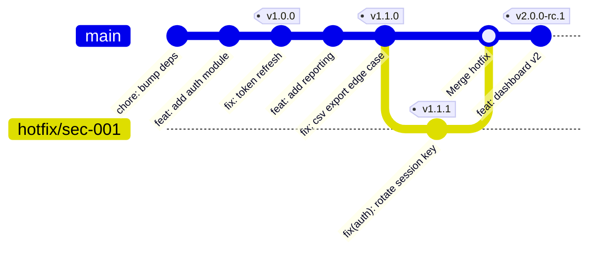

# Git Tags — Release Management and Versioning

> **Related sections:** [`enterprise-workflows/`](../enterprise-workflows/) for release branching strategies; [`security/`](../security/) for GPG tag signing; [`hooks/`](../hooks/) for CI/CD trigger patterns based on tags; [`branching/`](../branching/) for how tags relate to release branches.
>
> **Navigation:** [⌂ Index](../) | [← `cherry-pick/`](../cherry-pick/) | [`hooks/` →](../hooks/)

## Overview

Tags are permanent references to specific commits. Unlike branches, they do not move when new commits are added. They are the correct mechanism for marking releases, milestones, and auditable snapshots of your codebase.



> Tags (`v1.0.0`, `v1.1.0`, `v1.1.1`, `v2.0.0-rc.1`) are fixed pointers. `main` moves forward; tags never do.

---

## Why Tagging Matters

| Without tags | With tags |
|---|---|
| "Deploy the commit from last Friday" — which one? | `git checkout v2.4.1` — precise, unambiguous |
| Rollback requires digging through log history | `git checkout v2.3.0` — immediate |
| Release audit trail is reconstructed from commit messages | Release audit trail is a first-class artifact |
| CI/CD pipelines trigger on branch — hard to version | CI/CD pipelines trigger on `v*` tags — clean version semantics |

---

## Tag Types

### Lightweight tags

A pointer to a commit. Stored as a ref file. No metadata.

```bash
git tag v1.0.0
```

Do not use lightweight tags for releases. They carry no author, date, or message information beyond the commit they point to.

### Annotated tags

A full Git object with author, date, message, and optionally a GPG signature. Use these for all releases.

```bash
git tag -a v1.0.0 -m "Release v1.0.0 — initial production release"
```

```bash
git show v1.0.0
# tag v1.0.0
# Tagger: Akash Khurana <akash@example.com>
# Date:   Tue Jul 1 18:00:00 2025 +0000
#
# Release v1.0.0 — initial production release
#
# commit abc1234...
```

---

## Semantic Versioning

Tags should follow [Semantic Versioning](https://semver.org): `MAJOR.MINOR.PATCH`

| Segment | Increment when |
|---|---|
| `MAJOR` | Breaking change — consumers must update their code |
| `MINOR` | New backward-compatible functionality |
| `PATCH` | Backward-compatible bug fixes |

```
v1.0.0        — initial stable release
v1.1.0        — new feature added
v1.1.1        — bug fix in v1.1.0
v2.0.0        — breaking API change
v2.0.0-rc.1   — release candidate
v2.0.0-beta.1 — beta
```

### CalVer — Calendar Versioning

Some infrastructure and platform teams use CalVer instead of SemVer:

```
2025.07.1     — year.month.release-number
2025.07.01    — zero-padded variant
```

CalVer is appropriate when there are no API consumers to signal breaking changes to — for internal tooling, platform releases, or CI image versions where "what month was this released" is more useful than semantic compatibility signals.

---

## Tagging Workflow

### Tag the current HEAD

```bash
git checkout main
git pull origin main
git tag -a v1.2.0 -m "Release v1.2.0

Changes:
- feat: add VPC module for production [INFRA-1042]
- fix: correct IAM role trust policy [SEC-114]
- chore: update Terraform provider to 5.x"
```

### Tag a specific commit

```bash
git tag -a v1.1.1 abc1234 -m "Hotfix v1.1.1 — memory leak in worker pool"
```

### Push tags to remote

```bash
# Push a specific tag
git push origin v1.2.0

# Push all local tags not yet on remote
git push origin --tags
```

---

## Listing and Searching Tags

```bash
# List all tags (alphabetical order — not version order)
git tag

# List with pattern
git tag -l "v1.*"

# ⚠ git tag -l returns ALPHABETICAL order, not semantic version order
# v1.10.0 will appear before v1.9.0 alphabetically
# Always use --sort for version-safe ordering:
git tag -l --sort=version:refname "v*"
# v1.0.0
# v1.1.0
# v1.9.0
# v1.10.0
# v1.11.0

# Show tag details
git show v1.2.0
```

---

## Signed Tags — For Regulated Environments

Signed tags use GPG to cryptographically verify the tagger's identity. Required in some compliance frameworks.

```bash
# Configure signing key
git config --global user.signingkey <GPG-KEY-ID>

# Create a signed tag
git tag -s v1.2.0 -m "Release v1.2.0"

# Verify a signed tag
git tag -v v1.2.0
```

---

## Deleting Tags

```bash
# Delete locally
git tag -d v1.0.0-beta.1

# Delete from remote
git push origin --delete v1.0.0-beta.1
```

Do not delete tags that have been used in deployments or referenced in audit records.

---

## Expected Output

```bash
$ git tag -a v1.2.0 -m "Release v1.2.0"

$ git show v1.2.0
tag v1.2.0
Tagger: Akash Khurana <akash@example.com>
Date:   Tue Jul 1 18:00:00 2025 +0000

Release v1.2.0

commit 3f8a2b1c4d5e6f7a8b9c0d1e2f3a4b5c6d7e8f90 (tag: v1.2.0, HEAD -> main)
Author: Akash Khurana <akash@example.com>
Date:   Tue Jul 1 17:45:00 2025 +0000

    chore: update Terraform provider to 5.x

$ git log --oneline --decorate | head -5
3f8a2b1 (HEAD -> main, tag: v1.2.0, origin/main) chore: update Terraform provider to 5.x
```

---

## CI/CD Integration

Tags drive release pipelines. GitHub Actions example:

```yaml
on:
  push:
    tags:
      - 'v*'

jobs:
  release:
    runs-on: ubuntu-latest
    steps:
      - uses: actions/checkout@v4
      - name: Get version
        run: echo "VERSION=${GITHUB_REF#refs/tags/}" >> $GITHUB_ENV
      - name: Deploy
        run: ./scripts/deploy.sh $VERSION
```

### Auto-creating tags from CI (semantic-release)

```yaml
# .github/workflows/release.yml
on:
  push:
    branches: [main]

jobs:
  release:
    runs-on: ubuntu-latest
    steps:
      - uses: actions/checkout@v4
        with:
          fetch-depth: 0     # semantic-release needs full history to determine version
          persist-credentials: false
      - uses: actions/setup-node@v4
        with:
          node-version: 20
      - run: npx semantic-release
        env:
          GITHUB_TOKEN: ${{ secrets.GITHUB_TOKEN }}
```

`semantic-release` parses commit messages (Conventional Commits format), determines the next semver version, creates the annotated tag, and generates a GitHub Release automatically.

---

## git describe — Version Strings from Tags

`git describe` is how build systems derive a version string from the tag history:

```bash
# On a tagged commit
git describe --tags
# v1.2.0

# On a commit 3 commits after the tag (typical in dev)
git describe --tags
# v1.2.0-3-gabc1234
# └─────┘ └ └──────┘
# tag     │  abbreviated SHA of current commit
#         └─ number of commits since the tag

# Use in a build script
VERSION=$(git describe --tags --always --dirty)
# v1.2.0-3-gabc1234-dirty  ← -dirty suffix if working tree has changes
```

This is how Docker image tags, binary versions, and release notes are automatically versioned without manually maintaining a version file.

---

## Real Enterprise Use Cases

**Infrastructure module versioning**

Terraform modules are versioned with annotated tags. Downstream consumers pin to `v1.2.0` in their module source. Upgrading is a conscious, tested decision.

**Compliance audit trail**

A regulated financial environment requires that every production deployment be traceable to a specific commit. Tags provide the immutable reference. CI/CD refuses to deploy if the artifact was not built from a tagged commit.

**Multi-environment promotion**

`v1.2.0-rc.1` deploys to staging. After approval, the same commit is tagged `v1.2.0` and deployed to production. The history is clear.

---

## Common Mistakes

| Mistake | Consequence |
|---|---|
| Using lightweight tags for releases | No author/date/message — not useful for audit |
| Forgetting to push tags | Tags exist locally only — CI/CD never sees them |
| Tagging from a dirty or non-`main` branch | Tag points to an unreviewed or incorrect state |
| Deleting or moving tags that were deployed | Breaks reproducibility and audit trails |
| Not following semver | Consumers cannot determine upgrade impact |

---

## Best Practices

- Always use annotated tags for releases
- Always push tags explicitly after creation
- Follow semantic versioning consistently
- Include a meaningful message — at minimum, what changed and what tickets it addresses
- Protect tags in your repository settings (prevent deletion and overwriting)
- Automate tagging in your release pipeline — do not rely on humans to remember

---

## Troubleshooting

### "Tag exists locally but CI doesn't see it"

```bash
git push origin v1.2.0
```

### "I tagged the wrong commit"

```bash
# Move the tag (before it has been used for a deployment)
git tag -d v1.2.0
git tag -a v1.2.0 <correct-commit> -m "Release v1.2.0"
git push origin --delete v1.2.0
git push origin v1.2.0
```

### "I need to check out the exact state at a tag"

```bash
git checkout v1.2.0
# This puts you in detached HEAD state
# To work from this point, create a branch:
git checkout -b investigate/v1.2.0 v1.2.0
```

---

## Interview Questions

**Q: What is the difference between a lightweight tag and an annotated tag?**
A: A lightweight tag is just a pointer (like a branch) to a commit SHA — it is stored as a ref with no additional metadata. An annotated tag is a full Git object with its own SHA, containing the tagger name, email, date, and message. Use annotated tags for releases (they are signed, searchable, and carry metadata). Use lightweight tags for temporary or personal bookmarks.

**Q: How do you trigger a CI/CD pipeline to run only on tags?**
A: In GitHub Actions: `on: push: tags: ['v*.*.*']`. This triggers only when a push includes a tag matching the pattern. The pipeline can then use the tag name as the release version, build a release artifact, and publish to a registry.

**Q: A tag was pushed to the wrong commit. How do you fix it?**
A: Recreate it: `git tag -d v1.2.0` locally, `git push origin :refs/tags/v1.2.0` to delete remotely, then `git tag -a v1.2.0 <correct-sha>` and `git push origin v1.2.0`. Coordinate with the team — clients or CI systems may have already pulled the old tag. If the tag was signed and published in a release, update the GitHub Release as well.

---

## Engineering Insight

**Lightweight tags are for local bookmarks; annotated tags are for releases.** An annotated tag (`git tag -a`) creates a tag object in the Git database with a tagger identity, timestamp, and message. This is what `git describe` uses to calculate distances. A lightweight tag is just a pointer — no metadata, no object. Use annotated tags for anything that goes to production.

**Tag before you deploy, not after.** The production tag is a deployment artifact, not a historical marker. If you tag the commit after deploying it, you've lost the ability to reproduce exactly what was deployed during the gap. Tag the commit, then deploy the tag. The CI/CD system should deploy from the tag, not from a branch.

**`git tag -l` sorts alphabetically, not by version.** `v1.9.0` sorts after `v1.10.0` alphabetically because `9 > 1` lexicographically. Use `git tag -l --sort=-version:refname` for correct semantic version ordering, or `git tag -l | sort -V`.

**Immutability of tags in production is critical.** Deleting and recreating a tag (`git tag -f`) is a destructive operation for anyone who has already fetched the old tag. They will not automatically receive the new one. For production release tags, treat them as immutable — publish a new tag rather than moving an existing one.

**`git describe` is the basis of version strings in many release pipelines.** Understanding its output format (`v1.2.0-14-gab1c2d3`) — base tag, commits since tag, abbreviated SHA — is important for interpreting artifact version strings and tracing a deployed version back to its source commit.

---

## Production Checklist

### Before tagging a release

- [ ] All commits intended for this release are on `main` (or the release branch)
- [ ] CI is green on the commit you are tagging
- [ ] The commit SHA is noted and verified: `git log --oneline -1`
- [ ] Tag uses annotated format: `git tag -a vX.Y.Z -m "..."` — not `git tag vX.Y.Z`
- [ ] Tag message includes: version, date, brief description, and issue reference
- [ ] If GPG or SSH signing: key is loaded — `gpg --list-keys` / `ssh-add -l`

### After tagging

- [ ] Pushed the tag: `git push origin vX.Y.Z` (not just `git push`)
- [ ] GitHub Release created from the tag with release notes
- [ ] CI/CD deployment triggered and verified
- [ ] Tag is immutable — never `git tag -f` on a pushed production tag

### Tag naming

- [ ] Semantic version format: `vMAJOR.MINOR.PATCH`
- [ ] Pre-release suffix if applicable: `v2.0.0-rc.1`, `v2.0.0-beta.1`
- [ ] Hotfix increment: `v2.3.0` → `v2.3.1`

---

## References

| Resource | URL |
|---|---|
| Git Tagging | https://git-scm.com/book/en/v2/Git-Basics-Tagging |
| git tag | https://git-scm.com/docs/git-tag |
| Semantic Versioning | https://semver.org |
| GitHub — Managing releases | https://docs.github.com/en/repositories/releasing-projects-on-github |
