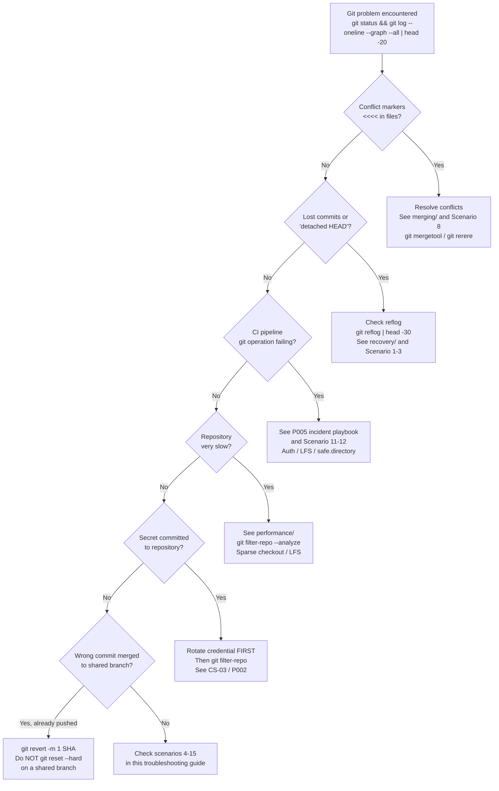

# Git Troubleshooting — Diagnosing and Recovering from Common Failures

> **Related sections:** [`recovery/`](../recovery/) for deep recovery workflows (reflog, bisect, lost stash); [`security/`](../security/) for credential and authentication issues; [`performance/`](../performance/) for slow operation diagnosis; [`internals/`](../internals/) for understanding why failures occur at the object level.
>
> **Navigation:** [⌂ Index](../) | [← `best-practices/`](../best-practices/) | [`decision-guides/` →](../decision-guides/)

## Overview

This is a field guide for Git problems in production environments. Every scenario here has been encountered in real engineering teams. The goal is not to explain theory — it is to give you the exact commands to diagnose and recover.



---

## Diagnostic First Steps

Before anything else:

```bash
git status          # What state is the working tree in?
git log --oneline --graph --all | head -20  # What does the branch topology look like?
git reflog | head -20  # What have HEAD movements been recently?
```

These three commands answer 80% of questions.

---

## Scenario 1 — Detached HEAD State

### Symptoms

```bash
$ git status
HEAD detached at abc1234
```

### Cause

You checked out a commit, tag, or remote branch directly instead of a local branch. `HEAD` points to a commit, not a branch ref.

### Recovery

```bash
# Option 1: Go back to your branch
git checkout main

# Option 2: Keep the work you did in detached HEAD
git checkout -b recover/detached-work
# Now you are on a named branch — commit and push safely
```

### If you made commits in detached HEAD state

```bash
git log --oneline | head -5
# Note the SHA of the work you want to keep

git checkout main
git cherry-pick <sha-of-commit-from-detached-head>
```

---

## Scenario 2 — Accidentally Committed to the Wrong Branch

### Situation A: Committed to `main` instead of feature branch (before push)

```bash
git log --oneline | head -3
# abc1234 feat: my accidental commit on main
# def5678 previous commit

# Create the feature branch from current state
git branch feature/INFRA-correct-branch

# Remove the commit from main
git reset --hard HEAD~1

# Switch to the feature branch
git checkout feature/INFRA-correct-branch
```

### Situation B: Pushed the wrong commit to `main`

```bash
# Create a revert commit (safe for shared branches)
git revert abc1234
git push origin main
```

Never `git reset --hard` a shared branch after it has been pushed.

---

## Scenario 3 — Recovering Lost Commits

### "I ran git reset --hard and lost work"

```bash
git reflog
# HEAD@{0}: reset: moving to HEAD~2
# HEAD@{1}: commit: feat: vpc module complete
# HEAD@{2}: commit: feat: subnet configuration
# HEAD@{3}: checkout: moving from main to feature/vpc

# Restore the commit before the reset
git reset --hard HEAD@{1}
```

The reflog is a local record of every HEAD movement. It is retained for 90 days by default.

### "I deleted a branch without merging"

```bash
git reflog | grep "feature/lost-branch"
# HEAD@{12}: checkout: moving from feature/lost-branch to main

# The SHA just before checkout is the tip of the deleted branch
git checkout -b feature/lost-branch HEAD@{12}
```

---

## Scenario 4 — Merge Conflict Resolution

### Step by step

```bash
git merge feature/INFRA-1042-vpc-module
# CONFLICT (content): Merge conflict in modules/vpc/main.tf

# See all conflicted files
git diff --name-only --diff-filter=U

# Resolve each file (edit to correct state, remove conflict markers)
# Then:
git add modules/vpc/main.tf
git merge --continue
```

### Abandon the merge entirely

```bash
git merge --abort
# Restores to pre-merge state
```

### Use git rerere to auto-resolve repeated conflicts

If your workflow produces the same conflict repeatedly (long-lived branches, frequent rebases):

```bash
git config rerere.enabled true
# Git records conflict resolutions and replays them automatically
```

---

## Scenario 5 — Finding Which Commit Introduced a Bug

For the full `git bisect` playbook with automated scripts, see [`recovery/`](../recovery/#git-bisect----finding-the-commit-that-broke-something).

Quick reference for when production is on fire:

```bash
git bisect start
git bisect bad                # current state is broken
git bisect good v1.0.0        # last known-good tag

# Git checks out the midpoint — test it
git bisect bad    # or git bisect good

# Automate:
git bisect run ./scripts/validate.sh

git bisect reset  # always run this when done
```

---

## Scenario 6 — Force Push Disaster Recovery

Someone force-pushed to `main` and overwrote commits.

```bash
# Check reflog on your local clone
git reflog show origin/main
# origin/main@{0}: 3f8a2b1 — the force-pushed state
# origin/main@{1}: abc1234 — the original state before force push

# Restore origin/main to the correct state
git push origin abc1234:main --force-with-lease
```

If no local clone has the original state, contact GitHub support — they retain reflog server-side for a limited time.

---

## Scenario 7 — Large File Accidentally Committed

```bash
git log --all --full-history -- path/to/large-file.bin | head -5
# Find the commit that added it

# Remove from history using git-filter-repo (the only supported tool — git filter-branch is deprecated)
pip install git-filter-repo
git filter-repo --path path/to/large-file.bin --invert-paths

# Force push required after history rewrite — coordinate with team
git push origin --force --all
git push origin --force --tags
```

> `git filter-branch` was deprecated in Git 2.24. Do not use it. It is slow, has known bugs, and its replacement `git filter-repo` is available as a pip package.

---

## Scenario 8 — Diagnosing Slow Git Operations

```bash
# Check repository size
git count-objects -vH

# Find large objects
git rev-list --objects --all \
  | git cat-file --batch-check='%(objecttype) %(objectname) %(objectsize) %(rest)' \
  | awk '/^blob/ {print substr($0,6)}' \
  | sort -k2 -rn \
  | head -10
```

---

## Scenario 9 — Authentication Failures

```bash
# Test SSH connectivity
ssh -T git@github.com
# Hi AkashKhuranaDev! You've successfully authenticated

# Test correct key is being used
ssh -vT git@github.com 2>&1 | grep "Offering public key"

# For multiple accounts (see git/fundamentals for SSH config)
ssh -T git@github-akashdev
```

---

## Scenario 10 — "Permission denied to AnotherUser"

This means the wrong credential is being sent. macOS Keychain is sending the wrong stored token.

```bash
# List stored credentials
git credential-osxkeychain get <<EOF
protocol=https
host=github.com
EOF

# Erase cached credential
git credential-osxkeychain erase <<EOF
protocol=https
host=github.com
EOF

# Next push will prompt for fresh credentials
```

Or use SSH aliases to avoid credential conflicts entirely. See `git/branching/README.md`.

---

## Scenario 11 — git pull Overwrote My Local Changes

### Symptoms

```bash
git pull
# Updating abc1234..def5678
# error: Your local changes to the following files would be overwritten by merge
```

### Recovery

```bash
# Option 1: Stash first, then pull
git stash push -m "WIP before pull"
git pull
git stash pop
# Resolve conflicts if stash pop produces any

# Option 2: If pull already ran and you lost working dir changes
git reflog
# HEAD@{0}: pull: Fast-forward
# HEAD@{1}: commit: your last commit
# The reflog only covers committed work — uncommitted changes are gone if you had --hard
```

If your changes were committed before the pull, they are in the reflog. If they were only in the working directory and you had a clean pull, they are unrecoverable.

---

## Scenario 12 — Binary Merge Conflict

### Symptoms

```
CONFLICT (content): Merge conflict in architecture.png
```

Git cannot auto-merge binary files. The conflict markers would corrupt the binary.

### Resolution

```bash
# See who changed the file on each side
git log --merge --oneline -- architecture.png

# Take the version from your branch
git checkout --ours architecture.png

# Take the version from the incoming branch
git checkout --theirs architecture.png

# Confirm which version you want and mark resolved
git add architecture.png
git merge --continue
```

**Prevention**: Track binary files in Git LFS (see [`performance/`](../performance/)). For architecture diagrams and binaries, document which version wins in `CONTRIBUTING.md`.

---

## Scenario 13 — Clone Fails with "early EOF" or "RPC failed"

### Symptoms

```
error: RPC failed; curl 18 transfer closed with outstanding read data remaining
fatal: the remote end hung up unexpectedly
```

### Cause

Large repository, slow network, or server timeout during clone.

### Recovery

```bash
# Option 1: Shallow clone first, then fetch full history
git clone --depth=1 https://github.com/org/repo.git
cd repo
git fetch --unshallow

# Option 2: Increase buffer size
git config --global http.postBuffer 524288000  # 500 MB

# Option 3: Use SSH instead of HTTPS (more resilient for large transfers)
git clone git@github.com:org/repo.git

# Option 4: Try again after reducing concurrent object fetches
git config --global http.maxRequests 1
```

---

## Scenario 14 — "fatal: detected dubious ownership" (Unsafe Directory)

### Symptoms

```
fatal: detected dubious ownership in repository at '/path/to/repo'
To add an exception for this directory, call:
    git config --global --add safe.directory /path/to/repo
```

### Cause

Git 2.35.2+ added a check: if the repository is owned by a different user (common in Docker containers, CI runners, or when running as root), Git refuses to operate.

### Recovery

```bash
# Add the directory as safe (resolve the root cause first)
git config --global --add safe.directory /path/to/repo

# In Docker — fix the ownership in the Dockerfile instead
# RUN chown -R $USER:$USER /app

# In GitHub Actions — use the official checkout action which handles this
- uses: actions/checkout@v4  # Automatically sets safe.directory in CI
```

**Root cause**: Do not run Git as root in containers if the repository is owned by a different user. Fix the container user configuration rather than just adding safe.directory.

---

## Scenario 15 — Submodule Out of Sync

### Symptoms

```bash
git status
# modified: path/to/submodule (new commits)
# or
git submodule update
# error: Server does not allow request for unadvertised object
```

### Recovery

```bash
# Update all submodules to the commit the parent repository tracks
git submodule update --init --recursive

# If the submodule commit is not available from the remote
git submodule update --init --recursive --remote

# Pull submodule updates AND update the parent's reference
git submodule update --remote --merge

# Check submodule status
git submodule status
# + abc1234 path/to/submodule (v1.2.0-3-gabc1234)
# ^ = newer commit exists in submodule
# + = submodule is checked out at a different commit than parent expects

# If a submodule was deleted from the remote
git submodule deinit path/to/submodule
git rm path/to/submodule
git commit -m "chore: remove deprecated submodule"
```

---

## Quick Reference — Git Emergency Commands

| Situation | Command |
|---|---|
| Undo last commit (keep changes staged) | `git reset --soft HEAD~1` |
| Undo last commit (keep changes unstaged) | `git reset --mixed HEAD~1` |
| Undo last commit and discard all changes | `git reset --hard HEAD~1` |
| Undo a pushed commit safely | `git revert HEAD` |
| See recent HEAD movements | `git reflog` |
| Recover deleted branch | `git checkout -b branch-name HEAD@{N}` |
| Abort in-progress merge | `git merge --abort` |
| Abort in-progress rebase | `git rebase --abort` |
| Abort in-progress cherry-pick | `git cherry-pick --abort` |
| See what is staged | `git diff --staged` |
| Find which commit broke something | `git bisect start && git bisect bad && git bisect good <tag>` |
| Remove a file from last commit (keep file) | `git reset HEAD~1 -- file.tf && git add file.tf && git commit --amend --no-edit` |
| Take one version of a conflicted binary | `git checkout --ours file.bin` or `git checkout --theirs file.bin` |

---

## Interview Questions

**Q: Production is down. You need to revert the last deployment commit from `main` immediately. What do you do?**
A: Run `git revert HEAD` to create a new commit that reverses the changes. Push it: `git push origin main`. This is safe on a shared branch — it does not rewrite history. Do not use `git reset --hard` on `main` after it has been pushed — this requires a force push and will disrupt everyone's local clone.

**Q: An engineer says "I lost all my work." What is the first thing you do?**
A: Ask when they last committed. If they committed: `git reflog` will show their commits — nearly nothing is permanently lost before GC runs. If they never committed: the changes were only in the working directory and are gone after `git reset --hard`. The reflog only covers committed objects.

**Q: You need to find which specific commit introduced a memory leak. There are 300 commits since the last known-good state. How do you approach it?**
A: Use `git bisect`. Mark the current state as bad, mark the last known-good release tag as good, and provide a test script that exercises the memory path and exits with the appropriate code. `git bisect run` performs binary search — 300 commits requires only 8-9 iterations to identify the culprit.

---

## Engineering Insight

**Most Git emergencies feel worse than they are.** The vast majority of "I've lost my work" situations are recoverable via reflog within 90 days. The first 30 seconds of a Git emergency should be spent not running commands, but identifying whether the work was ever committed. Uncommitted work in the working directory after a `git reset --hard` is genuinely gone. Committed work almost never is.

**`git filter-repo` is the only supported tool for history rewriting.** `git filter-branch` was deprecated in Git 2.24. It is slower by orders of magnitude and its behavior is full of edge cases. If you find a tutorial or runbook that uses `git filter-branch`, it is outdated. Use `git filter-repo`.

**Start every troubleshooting session with `git status` and `git log --oneline -10`.** These two commands establish your bearings — where HEAD is, what is staged, what is in the working tree, and recent history. Many problems are immediately visible. Jumping to aggressive recovery commands without this orientation is how engineers make situations worse.

**The safest recovery strategy is always to create a branch before doing anything.** Before running `git reset`, `git rebase`, or any other potentially destructive command: `git branch backup-$(date +%s)`. This costs nothing and gives you a named pointer to the current state. If the operation goes wrong, `git reset --hard backup-<timestamp>` puts you back.

**Read error messages fully before running commands.** Git error messages are unusually informative — they frequently contain the exact command to resolve the issue. Engineers who run commands reflexively without reading the full error message often bypass Git's own recovery suggestions and create new problems.

---

## References

| Resource | URL |
|---|---|
| git reflog | https://git-scm.com/docs/git-reflog |
| git bisect | https://git-scm.com/docs/git-bisect |
| git filter-repo | https://github.com/newren/git-filter-repo |
| Undoing Things | https://git-scm.com/book/en/v2/Git-Basics-Undoing-Things |
| Debugging with Git | https://git-scm.com/book/en/v2/Git-Tools-Debugging-with-Git |
